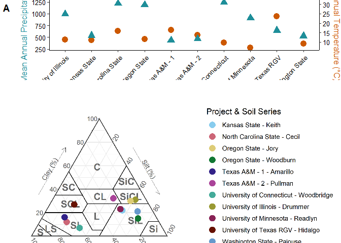

DSP4SH Reference States - Manuscript Figures and Tables
================
Katy Dynarski
2024-08-07

# Overview of DSP4SH Climate and Soil Texture

## Figure 1A - Dual-axis figure showing mean annual temperature and precipitation for each site

``` r
# Compile data
clim <- soc_pedon %>%
  distinct(project, dsp_plot_id, label, mat, map) %>%
  group_by(project) %>%
  summarize(mean_mat = mean(mat),
            mean_map = mean(map))

# Make the plot
proj_tem_prep_clim <- ggplot(clim, aes(x = project)) +
  # Add temperature points (scaled for dual y-axis)
  geom_point(aes(y = mean_mat * 40), color = "#CC5800FF", size = 4, shape = 19) + # Adjust scale factor as needed
  # Add precipitation points
  geom_point(aes(y = mean_map), color = "#1E8E99FF", size = 4, shape = 17) +
  scale_x_discrete(labels=project_labels, name="Project") + 
  # Customize y-axes
  scale_y_continuous(
    name = "Mean Annual Precipitation (mm)",
    sec.axis = sec_axis(~ . / 40, name = "Mean Annual Temperature (°C)")) + # Adjust scale factor
  theme_katy(base_size=12) +
  theme(axis.title.y=element_text(color="#1E8E99FF"),
        axis.title.y.right=element_text(color="#CC5800FF"),
        axis.text.x=element_text(angle=45, hjust=1),
        axis.title.x = element_text(vjust=0),
        plot.margin = margin(l=30))

proj_tem_prep_clim
```

<!-- -->

``` r
ggsave(here("figs", "fig1a_climate_2_axis.tiff"), width=120, height=100, units="mm", dpi=500)

# Optional to include in figure: color text labels to indicate which symbol is which
  # Manually add legend labels
  # annotate("text", x = 1, y = max(clim$mean_map) * 1.1, label = "Annual Precipitation (mm)", color = "#1E8E99FF", hjust = 0) +
  # annotate("text", x = 1, y = min(clim$mean_mat) * 40 * 1.1, label = "Annual Average Temperature (°C)", color = "#CC5800FF", hjust = 0) +
```

## Figure 1B - Soil texture triangle showing mean SSURGO texture in top horizon for each project

Make the USDA soil texture triangle to overlay:

``` r
# USDA dataset comes pre-loaded
data(USDA)

# rename the labels to be shorter for easier printing
USDA <- USDA %>% 
  rename("clay_pct" = Clay, "sand_pct" = Sand, "silt_pct" = Silt) %>% 
  mutate(
    label = case_when(
      Label == "Clay" ~ "C",
      Label == "Sandy Clay" ~ "SC",
      Label == "Sandy Clay Loam" ~ "SCL",
      Label == "Sandy Loam" ~ "SL",
      Label == "Loamy Sand" ~ "LS",
      Label == "Sand" ~ "S",
      Label == "Clay Loam" ~ "CL",
      Label == "Silt Loam" ~ "SiL",
      Label == "Silty Clay" ~ "SiC",
      Label == "Silty Clay Loam" ~ "SiCL",
      Label == "Silt" ~ "Si",
      Label == "Loam" ~ "L",
      TRUE ~ NA_character_
    ))
USDA_text <- USDA  %>% 
  group_by(label) %>%
  summarise_if(is.numeric, mean, na.rm = TRUE)
```

Now, plot the SSURGO data on the textural triangle:

``` r
# Make a new column with both project and soil name for plotting
project_labels_df <- data.frame(project_labels) %>%
  rownames_to_column() %>%
  rename(project = rowname)

ssurgo_texture2 <- ssurgo_texture %>%
  left_join(project_labels_df, by="project") %>%
  unite("project_soil", c("project_labels", "soil"), remove=FALSE, sep=" - ")

# Plot texture with SSURGO data only, point fill color by project/soil combo
# overlay textural triangle
theme_set(theme_bw())
triangle_plot <- ggtern::ggtern(ssurgo_texture2, aes(x=sand_pct, y=clay_pct, z=silt_pct, 
                                          color=project_soil)) +
  geom_polygon(data=USDA,
               aes(fill = label),
               alpha = 0.0,
               linewidth = 0.5,
               color = "black",
               show.legend = FALSE) +
  geom_text(data = USDA_text,
            aes(label = label),
            color = 'grey40',
            fontface = "bold",
            size = 5) +
  geom_point(size=4) +
  theme_showarrows() +
  labs(yarrow = "Clay (%)",
       zarrow = "Silt (%)",
       xarrow = "Sand(%)",
       x="", y="", z="",
       color = "Project")  +
  theme_clockwise() +
  scale_color_paletteer_d("rcartocolor::Safe", name="Project & Soil Series")
triangle_plot
```

<!-- -->

``` r
ggsave(here("figs", "fig1b_ssurgo_texture.png"), width=7, height=4, units="in", dpi=400)
```

``` r
# Put two panels together

# ggtern does not play well with cowplot - so call in the texture triangle figure as a PNG file and add to a grid with a blank space
tt_file <- readPNG(here("figs", "fig1b_ssurgo_texture.png"))

fig1_grid_space <- plot_grid(proj_tem_prep_clim, NULL,
                          nrow=2, rel_heights=c(1,1),
                          labels=c("A", "B"))
fig1 <- ggdraw(fig1_grid_space) +
  draw_image(tt_file, x=0, y=0, vjust=0.23)

fig1
```

<!-- -->

## Summary of site data and sampling information for methods

### Site data summary

``` r
site_range_table <- project %>%
  summarize(across(where(is.numeric), min_max)) %>%
  mutate(across(where(is.numeric), ~round(.x, 2))) %>%
  transmute(lat_range= paste(pedon_y_min, pedon_y_max, sep="-"),
         long_range = paste(pedon_x_min, pedon_x_max, sep="-"),
         mat_range = paste(mat_min, mat_max, sep="-"),
         map_range = paste(map_min, map_max, sep="-")) %>%
  pivot_longer(everything())
flextable(site_range_table)
```


``` r
# Range in clay content
surf %>%
  summarize(clay_min = min(clay_combined, na.rm=TRUE),
            clay_max = max(clay_combined, na.rm=TRUE)) %>%
  flextable()
```


### How many sites per project? How many pedons?

``` r
plot_n <- project %>%
  group_by(project, label) %>%
  summarize(plot_n = n_distinct(dsp_plot_id),
            pedon_n = n_distinct(dsp_pedon_id)) %>%
  mutate(pedon_per_plot = round(pedon_n / plot_n, 0))
```

    ## `summarise()` has grouped output by 'project'. You can override using the
    ## `.groups` argument.

``` r
pedon_n <- project %>%
  group_by(project, dsp_plot_id) %>%
  summarize(pedon_n = n_distinct(dsp_pedon_id))
```

    ## `summarise()` has grouped output by 'project'. You can override using the
    ## `.groups` argument.

### How many SOC and BD values were filled?

``` r
missing_soc <- soc_horizon %>%
  select(project, label, dsp_pedon_id, dsp_sample_id, hrzdep_t, hrzdep_b, soc_pct, c_tot_ncs, bulk_density, soc_fill, bd_fill) %>%
  filter(project!="TexasA&MPt-2", is.na(soc_pct)) %>%
  group_by(project) %>%
  summarize(soc_filled_n = n_distinct(dsp_sample_id))

missing_bd <- soc_horizon %>%
  select(project, label, dsp_pedon_id, dsp_sample_id, hrzdep_t, hrzdep_b, soc_pct, c_tot_ncs, bulk_density, soc_fill, bd_fill) %>%
  filter(project!="TexasA&MPt-2", project!="UTRGV", is.na(bulk_density), !is.na(bd_fill)) %>%
  group_by(project) %>%
  summarize(bd_filled_n = n_distinct(dsp_sample_id))

filled <- left_join(missing_bd, missing_soc, by="project")
flextable(filled)
```


``` r
filled_summary <- filled %>%
  summarize(sum_soc = sum(soc_filled_n, na.rm=TRUE),
            sum_bd = sum(bd_filled_n)) %>%
  mutate(pct_soc = (sum_soc / 1592)*100,
         pct_bd = (sum_bd / 1592)*100)
flextable(filled_summary)
```


# Summary Figures of SOC Stocks

## Summary table of SOC stocks across projects, soils, and treatments

Mean, standard deviation, and n for SOC stocks calculated to 30 cm and
100 cm for all soils in DSP4SH projects.

``` r
soc_summary <- soc_pedon %>%
  group_by(project, soil, label) %>%
  summarize(across(soc_stock_0_30cm:soc_stock_100cm, mean_sd), n=n())
```

    ## `summarise()` has grouped output by 'project', 'soil'. You can override using
    ## the `.groups` argument.

``` r
flextable(soc_summary)
```


``` r
# range in SOC values
soc_min_max <- soc_pedon %>%
  summarize(across(soc_stock_0_30cm:soc_stock_100cm, min_max), n=n())
flextable(soc_min_max)
```


``` r
# which is the min?
soc_pedon %>% slice_min(soc_stock_100cm, n = 1) %>%
  select(project, label, dsp_pedon_id, soc_stock_100cm)
```

    ##        project label dsp_pedon_id soc_stock_100cm
    ## 1 TexasA&MPt-1   BAU      CVT-1-1          21.332

``` r
# which is the max?
soc_pedon %>% slice_max(soc_stock_100cm, n = 1) %>%
  select(project, label, dsp_pedon_id, soc_stock_100cm)
```

    ##           project label dsp_pedon_id soc_stock_100cm
    ## 1 UnivOfMinnesota   Ref        REF-2        372.2768

## Fig 2 - Boxplots of total SOC stocks under different management treatments

Plot boxplots of total SOC stocks under different management treatments:

    ## Warning: Removed 2 rows containing non-finite outside the scale range
    ## (`stat_boxplot()`).

    ## Warning: Removed 18 rows containing non-finite outside the scale range
    ## (`stat_boxplot()`).

<!-- -->

Takeaways:

- Significant variability in SOC stocks between sites (expected)

- Differences between treatments more apparent at 30 cm depth than 100
  cm depth

- Reference sites are significantly higher in C at some, but not all
  sites (Illinois, UConn, University of Minnesota, UTRGV)

- Differences between SHM and BAU are infrequently observed

# Test effect of treatment on SOC stocks and concentrations with mixed linear model

## Effect of treatment on SOC stocks to 100 cm depth

``` r
# Remove NAs from data
soc100_clean <- soc_pedon %>%
  select(dsp_pedon_id, project, label, soil, soc_stock_100cm) %>%
  na.omit() 

# Random effects: project
# Fixed effects: label
soc_stock100_mixed <- lmer(soc_stock_100cm ~ label + (1|project), data = soc100_clean)
summary(soc_stock100_mixed)
```

    ## Linear mixed model fit by REML. t-tests use Satterthwaite's method [
    ## lmerModLmerTest]
    ## Formula: soc_stock_100cm ~ label + (1 | project)
    ##    Data: soc100_clean
    ## 
    ## REML criterion at convergence: 2484.1
    ## 
    ## Scaled residuals: 
    ##     Min      1Q  Median      3Q     Max 
    ## -2.5271 -0.5977 -0.1282  0.4769  2.9054 
    ## 
    ## Random effects:
    ##  Groups   Name        Variance Std.Dev.
    ##  project  (Intercept) 2668     51.65   
    ##  Residual             2316     48.12   
    ## Number of obs: 234, groups:  project, 9
    ## 
    ## Fixed effects:
    ##             Estimate Std. Error      df t value Pr(>|t|)    
    ## (Intercept)  123.423     18.070   8.970   6.830 7.77e-05 ***
    ## labelRef      36.910      8.221 224.569   4.490 1.14e-05 ***
    ## labelSHM       3.908      7.942 225.232   0.492    0.623    
    ## ---
    ## Signif. codes:  0 '***' 0.001 '**' 0.01 '*' 0.05 '.' 0.1 ' ' 1
    ## 
    ## Correlation of Fixed Effects:
    ##          (Intr) lablRf
    ## labelRef -0.173       
    ## labelSHM -0.186  0.410

``` r
# Test significance of treatment by comparing full and reduced models, use likelihood ratio test
drop1_100 <- drop1(lmer(soc_stock_100cm ~ label + (1|project), data = soc100_clean, REML = FALSE), test="Chisq") %>%
  broom.mixed::tidy() %>%
  select(term, statistic, p.value) %>%
  mutate(var="soc_stock_100")
```

    ## Warning in tidy.anova(.): The following column names in ANOVA output were not
    ## recognized or transformed: NumDF, DenDF

``` r
# Tukey post-hoc
tukey_100 <- glht(soc_stock100_mixed, linfct = mcp(label = 'Tukey'))
cld_100 <- cld(tukey_100) %>%
  pluck("mcletters","Letters") %>%
  data.frame() %>%
  rownames_to_column(var="label") %>%
  rename("letter" = ".")

# Pull out predicted values
pred_100 <- ggpredict(soc_stock100_mixed, terms = c("label")) %>%
  rename("label" = "x")

# Join predicted values to letters
pred_let_100 <- pred_100 %>%
  data.frame() %>%
  select(label, predicted) %>%
  left_join(cld_100, by="label") %>%
  mutate(var = "soc_stock_100")
```

**Results:** Full model is significantly different from reduced model -
there is a significant effect of treatment when between-project
variation is controlled for. Tukey HSD post-hoc test shows that Ref SOC
stock is significantly different from BAU and Ref groups.

## Effect of treatment on SOC stocks to 30 cm depth

``` r
# Remove NAs from data
soc30_clean <- soc_pedon %>%
  select(dsp_pedon_id, project, label, soil, soc_stock_0_30cm) %>%
  na.omit() 

# Random effects: project
# Fixed effects: label
soc_stock30_mixed <- lmer(soc_stock_0_30cm ~ label + (1|project), data = soc30_clean)
summary(soc_stock30_mixed)
```

    ## Linear mixed model fit by REML. t-tests use Satterthwaite's method [
    ## lmerModLmerTest]
    ## Formula: soc_stock_0_30cm ~ label + (1 | project)
    ##    Data: soc30_clean
    ## 
    ## REML criterion at convergence: 2203.7
    ## 
    ## Scaled residuals: 
    ##     Min      1Q  Median      3Q     Max 
    ## -3.0993 -0.6676 -0.0388  0.4469  3.6310 
    ## 
    ## Random effects:
    ##  Groups   Name        Variance Std.Dev.
    ##  project  (Intercept) 952.9    30.87   
    ##  Residual             363.1    19.06   
    ## Number of obs: 250, groups:  project, 9
    ## 
    ## Fixed effects:
    ##             Estimate Std. Error      df t value Pr(>|t|)    
    ## (Intercept)   64.218     10.488   8.345   6.123 0.000238 ***
    ## labelRef      17.995      3.217 239.704   5.594 6.02e-08 ***
    ## labelSHM       1.561      3.030 240.204   0.515 0.606966    
    ## ---
    ## Signif. codes:  0 '***' 0.001 '**' 0.01 '*' 0.05 '.' 0.1 ' ' 1
    ## 
    ## Correlation of Fixed Effects:
    ##          (Intr) lablRf
    ## labelRef -0.116       
    ## labelSHM -0.133  0.425

``` r
# Test significance of treatment by comparing full and reduced models, use likelihood ratio test
drop1_30 <- drop1(lmer(soc_stock_0_30cm ~ label + (1|project), data = soc30_clean, REML = FALSE), test="Chisq") %>%
  broom.mixed::tidy() %>%
  select(term, statistic, p.value) %>%
  mutate(var="soc_stock_30")
```

    ## Warning in tidy.anova(.): The following column names in ANOVA output were not
    ## recognized or transformed: NumDF, DenDF

``` r
# Tukey post-hoc
tukey_30 <- glht(soc_stock30_mixed, linfct = mcp(label = 'Tukey'))
cld_30 <- cld(tukey_30) %>%
  pluck("mcletters","Letters") %>%
  data.frame() %>%
  rownames_to_column(var="label") %>%
  rename("letter" = ".")

# Pull out predicted values
pred_30 <- ggpredict(soc_stock30_mixed, terms = c("label")) %>%
  rename("label" = "x")

# Join predicted values to letters
pred_let_30 <- pred_30 %>%
  data.frame() %>%
  select(label, predicted) %>%
  left_join(cld_30, by="label") %>%
  mutate(var = "soc_stock_30")
```

**Results:** Full model is significantly different from reduced model -
there is a significant effect of treatment when between-project
variation is controlled for. Tukey HSD post-hoc test shows that Ref SOC
stock is significantly different from BAU and Ref groups.

``` r
pred_let_both <- pred_let_30 %>%
  bind_rows(pred_let_100)

drop1_both <- drop1_30 %>%
  bind_rows(drop1_100)

stock_lmer_table <- drop1_both %>%
  left_join(pred_let_both, by="var") %>%
  relocate(var, .before="term") %>%
  mutate(predicted = round(predicted, 1),
         statistic = round(statistic, 2),
         p.value = ifelse(p.value < 0.001, "<0.001", round(p.value, 3)))
flextable(stock_lmer_table)
```


## Plot results of mixed linear model

<!-- -->

Takeaways:

- Though not many significant differences are detected between
  treatments within each project, mixed linear model suggests that when
  accounting for between-project variability, SOC stocks (both 30cm and
  100cm depth) are significantly higher in the Ref condition vs. SHM and
  BAU.

- Supports choice of Ref conditions as a broad concept.

# Drivers of SOC variability

## Plot relationship between MAT, MAP, and SOC stocks in Ref sites only

``` r
mat_soc <- ggplot(soc_pedon %>% filter(label=="Ref"), aes(x=mat, y=soc_stock_100cm)) +
  geom_point(aes(color=project), size=0.8) +
  geom_smooth(method="lm", color="black", lwd=0.8) +
  stat_cor(aes(label = paste(after_stat(rr.label), after_stat(p.label), sep = "~`,`~")),
           size=3, label.x=8, label.y=380) +
  stat_regline_equation(size=3, label.x=8, label.y=360) +
  labs(x="Mean Annual Temperature (°C)", y="SOC stock to 100 cm depth\n(Mg/ha)") +
  scale_color_paletteer_d("rcartocolor::Safe", name="Project", labels=project_labels) +
  theme_katy()

map_soc <- ggplot(soc_pedon %>% filter(label=="Ref"), aes(x=map, y=soc_stock_100cm)) +
  geom_point(aes(color=project), size=0.8) +
  geom_smooth(method="lm", color="black", lwd=0.8) +
  stat_cor(aes(label = paste(after_stat(rr.label), after_stat(p.label), sep = "~`,`~")),
           size=3, label.x=400, label.y=380) +
  stat_regline_equation(size=3, label.x=400, label.y=360) +
  labs(x="Mean Annual Precipitation (mm)", y="SOC stock to 100 cm depth\n(Mg/ha)") +
  scale_color_paletteer_d("rcartocolor::Safe", name="Project", labels=project_labels) +
  theme_katy()

clim_soc_plot <- mat_soc + map_soc + 
  plot_layout(guides = 'collect', axes = "collect") + plot_annotation(tag_levels = 'A') & 
  theme(plot.tag = element_text(face="bold"))

clim_soc_plot
```

    ## `geom_smooth()` using formula = 'y ~ x'

    ## Warning: Removed 9 rows containing non-finite outside the scale range
    ## (`stat_smooth()`).

    ## Warning: Removed 9 rows containing non-finite outside the scale range
    ## (`stat_cor()`).

    ## Warning: Removed 9 rows containing non-finite outside the scale range
    ## (`stat_regline_equation()`).

    ## Warning: Removed 9 rows containing missing values or values outside the scale range
    ## (`geom_point()`).

    ## `geom_smooth()` using formula = 'y ~ x'

    ## Warning: Removed 9 rows containing non-finite outside the scale range
    ## (`stat_smooth()`).

    ## Warning: Removed 9 rows containing non-finite outside the scale range
    ## (`stat_cor()`).

    ## Warning: Removed 9 rows containing non-finite outside the scale range
    ## (`stat_regline_equation()`).

    ## Warning: Removed 9 rows containing missing values or values outside the scale range
    ## (`geom_point()`).

<!-- -->

## Random forest model to look at drivers of SOC stock variation

``` r
soc_df <- meta_df %>%
  mutate(across(where(is.character), as.factor)) %>%
  filter(!is.na(soc_stock_100cm))

# Make list of state factor variables
env_vars <- c("soil", "mat", "map", "clay_combined")

# Run random forest model
soc_forest <- cforest(soc_stock_100cm ~ label + lu + mat + map + soil + clay_combined, 
                      data=soc_df, ntree=10000)

# Extract variable importance and assign variables to either environmental or management variables
soc_vi <- vi(soc_forest) %>%
  mutate(var_type = ifelse(Variable %in% env_vars, "env", "mgmt"))

# Make variable importance plot
soc_vip <- vip(soc_vi, geom="col",
               mapping = aes(fill=var_type)) +
  labs(y="Variable Importance", x="Variable") +
  scale_x_discrete(labels=c("soil" = "Soil series",
                            "mat" = "Mean annual temperature",
                            "map" = "Mean annual precipitation",
                            "lu" = "Land use",
                            "clay_combined" = "Soil clay content",
                            "label" = "Management condition")) +
  scale_fill_manual(values = pnw_palette("Lake",2), 
                         name="Variable type", 
                         labels=c("Soil and environmental", "Land use and management")) +
  theme_katy()

soc_vip
```

<!-- -->

# Boxplots of SOC stock data calculated via ESM

    ## `summarise()` has grouped output by 'project', 'label', 'dsp_pedon_id'. You can
    ## override using the `.groups` argument.

<!-- -->

## Comparison of ESM results to fixed depth results

``` r
esm_standard_min_totals_long <- esm_standard_min_totals %>%
  pivot_longer(soc_0to30:soc_0to100, names_to="depth", values_to="soc_stock") %>%
  select(-depth_increments) %>%
  mutate(depth = case_when(depth== "soc_0to30" ~ "0to30cm",
                               depth=="soc_0to100" ~ "0to100cm"))

soc_pedon_fixed <- soc_pedon %>%
  select(project, label, dsp_pedon_id, soc_stock_0_30cm, soc_stock_100cm) %>%
  pivot_longer(soc_stock_0_30cm:soc_stock_100cm,
               names_to="depth", values_to="soc_stock") %>%
    mutate(depth = case_when(depth== "soc_stock_0_30cm" ~ "0to30cm",
                               depth=="soc_stock_100cm" ~ "0to100cm"))

soc_fixed_esm <- soc_pedon_fixed %>%
  left_join(esm_standard_min_totals_long, by=c("project", "label", "dsp_pedon_id","depth"), suffix=c("_fixed", "_esm")) %>%
  pivot_longer(soc_stock_fixed:soc_stock_esm, names_to="calc_method", values_to="soc_stock") %>%
  mutate(depth = factor(depth, levels=c("0to30cm", "0to100cm"))) %>%
  filter(project!="TexasA&MPt-2")

# Make plot
ggplot(soc_fixed_esm, aes(x=label, y=soc_stock, fill=calc_method)) +
  geom_boxplot() +
  facet_grid(project ~ depth, scales="free_y", labeller=labeller(project = project_labels2, 
                                                                 depth=c("0to100cm"="0 to 100 cm", "0to30cm"="0 to 30 cm"))) +
  labs(x="Management", y="SOC Stock (Mg/ha)") +
  scale_fill_paletteer_d("nationalparkcolors::Arches", name="Calculation method",
                         labels=c("ESM (Cubic Spline)", "Fixed Depth")) +
  theme_katy()
```

    ## Warning: Removed 56 rows containing non-finite outside the scale range
    ## (`stat_boxplot()`).

<!-- -->

Table of difference in SOC stocks calculated via fixed depth vs. ESM:

``` r
# Calculate differences
soc_stock_comparison <- soc_fixed_esm %>%
  pivot_wider(names_from="calc_method", values_from="soc_stock") %>%
  group_by(project, label, depth) %>%
  summarize(across(soc_stock_fixed:soc_stock_esm, ~round(mean(.x, na.rm=TRUE),1))) %>%
  mutate(difference = round(soc_stock_fixed - soc_stock_esm,1)) %>%
  mutate(percent_diff = round((difference / soc_stock_esm)*100,1)) %>%
  mutate(label=factor(label, levels=c("BAU", "SHM", "Ref"))) %>%
  arrange(project, label, depth)
```

    ## `summarise()` has grouped output by 'project', 'label'. You can override using
    ## the `.groups` argument.

``` r
flextable(soc_stock_comparison)
```


``` r
soc_stock_comparison_summary <- soc_stock_comparison %>%
  ungroup() %>%
  group_by(depth) %>%
  summarize(mean_diff = round(mean(difference),1),
            mean_percent_diff = round(mean(percent_diff),1))
flextable(soc_stock_comparison_summary)
```


Mean difference in SOC stocks between fixed depth and ESM is 9.5 Mg/ha
(greater in fixed depth vs ESM), mean percent difference is 14.3%.

# Depth patterns in SOC

<!-- -->

Takeaways:

- Very few projects actually showed greater SOC stocks throughout the
  soil profile (Minnesota, Texas A&M, UTRGV)
- Differences in C stocks tended to be most apparent at shallow depths
  (though see Texas A&M Pt 1 and Minnesota for exceptions where
  differences were greater deeper in the soil profile)

# SHAPE Score Analysis

## SHAPE Scores and Management

Does management significantly influence SHAPE scores?

``` r
# Join in project data
shape_spatial_proj <- shape_spatial %>%
  select(dsp_pedon_id, score_mean_soc, gt_90_soc) %>%
  left_join(select(project, dsp_plot_id, dsp_pedon_id, project, soil, label, trt, lu, till), by="dsp_pedon_id") %>%
  mutate(shape_source = "spatial")

# Run lmer for all indicators
shape_lmer <- lmer(score_mean_soc ~ label + (1|project), data = shape_spatial_proj)
summary(shape_lmer)
```

    ## Linear mixed model fit by REML. t-tests use Satterthwaite's method [
    ## lmerModLmerTest]
    ## Formula: score_mean_soc ~ label + (1 | project)
    ##    Data: shape_spatial_proj
    ## 
    ## REML criterion at convergence: -56.4
    ## 
    ## Scaled residuals: 
    ##     Min      1Q  Median      3Q     Max 
    ## -3.1785 -0.4952  0.0162  0.6557  2.5807 
    ## 
    ## Random effects:
    ##  Groups   Name        Variance Std.Dev.
    ##  project  (Intercept) 0.07036  0.2652  
    ##  Residual             0.03934  0.1983  
    ## Number of obs: 263, groups:  project, 10
    ## 
    ## Fixed effects:
    ##              Estimate Std. Error        df t value Pr(>|t|)    
    ## (Intercept)   0.50650    0.08642   9.46227   5.861 0.000198 ***
    ## labelRef      0.33205    0.03246 251.52464  10.230  < 2e-16 ***
    ## labelSHM      0.10133    0.03029 252.91511   3.346 0.000946 ***
    ## ---
    ## Signif. codes:  0 '***' 0.001 '**' 0.01 '*' 0.05 '.' 0.1 ' ' 1
    ## 
    ## Correlation of Fixed Effects:
    ##          (Intr) lablRf
    ## labelRef -0.132       
    ## labelSHM -0.166  0.406

``` r
drop1(lmer(score_mean_soc ~ label + (1|project), REML=FALSE, data = shape_spatial_proj), test="Chisq")
```

    ## Single term deletions using Satterthwaite's method:
    ## 
    ## Model:
    ## score_mean_soc ~ label + (1 | project)
    ##       Sum Sq Mean Sq NumDF DenDF F value    Pr(>F)    
    ## label  4.146   2.073     2 254.4  53.112 < 2.2e-16 ***
    ## ---
    ## Signif. codes:  0 '***' 0.001 '**' 0.01 '*' 0.05 '.' 0.1 ' ' 1

``` r
shape_tukey <- glht(shape_lmer, linfct = mcp(label = 'Tukey'))
shape_cld <- cld(shape_tukey)

# Extract significance letters
shape_letters <- shape_cld %>%
  pluck("mcletters","Letters") %>%
  data.frame() %>%
  rownames_to_column(var="label") %>%
  rename("letter" = ".")
```

There is a significant effect of management on SHAPE scores when
accounting for between-project variation.

Plot SOC stocks vs SHAPE scores:

``` r
# Need to join SHAPE scores to SOC stock data
shape_soc_stock <- shape_spatial %>%
  select(dsp_pedon_id, score_mean_soc, gt_90_soc) %>%
  left_join(select(soc_pedon, dsp_pedon_id, project, soil, label, trt, lu, till, soc_stock_0_30cm, soc_stock_100cm),
            by="dsp_pedon_id")

# Details of logarithmic regression
shape_soc_lm <- lm(score_mean_soc ~ log(soc_stock_100cm), data=shape_soc_stock)
summary(shape_soc_lm)
```

    ## 
    ## Call:
    ## lm(formula = score_mean_soc ~ log(soc_stock_100cm), data = shape_soc_stock)
    ## 
    ## Residuals:
    ##      Min       1Q   Median       3Q      Max 
    ## -0.72427 -0.14150  0.02464  0.15260  0.58300 
    ## 
    ## Coefficients:
    ##                      Estimate Std. Error t value Pr(>|t|)    
    ## (Intercept)          -0.90065    0.10988  -8.197 1.84e-14 ***
    ## log(soc_stock_100cm)  0.31638    0.02305  13.728  < 2e-16 ***
    ## ---
    ## Signif. codes:  0 '***' 0.001 '**' 0.01 '*' 0.05 '.' 0.1 ' ' 1
    ## 
    ## Residual standard error: 0.2242 on 226 degrees of freedom
    ##   (48 observations deleted due to missingness)
    ## Multiple R-squared:  0.4547, Adjusted R-squared:  0.4523 
    ## F-statistic: 188.5 on 1 and 226 DF,  p-value: < 2.2e-16

``` r
# Plot
shape_soc_plot <- ggplot(shape_soc_stock, aes(x=soc_stock_100cm, y=score_mean_soc)) +
  geom_point(aes(colour=label), size=0.8) + 
  geom_smooth(method="lm", formula=y~log(x), color="black", lwd=0.8) +
  annotate(geom="text", x=250, y=0.22, size = 8/.pt,
           label="y = -0.90 + 0.32*log(x)\nR2= 0.45, p < 0.001") +
  labs(x="SOC stock to 100 cm depth (Mg/ha)",
       y="SHAPE Score\n(Peer Group Percentile)") +
  scale_colour_manual(values=c("#FED789FF","#72874EFF","#476F84FF"),
                    breaks=c("BAU", "SHM", "Ref"), 
                    name="Management") +
  theme_katy() +
  theme(legend.position="none")
```

Boxplots of SHAPE SOC scores:

    ## Warning: Removed 13 rows containing non-finite outside the scale range
    ## (`stat_boxplot()`).
    ## Removed 13 rows containing non-finite outside the scale range
    ## (`stat_boxplot()`).

    ## Warning: Removed 48 rows containing non-finite outside the scale range
    ## (`stat_smooth()`).

    ## Warning: Removed 48 rows containing missing values or values outside the scale range
    ## (`geom_point()`).

<!-- -->

``` r
shape_spatial_proj %>% 
  group_by(label) %>%
  summarize(median_score = round(median(score_mean_soc, na.rm=TRUE), 2)) %>%
  flextable()
```


Overall, the SHAPE scores support the Ref/SHM/BAU groupings:

- Very few projects had median Ref SHAPE score at 90th percentile or
  above (Illinois, Oregon State, University of Minnesota, and UTRGV)

- Most projects had median Ref SHAPE score at 75th percentile or above
  (only Texas A&M projects do not hit 75th percentile - wonder if this
  is a spatial issue)

- Only one project has SHM SHAPE score at 90th percentile (UConn)

- Few projects had SHM SHAPE scores at 75th percentile (University of
  Minnesota, Oregon State, NC State is just a hair below the 75th
  percentile)

- No projects had BAU SHAPE scores at or above the 75th percentile

## SHAPE Scores and ESD-STMs

``` r
eco_sites_trt <- eco_sites %>%
  left_join(select(project, dsp_plot_id, label, trt), by="dsp_plot_id") %>%
  distinct()

eco_sites_shape <- eco_sites %>%
  left_join(shape_spatial_proj, by="dsp_plot_id")
```

Plot SHAPE scores and SOC% corresponding to different ecological states
for project that correlated sampling sites with ecological states -
UTRGV is the only project that did this.

``` r
# Compile data - need surface SOC%
utrgv_soc_surf <- surf %>%
  select(project, dsp_pedon_id, soc_pct) %>%
  filter(project=="UTRGV")

shape_soc_utrgv <- eco_sites_shape %>%
  filter(project.y=="UTRGV") %>%
  select(project.y, dsp_pedon_id, ecological_site, ecological_state, soil, label, score_mean_soc) %>%
  rename(project = project.y,
         soc_shape = score_mean_soc) %>%
  left_join(utrgv_soc_surf, by=c("dsp_pedon_id", "project")) %>%
  rename(soc_measured = soc_pct) %>%
  pivot_longer(cols=soc_shape:soc_measured,
               names_to="type", values_to="value")

# Make plot
ggplot(shape_soc_utrgv, aes(x=ecological_state, 
                          y=value, 
                          fill=ecological_state)) +
  geom_boxplot(fatten=1.5, lwd=0.3, outlier.size=0.8) +
  labs(x="Ecological state",
      y=NULL) +
  facet_wrap(vars(type), scales="free",
             strip.position = "left", 
             labeller = as_labeller(c(soc_measured = "Measured SOC (%)", 
                                      soc_shape = "SOC SHAPE Score\n(Peer Group Percentile)"))) +
  scale_fill_manual(values=c("#FED789FF", "#476F84FF")) +
  theme_katy() +
  theme(legend.position="none",
        strip.background = element_blank(),
        strip.placement = "outside")
```

<!-- -->
