# Overview of DSP4SH Climate and Soil Texture

## Figure 1A - Dual-axis figure showing mean annual temperature and precipitation for each site


``` r
# Compile data
clim <- soc_pedon %>%
  distinct(project, dsp_plot_id, label, mat, map) %>%
  group_by(project) %>%
  summarize(mean_mat = mean(mat),
            mean_map = mean(map))

# Make the plot
proj_tem_prep_clim <- ggplot(clim, aes(x = project)) +
  # Add temperature points (scaled for dual y-axis)
  geom_point(aes(y = mean_mat * 40), color = "#CC5800FF", size = 4, shape = 19) + # Adjust scale factor as needed
  # Add precipitation points
  geom_point(aes(y = mean_map), color = "#1E8E99FF", size = 4, shape = 17) +
  scale_x_discrete(labels=project_labels, name="Project") + 
  # Customize y-axes
  scale_y_continuous(
    name = "Mean Annual Precipitation (mm)",
    sec.axis = sec_axis(~ . / 40, name = "Mean Annual Temperature (°C)")) + # Adjust scale factor
  theme_katy() +
  theme(axis.title.y=element_text(color="#1E8E99FF"),
        axis.title.y.right=element_text(color="#CC5800FF"),
        axis.text.x=element_text(angle=45, hjust=1),
        plot.margin = margin(l=30))

proj_tem_prep_clim
```

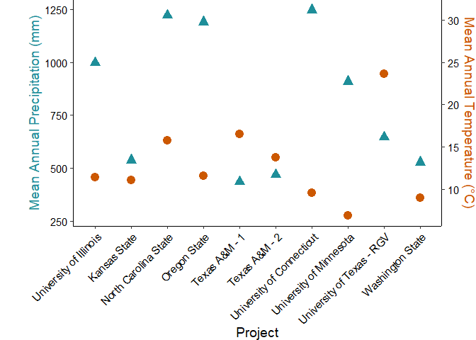<!-- -->

## Figure 1B - Soil texture triangle showing mean SSURGO texture in top horizon for each project

Make the USDA soil texture triangle to overlay:


``` r
# USDA dataset comes pre-loaded in ggtern package
data(USDA)

# rename the labels to be shorter for easier printing
USDA <- USDA %>% 
  rename("clay_pct" = Clay, "sand_pct" = Sand, "silt_pct" = Silt) %>% 
  mutate(
    label = case_when(
      Label == "Clay" ~ "C",
      Label == "Sandy Clay" ~ "SC",
      Label == "Sandy Clay Loam" ~ "SCL",
      Label == "Sandy Loam" ~ "SL",
      Label == "Loamy Sand" ~ "LS",
      Label == "Sand" ~ "S",
      Label == "Clay Loam" ~ "CL",
      Label == "Silt Loam" ~ "SiL",
      Label == "Silty Clay" ~ "SiC",
      Label == "Silty Clay Loam" ~ "SiCL",
      Label == "Silt" ~ "Si",
      Label == "Loam" ~ "L",
      TRUE ~ NA_character_
    ))
USDA_text <- USDA  %>% 
  group_by(label) %>%
  summarise_if(is.numeric, mean, na.rm = TRUE)
USDA_text
```

```
## # A tibble: 12 × 4
##    label clay_pct sand_pct silt_pct
##    <chr>    <dbl>    <dbl>    <dbl>
##  1 C       0.59     0.22     0.19  
##  2 CL      0.338    0.325    0.338 
##  3 L       0.17     0.435    0.395 
##  4 LS      0.0625   0.825    0.112 
##  5 S       0.0333   0.917    0.05  
##  6 SC      0.417    0.517    0.0667
##  7 SCL     0.275    0.575    0.15  
##  8 SL      0.0929   0.621    0.286 
##  9 Si      0.0625   0.0688   0.869 
## 10 SiC     0.467    0.0667   0.467 
## 11 SiCL    0.338    0.1      0.562 
## 12 SiL     0.133    0.167    0.7
```

Now, plot the SSURGO data on the textural triangle:


``` r
# Make a new column with both project and soil name for plotting
project_labels_df <- data.frame(project_labels) %>%
  rownames_to_column() %>%
  rename(project = rowname)

ssurgo_texture2 <- ssurgo_texture %>%
  left_join(project_labels_df, by="project") %>%
  unite("project_soil", c("project_labels", "soil"), remove=FALSE, sep=" - ")

# Plot texture with SSURGO data only, point fill color by project/soil combo
# overlay textural triangle
theme_set(theme_bw())
triangle_plot <- ggtern(ssurgo_texture2, aes(x=sand_pct, y=clay_pct, z=silt_pct, 
                                          color=project_soil)) +
  geom_polygon(data=USDA,
               aes(fill = label),
               alpha = 0.0,
               linewidth = 0.5,
               color = "black",
               show.legend = FALSE) +
  geom_text(data = USDA_text,
            aes(label = label),
            color = 'grey40',
            fontface = "bold",
            size = 5) +
  geom_point(size=4) +
  theme_showarrows() +
  labs(yarrow = "Clay (%)",
       zarrow = "Silt (%)",
       xarrow = "Sand(%)",
       x="", y="", z="",
       color = "Project")  +
  theme_clockwise() +
  scale_color_paletteer_d("rcartocolor::Safe", name="Project & Soil Series")
triangle_plot
```

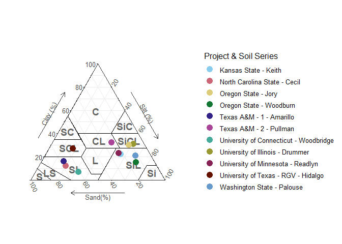<!-- -->

# Summary Figures of SOC Stocks

## Summary table of SOC stocks across projects, soils, and treatments

Mean, standard deviation, and n for SOC stocks calculated to 30 cm and
100 cm for all soils in DSP4SH projects.


``` r
soc_summary <- soc_pedon %>%
  group_by(project, soil, label) %>%
  summarize(across(soc_stock_0_30cm:soc_stock_100cm, mean_sd), n=n())
```

```
## `summarise()` has grouped output by 'project', 'soil'. You can override using
## the `.groups` argument.
```

``` r
flextable(soc_summary)
```

```{=html}
<div class="tabwid"><style>.cl-0f697686{}.cl-0f5c7850{font-family:'Arial';font-size:11pt;font-weight:normal;font-style:normal;text-decoration:none;color:rgba(0, 0, 0, 1.00);background-color:transparent;}.cl-0f62f4fa{margin:0;text-align:left;border-bottom: 0 solid rgba(0, 0, 0, 1.00);border-top: 0 solid rgba(0, 0, 0, 1.00);border-left: 0 solid rgba(0, 0, 0, 1.00);border-right: 0 solid rgba(0, 0, 0, 1.00);padding-bottom:5pt;padding-top:5pt;padding-left:5pt;padding-right:5pt;line-height: 1;background-color:transparent;}.cl-0f62f504{margin:0;text-align:right;border-bottom: 0 solid rgba(0, 0, 0, 1.00);border-top: 0 solid rgba(0, 0, 0, 1.00);border-left: 0 solid rgba(0, 0, 0, 1.00);border-right: 0 solid rgba(0, 0, 0, 1.00);padding-bottom:5pt;padding-top:5pt;padding-left:5pt;padding-right:5pt;line-height: 1;background-color:transparent;}.cl-0f630d78{width:0.75in;background-color:transparent;vertical-align: middle;border-bottom: 1.5pt solid rgba(102, 102, 102, 1.00);border-top: 1.5pt solid rgba(102, 102, 102, 1.00);border-left: 0 solid rgba(0, 0, 0, 1.00);border-right: 0 solid rgba(0, 0, 0, 1.00);margin-bottom:0;margin-top:0;margin-left:0;margin-right:0;}.cl-0f630d82{width:0.75in;background-color:transparent;vertical-align: middle;border-bottom: 1.5pt solid rgba(102, 102, 102, 1.00);border-top: 1.5pt solid rgba(102, 102, 102, 1.00);border-left: 0 solid rgba(0, 0, 0, 1.00);border-right: 0 solid rgba(0, 0, 0, 1.00);margin-bottom:0;margin-top:0;margin-left:0;margin-right:0;}.cl-0f630d8c{width:0.75in;background-color:transparent;vertical-align: middle;border-bottom: 0 solid rgba(0, 0, 0, 1.00);border-top: 0 solid rgba(0, 0, 0, 1.00);border-left: 0 solid rgba(0, 0, 0, 1.00);border-right: 0 solid rgba(0, 0, 0, 1.00);margin-bottom:0;margin-top:0;margin-left:0;margin-right:0;}.cl-0f630d8d{width:0.75in;background-color:transparent;vertical-align: middle;border-bottom: 0 solid rgba(0, 0, 0, 1.00);border-top: 0 solid rgba(0, 0, 0, 1.00);border-left: 0 solid rgba(0, 0, 0, 1.00);border-right: 0 solid rgba(0, 0, 0, 1.00);margin-bottom:0;margin-top:0;margin-left:0;margin-right:0;}.cl-0f630d8e{width:0.75in;background-color:transparent;vertical-align: middle;border-bottom: 1.5pt solid rgba(102, 102, 102, 1.00);border-top: 0 solid rgba(0, 0, 0, 1.00);border-left: 0 solid rgba(0, 0, 0, 1.00);border-right: 0 solid rgba(0, 0, 0, 1.00);margin-bottom:0;margin-top:0;margin-left:0;margin-right:0;}.cl-0f630d96{width:0.75in;background-color:transparent;vertical-align: middle;border-bottom: 1.5pt solid rgba(102, 102, 102, 1.00);border-top: 0 solid rgba(0, 0, 0, 1.00);border-left: 0 solid rgba(0, 0, 0, 1.00);border-right: 0 solid rgba(0, 0, 0, 1.00);margin-bottom:0;margin-top:0;margin-left:0;margin-right:0;}</style><table data-quarto-disable-processing='true' class='cl-0f697686'><thead><tr style="overflow-wrap:break-word;"><th class="cl-0f630d78"><p class="cl-0f62f4fa"><span class="cl-0f5c7850">project</span></p></th><th class="cl-0f630d78"><p class="cl-0f62f4fa"><span class="cl-0f5c7850">soil</span></p></th><th class="cl-0f630d78"><p class="cl-0f62f4fa"><span class="cl-0f5c7850">label</span></p></th><th class="cl-0f630d82"><p class="cl-0f62f504"><span class="cl-0f5c7850">soc_stock_0_30cm_mean</span></p></th><th class="cl-0f630d82"><p class="cl-0f62f504"><span class="cl-0f5c7850">soc_stock_0_30cm_sd</span></p></th><th class="cl-0f630d82"><p class="cl-0f62f504"><span class="cl-0f5c7850">soc_stock_30_50cm_mean</span></p></th><th class="cl-0f630d82"><p class="cl-0f62f504"><span class="cl-0f5c7850">soc_stock_30_50cm_sd</span></p></th><th class="cl-0f630d82"><p class="cl-0f62f504"><span class="cl-0f5c7850">soc_stock_50_100cm_mean</span></p></th><th class="cl-0f630d82"><p class="cl-0f62f504"><span class="cl-0f5c7850">soc_stock_50_100cm_sd</span></p></th><th class="cl-0f630d82"><p class="cl-0f62f504"><span class="cl-0f5c7850">soc_stock_100cm_mean</span></p></th><th class="cl-0f630d82"><p class="cl-0f62f504"><span class="cl-0f5c7850">soc_stock_100cm_sd</span></p></th><th class="cl-0f630d82"><p class="cl-0f62f504"><span class="cl-0f5c7850">n</span></p></th></tr></thead><tbody><tr style="overflow-wrap:break-word;"><td class="cl-0f630d8c"><p class="cl-0f62f4fa"><span class="cl-0f5c7850">Illinois</span></p></td><td class="cl-0f630d8c"><p class="cl-0f62f4fa"><span class="cl-0f5c7850">Drummer</span></p></td><td class="cl-0f630d8c"><p class="cl-0f62f4fa"><span class="cl-0f5c7850">BAU</span></p></td><td class="cl-0f630d8d"><p class="cl-0f62f504"><span class="cl-0f5c7850">93.70</span></p></td><td class="cl-0f630d8d"><p class="cl-0f62f504"><span class="cl-0f5c7850">11.65</span></p></td><td class="cl-0f630d8d"><p class="cl-0f62f504"><span class="cl-0f5c7850">37.70</span></p></td><td class="cl-0f630d8d"><p class="cl-0f62f504"><span class="cl-0f5c7850">10.12</span></p></td><td class="cl-0f630d8d"><p class="cl-0f62f504"><span class="cl-0f5c7850">41.64</span></p></td><td class="cl-0f630d8d"><p class="cl-0f62f504"><span class="cl-0f5c7850">8.21</span></p></td><td class="cl-0f630d8d"><p class="cl-0f62f504"><span class="cl-0f5c7850">171.93</span></p></td><td class="cl-0f630d8d"><p class="cl-0f62f504"><span class="cl-0f5c7850">22.63</span></p></td><td class="cl-0f630d8d"><p class="cl-0f62f504"><span class="cl-0f5c7850">16</span></p></td></tr><tr style="overflow-wrap:break-word;"><td class="cl-0f630d8c"><p class="cl-0f62f4fa"><span class="cl-0f5c7850">Illinois</span></p></td><td class="cl-0f630d8c"><p class="cl-0f62f4fa"><span class="cl-0f5c7850">Drummer</span></p></td><td class="cl-0f630d8c"><p class="cl-0f62f4fa"><span class="cl-0f5c7850">Ref</span></p></td><td class="cl-0f630d8d"><p class="cl-0f62f504"><span class="cl-0f5c7850">119.64</span></p></td><td class="cl-0f630d8d"><p class="cl-0f62f504"><span class="cl-0f5c7850">10.55</span></p></td><td class="cl-0f630d8d"><p class="cl-0f62f504"><span class="cl-0f5c7850">37.61</span></p></td><td class="cl-0f630d8d"><p class="cl-0f62f504"><span class="cl-0f5c7850">4.60</span></p></td><td class="cl-0f630d8d"><p class="cl-0f62f504"><span class="cl-0f5c7850">40.08</span></p></td><td class="cl-0f630d8d"><p class="cl-0f62f504"><span class="cl-0f5c7850">4.83</span></p></td><td class="cl-0f630d8d"><p class="cl-0f62f504"><span class="cl-0f5c7850">197.33</span></p></td><td class="cl-0f630d8d"><p class="cl-0f62f504"><span class="cl-0f5c7850">4.03</span></p></td><td class="cl-0f630d8d"><p class="cl-0f62f504"><span class="cl-0f5c7850">3</span></p></td></tr><tr style="overflow-wrap:break-word;"><td class="cl-0f630d8c"><p class="cl-0f62f4fa"><span class="cl-0f5c7850">Illinois</span></p></td><td class="cl-0f630d8c"><p class="cl-0f62f4fa"><span class="cl-0f5c7850">Drummer</span></p></td><td class="cl-0f630d8c"><p class="cl-0f62f4fa"><span class="cl-0f5c7850">SHM</span></p></td><td class="cl-0f630d8d"><p class="cl-0f62f504"><span class="cl-0f5c7850">91.78</span></p></td><td class="cl-0f630d8d"><p class="cl-0f62f504"><span class="cl-0f5c7850">22.22</span></p></td><td class="cl-0f630d8d"><p class="cl-0f62f504"><span class="cl-0f5c7850">31.91</span></p></td><td class="cl-0f630d8d"><p class="cl-0f62f504"><span class="cl-0f5c7850">11.30</span></p></td><td class="cl-0f630d8d"><p class="cl-0f62f504"><span class="cl-0f5c7850">75.64</span></p></td><td class="cl-0f630d8d"><p class="cl-0f62f504"><span class="cl-0f5c7850">72.22</span></p></td><td class="cl-0f630d8d"><p class="cl-0f62f504"><span class="cl-0f5c7850">203.73</span></p></td><td class="cl-0f630d8d"><p class="cl-0f62f504"><span class="cl-0f5c7850">81.93</span></p></td><td class="cl-0f630d8d"><p class="cl-0f62f504"><span class="cl-0f5c7850">6</span></p></td></tr><tr style="overflow-wrap:break-word;"><td class="cl-0f630d8c"><p class="cl-0f62f4fa"><span class="cl-0f5c7850">KansasState</span></p></td><td class="cl-0f630d8c"><p class="cl-0f62f4fa"><span class="cl-0f5c7850">Keith</span></p></td><td class="cl-0f630d8c"><p class="cl-0f62f4fa"><span class="cl-0f5c7850">BAU</span></p></td><td class="cl-0f630d8d"><p class="cl-0f62f504"><span class="cl-0f5c7850">52.75</span></p></td><td class="cl-0f630d8d"><p class="cl-0f62f504"><span class="cl-0f5c7850">11.65</span></p></td><td class="cl-0f630d8d"><p class="cl-0f62f504"><span class="cl-0f5c7850">20.28</span></p></td><td class="cl-0f630d8d"><p class="cl-0f62f504"><span class="cl-0f5c7850">2.99</span></p></td><td class="cl-0f630d8d"><p class="cl-0f62f504"><span class="cl-0f5c7850">43.26</span></p></td><td class="cl-0f630d8d"><p class="cl-0f62f504"><span class="cl-0f5c7850">13.67</span></p></td><td class="cl-0f630d8d"><p class="cl-0f62f504"><span class="cl-0f5c7850">116.29</span></p></td><td class="cl-0f630d8d"><p class="cl-0f62f504"><span class="cl-0f5c7850">20.80</span></p></td><td class="cl-0f630d8d"><p class="cl-0f62f504"><span class="cl-0f5c7850">9</span></p></td></tr><tr style="overflow-wrap:break-word;"><td class="cl-0f630d8c"><p class="cl-0f62f4fa"><span class="cl-0f5c7850">KansasState</span></p></td><td class="cl-0f630d8c"><p class="cl-0f62f4fa"><span class="cl-0f5c7850">Keith</span></p></td><td class="cl-0f630d8c"><p class="cl-0f62f4fa"><span class="cl-0f5c7850">Ref</span></p></td><td class="cl-0f630d8d"><p class="cl-0f62f504"><span class="cl-0f5c7850">55.82</span></p></td><td class="cl-0f630d8d"><p class="cl-0f62f504"><span class="cl-0f5c7850">9.63</span></p></td><td class="cl-0f630d8d"><p class="cl-0f62f504"><span class="cl-0f5c7850">23.66</span></p></td><td class="cl-0f630d8d"><p class="cl-0f62f504"><span class="cl-0f5c7850">8.65</span></p></td><td class="cl-0f630d8d"><p class="cl-0f62f504"><span class="cl-0f5c7850">43.27</span></p></td><td class="cl-0f630d8d"><p class="cl-0f62f504"><span class="cl-0f5c7850">8.62</span></p></td><td class="cl-0f630d8d"><p class="cl-0f62f504"><span class="cl-0f5c7850">122.75</span></p></td><td class="cl-0f630d8d"><p class="cl-0f62f504"><span class="cl-0f5c7850">21.30</span></p></td><td class="cl-0f630d8d"><p class="cl-0f62f504"><span class="cl-0f5c7850">9</span></p></td></tr><tr style="overflow-wrap:break-word;"><td class="cl-0f630d8c"><p class="cl-0f62f4fa"><span class="cl-0f5c7850">KansasState</span></p></td><td class="cl-0f630d8c"><p class="cl-0f62f4fa"><span class="cl-0f5c7850">Keith</span></p></td><td class="cl-0f630d8c"><p class="cl-0f62f4fa"><span class="cl-0f5c7850">SHM</span></p></td><td class="cl-0f630d8d"><p class="cl-0f62f504"><span class="cl-0f5c7850">38.72</span></p></td><td class="cl-0f630d8d"><p class="cl-0f62f504"><span class="cl-0f5c7850">4.57</span></p></td><td class="cl-0f630d8d"><p class="cl-0f62f504"><span class="cl-0f5c7850">16.20</span></p></td><td class="cl-0f630d8d"><p class="cl-0f62f504"><span class="cl-0f5c7850">2.33</span></p></td><td class="cl-0f630d8d"><p class="cl-0f62f504"><span class="cl-0f5c7850">34.49</span></p></td><td class="cl-0f630d8d"><p class="cl-0f62f504"><span class="cl-0f5c7850">6.87</span></p></td><td class="cl-0f630d8d"><p class="cl-0f62f504"><span class="cl-0f5c7850">89.42</span></p></td><td class="cl-0f630d8d"><p class="cl-0f62f504"><span class="cl-0f5c7850">6.17</span></p></td><td class="cl-0f630d8d"><p class="cl-0f62f504"><span class="cl-0f5c7850">6</span></p></td></tr><tr style="overflow-wrap:break-word;"><td class="cl-0f630d8c"><p class="cl-0f62f4fa"><span class="cl-0f5c7850">NCState</span></p></td><td class="cl-0f630d8c"><p class="cl-0f62f4fa"><span class="cl-0f5c7850">Cecil</span></p></td><td class="cl-0f630d8c"><p class="cl-0f62f4fa"><span class="cl-0f5c7850">BAU</span></p></td><td class="cl-0f630d8d"><p class="cl-0f62f504"><span class="cl-0f5c7850">65.22</span></p></td><td class="cl-0f630d8d"><p class="cl-0f62f504"><span class="cl-0f5c7850">21.26</span></p></td><td class="cl-0f630d8d"><p class="cl-0f62f504"><span class="cl-0f5c7850">25.77</span></p></td><td class="cl-0f630d8d"><p class="cl-0f62f504"><span class="cl-0f5c7850">17.56</span></p></td><td class="cl-0f630d8d"><p class="cl-0f62f504"><span class="cl-0f5c7850">28.02</span></p></td><td class="cl-0f630d8d"><p class="cl-0f62f504"><span class="cl-0f5c7850">17.89</span></p></td><td class="cl-0f630d8d"><p class="cl-0f62f504"><span class="cl-0f5c7850">111.81</span></p></td><td class="cl-0f630d8d"><p class="cl-0f62f504"><span class="cl-0f5c7850">49.24</span></p></td><td class="cl-0f630d8d"><p class="cl-0f62f504"><span class="cl-0f5c7850">9</span></p></td></tr><tr style="overflow-wrap:break-word;"><td class="cl-0f630d8c"><p class="cl-0f62f4fa"><span class="cl-0f5c7850">NCState</span></p></td><td class="cl-0f630d8c"><p class="cl-0f62f4fa"><span class="cl-0f5c7850">Cecil</span></p></td><td class="cl-0f630d8c"><p class="cl-0f62f4fa"><span class="cl-0f5c7850">Ref</span></p></td><td class="cl-0f630d8d"><p class="cl-0f62f504"><span class="cl-0f5c7850">45.04</span></p></td><td class="cl-0f630d8d"><p class="cl-0f62f504"><span class="cl-0f5c7850">1.57</span></p></td><td class="cl-0f630d8d"><p class="cl-0f62f504"><span class="cl-0f5c7850">11.62</span></p></td><td class="cl-0f630d8d"><p class="cl-0f62f504"><span class="cl-0f5c7850">2.57</span></p></td><td class="cl-0f630d8d"><p class="cl-0f62f504"><span class="cl-0f5c7850">13.55</span></p></td><td class="cl-0f630d8d"><p class="cl-0f62f504"><span class="cl-0f5c7850">4.18</span></p></td><td class="cl-0f630d8d"><p class="cl-0f62f504"><span class="cl-0f5c7850">70.21</span></p></td><td class="cl-0f630d8d"><p class="cl-0f62f504"><span class="cl-0f5c7850">8.32</span></p></td><td class="cl-0f630d8d"><p class="cl-0f62f504"><span class="cl-0f5c7850">2</span></p></td></tr><tr style="overflow-wrap:break-word;"><td class="cl-0f630d8c"><p class="cl-0f62f4fa"><span class="cl-0f5c7850">NCState</span></p></td><td class="cl-0f630d8c"><p class="cl-0f62f4fa"><span class="cl-0f5c7850">Cecil</span></p></td><td class="cl-0f630d8c"><p class="cl-0f62f4fa"><span class="cl-0f5c7850">SHM</span></p></td><td class="cl-0f630d8d"><p class="cl-0f62f504"><span class="cl-0f5c7850">56.20</span></p></td><td class="cl-0f630d8d"><p class="cl-0f62f504"><span class="cl-0f5c7850">17.59</span></p></td><td class="cl-0f630d8d"><p class="cl-0f62f504"><span class="cl-0f5c7850">17.78</span></p></td><td class="cl-0f630d8d"><p class="cl-0f62f504"><span class="cl-0f5c7850">5.09</span></p></td><td class="cl-0f630d8d"><p class="cl-0f62f504"><span class="cl-0f5c7850">19.17</span></p></td><td class="cl-0f630d8d"><p class="cl-0f62f504"><span class="cl-0f5c7850">4.86</span></p></td><td class="cl-0f630d8d"><p class="cl-0f62f504"><span class="cl-0f5c7850">92.70</span></p></td><td class="cl-0f630d8d"><p class="cl-0f62f504"><span class="cl-0f5c7850">20.25</span></p></td><td class="cl-0f630d8d"><p class="cl-0f62f504"><span class="cl-0f5c7850">9</span></p></td></tr><tr style="overflow-wrap:break-word;"><td class="cl-0f630d8c"><p class="cl-0f62f4fa"><span class="cl-0f5c7850">OregonState</span></p></td><td class="cl-0f630d8c"><p class="cl-0f62f4fa"><span class="cl-0f5c7850">Jory</span></p></td><td class="cl-0f630d8c"><p class="cl-0f62f4fa"><span class="cl-0f5c7850">BAU</span></p></td><td class="cl-0f630d8d"><p class="cl-0f62f504"><span class="cl-0f5c7850">93.50</span></p></td><td class="cl-0f630d8d"><p class="cl-0f62f504"><span class="cl-0f5c7850">18.58</span></p></td><td class="cl-0f630d8d"><p class="cl-0f62f504"><span class="cl-0f5c7850">38.54</span></p></td><td class="cl-0f630d8d"><p class="cl-0f62f504"><span class="cl-0f5c7850">8.02</span></p></td><td class="cl-0f630d8d"><p class="cl-0f62f504"><span class="cl-0f5c7850">53.36</span></p></td><td class="cl-0f630d8d"><p class="cl-0f62f504"><span class="cl-0f5c7850">15.40</span></p></td><td class="cl-0f630d8d"><p class="cl-0f62f504"><span class="cl-0f5c7850">185.40</span></p></td><td class="cl-0f630d8d"><p class="cl-0f62f504"><span class="cl-0f5c7850">32.87</span></p></td><td class="cl-0f630d8d"><p class="cl-0f62f504"><span class="cl-0f5c7850">9</span></p></td></tr><tr style="overflow-wrap:break-word;"><td class="cl-0f630d8c"><p class="cl-0f62f4fa"><span class="cl-0f5c7850">OregonState</span></p></td><td class="cl-0f630d8c"><p class="cl-0f62f4fa"><span class="cl-0f5c7850">Jory</span></p></td><td class="cl-0f630d8c"><p class="cl-0f62f4fa"><span class="cl-0f5c7850">Ref</span></p></td><td class="cl-0f630d8d"><p class="cl-0f62f504"><span class="cl-0f5c7850">114.66</span></p></td><td class="cl-0f630d8d"><p class="cl-0f62f504"><span class="cl-0f5c7850">29.74</span></p></td><td class="cl-0f630d8d"><p class="cl-0f62f504"><span class="cl-0f5c7850">56.89</span></p></td><td class="cl-0f630d8d"><p class="cl-0f62f504"><span class="cl-0f5c7850">19.67</span></p></td><td class="cl-0f630d8d"><p class="cl-0f62f504"><span class="cl-0f5c7850">63.09</span></p></td><td class="cl-0f630d8d"><p class="cl-0f62f504"><span class="cl-0f5c7850">20.58</span></p></td><td class="cl-0f630d8d"><p class="cl-0f62f504"><span class="cl-0f5c7850">234.64</span></p></td><td class="cl-0f630d8d"><p class="cl-0f62f504"><span class="cl-0f5c7850">60.35</span></p></td><td class="cl-0f630d8d"><p class="cl-0f62f504"><span class="cl-0f5c7850">9</span></p></td></tr><tr style="overflow-wrap:break-word;"><td class="cl-0f630d8c"><p class="cl-0f62f4fa"><span class="cl-0f5c7850">OregonState</span></p></td><td class="cl-0f630d8c"><p class="cl-0f62f4fa"><span class="cl-0f5c7850">Jory</span></p></td><td class="cl-0f630d8c"><p class="cl-0f62f4fa"><span class="cl-0f5c7850">SHM</span></p></td><td class="cl-0f630d8d"><p class="cl-0f62f504"><span class="cl-0f5c7850">79.29</span></p></td><td class="cl-0f630d8d"><p class="cl-0f62f504"><span class="cl-0f5c7850">17.92</span></p></td><td class="cl-0f630d8d"><p class="cl-0f62f504"><span class="cl-0f5c7850">37.76</span></p></td><td class="cl-0f630d8d"><p class="cl-0f62f504"><span class="cl-0f5c7850">12.25</span></p></td><td class="cl-0f630d8d"><p class="cl-0f62f504"><span class="cl-0f5c7850">65.78</span></p></td><td class="cl-0f630d8d"><p class="cl-0f62f504"><span class="cl-0f5c7850">22.45</span></p></td><td class="cl-0f630d8d"><p class="cl-0f62f504"><span class="cl-0f5c7850">182.82</span></p></td><td class="cl-0f630d8d"><p class="cl-0f62f504"><span class="cl-0f5c7850">48.83</span></p></td><td class="cl-0f630d8d"><p class="cl-0f62f504"><span class="cl-0f5c7850">9</span></p></td></tr><tr style="overflow-wrap:break-word;"><td class="cl-0f630d8c"><p class="cl-0f62f4fa"><span class="cl-0f5c7850">OregonState</span></p></td><td class="cl-0f630d8c"><p class="cl-0f62f4fa"><span class="cl-0f5c7850">Woodburn</span></p></td><td class="cl-0f630d8c"><p class="cl-0f62f4fa"><span class="cl-0f5c7850">BAU</span></p></td><td class="cl-0f630d8d"><p class="cl-0f62f504"><span class="cl-0f5c7850">64.17</span></p></td><td class="cl-0f630d8d"><p class="cl-0f62f504"><span class="cl-0f5c7850">17.14</span></p></td><td class="cl-0f630d8d"><p class="cl-0f62f504"><span class="cl-0f5c7850">22.37</span></p></td><td class="cl-0f630d8d"><p class="cl-0f62f504"><span class="cl-0f5c7850">11.94</span></p></td><td class="cl-0f630d8d"><p class="cl-0f62f504"><span class="cl-0f5c7850">27.35</span></p></td><td class="cl-0f630d8d"><p class="cl-0f62f504"><span class="cl-0f5c7850">12.71</span></p></td><td class="cl-0f630d8d"><p class="cl-0f62f504"><span class="cl-0f5c7850">113.88</span></p></td><td class="cl-0f630d8d"><p class="cl-0f62f504"><span class="cl-0f5c7850">41.19</span></p></td><td class="cl-0f630d8d"><p class="cl-0f62f504"><span class="cl-0f5c7850">9</span></p></td></tr><tr style="overflow-wrap:break-word;"><td class="cl-0f630d8c"><p class="cl-0f62f4fa"><span class="cl-0f5c7850">OregonState</span></p></td><td class="cl-0f630d8c"><p class="cl-0f62f4fa"><span class="cl-0f5c7850">Woodburn</span></p></td><td class="cl-0f630d8c"><p class="cl-0f62f4fa"><span class="cl-0f5c7850">Ref</span></p></td><td class="cl-0f630d8d"><p class="cl-0f62f504"><span class="cl-0f5c7850">67.94</span></p></td><td class="cl-0f630d8d"><p class="cl-0f62f504"><span class="cl-0f5c7850">17.20</span></p></td><td class="cl-0f630d8d"><p class="cl-0f62f504"><span class="cl-0f5c7850">22.22</span></p></td><td class="cl-0f630d8d"><p class="cl-0f62f504"><span class="cl-0f5c7850">8.25</span></p></td><td class="cl-0f630d8d"><p class="cl-0f62f504"><span class="cl-0f5c7850">22.05</span></p></td><td class="cl-0f630d8d"><p class="cl-0f62f504"><span class="cl-0f5c7850">6.71</span></p></td><td class="cl-0f630d8d"><p class="cl-0f62f504"><span class="cl-0f5c7850">112.20</span></p></td><td class="cl-0f630d8d"><p class="cl-0f62f504"><span class="cl-0f5c7850">26.85</span></p></td><td class="cl-0f630d8d"><p class="cl-0f62f504"><span class="cl-0f5c7850">9</span></p></td></tr><tr style="overflow-wrap:break-word;"><td class="cl-0f630d8c"><p class="cl-0f62f4fa"><span class="cl-0f5c7850">OregonState</span></p></td><td class="cl-0f630d8c"><p class="cl-0f62f4fa"><span class="cl-0f5c7850">Woodburn</span></p></td><td class="cl-0f630d8c"><p class="cl-0f62f4fa"><span class="cl-0f5c7850">SHM</span></p></td><td class="cl-0f630d8d"><p class="cl-0f62f504"><span class="cl-0f5c7850">69.31</span></p></td><td class="cl-0f630d8d"><p class="cl-0f62f504"><span class="cl-0f5c7850">8.73</span></p></td><td class="cl-0f630d8d"><p class="cl-0f62f504"><span class="cl-0f5c7850">21.96</span></p></td><td class="cl-0f630d8d"><p class="cl-0f62f504"><span class="cl-0f5c7850">5.93</span></p></td><td class="cl-0f630d8d"><p class="cl-0f62f504"><span class="cl-0f5c7850">32.27</span></p></td><td class="cl-0f630d8d"><p class="cl-0f62f504"><span class="cl-0f5c7850">5.32</span></p></td><td class="cl-0f630d8d"><p class="cl-0f62f504"><span class="cl-0f5c7850">123.53</span></p></td><td class="cl-0f630d8d"><p class="cl-0f62f504"><span class="cl-0f5c7850">17.31</span></p></td><td class="cl-0f630d8d"><p class="cl-0f62f504"><span class="cl-0f5c7850">9</span></p></td></tr><tr style="overflow-wrap:break-word;"><td class="cl-0f630d8c"><p class="cl-0f62f4fa"><span class="cl-0f5c7850">TexasA&amp;MPt-1</span></p></td><td class="cl-0f630d8c"><p class="cl-0f62f4fa"><span class="cl-0f5c7850">Amarillo</span></p></td><td class="cl-0f630d8c"><p class="cl-0f62f4fa"><span class="cl-0f5c7850">BAU</span></p></td><td class="cl-0f630d8d"><p class="cl-0f62f504"><span class="cl-0f5c7850">8.07</span></p></td><td class="cl-0f630d8d"><p class="cl-0f62f504"><span class="cl-0f5c7850">1.41</span></p></td><td class="cl-0f630d8d"><p class="cl-0f62f504"><span class="cl-0f5c7850">5.33</span></p></td><td class="cl-0f630d8d"><p class="cl-0f62f504"><span class="cl-0f5c7850">0.72</span></p></td><td class="cl-0f630d8d"><p class="cl-0f62f504"><span class="cl-0f5c7850">11.82</span></p></td><td class="cl-0f630d8d"><p class="cl-0f62f504"><span class="cl-0f5c7850">2.02</span></p></td><td class="cl-0f630d8d"><p class="cl-0f62f504"><span class="cl-0f5c7850">25.21</span></p></td><td class="cl-0f630d8d"><p class="cl-0f62f504"><span class="cl-0f5c7850">2.97</span></p></td><td class="cl-0f630d8d"><p class="cl-0f62f504"><span class="cl-0f5c7850">9</span></p></td></tr><tr style="overflow-wrap:break-word;"><td class="cl-0f630d8c"><p class="cl-0f62f4fa"><span class="cl-0f5c7850">TexasA&amp;MPt-1</span></p></td><td class="cl-0f630d8c"><p class="cl-0f62f4fa"><span class="cl-0f5c7850">Amarillo</span></p></td><td class="cl-0f630d8c"><p class="cl-0f62f4fa"><span class="cl-0f5c7850">Ref</span></p></td><td class="cl-0f630d8d"><p class="cl-0f62f504"><span class="cl-0f5c7850">11.92</span></p></td><td class="cl-0f630d8d"><p class="cl-0f62f504"><span class="cl-0f5c7850">1.77</span></p></td><td class="cl-0f630d8d"><p class="cl-0f62f504"><span class="cl-0f5c7850">7.14</span></p></td><td class="cl-0f630d8d"><p class="cl-0f62f504"><span class="cl-0f5c7850">1.69</span></p></td><td class="cl-0f630d8d"><p class="cl-0f62f504"><span class="cl-0f5c7850">19.25</span></p></td><td class="cl-0f630d8d"><p class="cl-0f62f504"><span class="cl-0f5c7850">2.40</span></p></td><td class="cl-0f630d8d"><p class="cl-0f62f504"><span class="cl-0f5c7850">38.31</span></p></td><td class="cl-0f630d8d"><p class="cl-0f62f504"><span class="cl-0f5c7850">2.01</span></p></td><td class="cl-0f630d8d"><p class="cl-0f62f504"><span class="cl-0f5c7850">3</span></p></td></tr><tr style="overflow-wrap:break-word;"><td class="cl-0f630d8c"><p class="cl-0f62f4fa"><span class="cl-0f5c7850">TexasA&amp;MPt-1</span></p></td><td class="cl-0f630d8c"><p class="cl-0f62f4fa"><span class="cl-0f5c7850">Amarillo</span></p></td><td class="cl-0f630d8c"><p class="cl-0f62f4fa"><span class="cl-0f5c7850">SHM</span></p></td><td class="cl-0f630d8d"><p class="cl-0f62f504"><span class="cl-0f5c7850">12.15</span></p></td><td class="cl-0f630d8d"><p class="cl-0f62f504"><span class="cl-0f5c7850">1.65</span></p></td><td class="cl-0f630d8d"><p class="cl-0f62f504"><span class="cl-0f5c7850">5.34</span></p></td><td class="cl-0f630d8d"><p class="cl-0f62f504"><span class="cl-0f5c7850">1.08</span></p></td><td class="cl-0f630d8d"><p class="cl-0f62f504"><span class="cl-0f5c7850">13.38</span></p></td><td class="cl-0f630d8d"><p class="cl-0f62f504"><span class="cl-0f5c7850">3.67</span></p></td><td class="cl-0f630d8d"><p class="cl-0f62f504"><span class="cl-0f5c7850">30.87</span></p></td><td class="cl-0f630d8d"><p class="cl-0f62f504"><span class="cl-0f5c7850">5.72</span></p></td><td class="cl-0f630d8d"><p class="cl-0f62f504"><span class="cl-0f5c7850">18</span></p></td></tr><tr style="overflow-wrap:break-word;"><td class="cl-0f630d8c"><p class="cl-0f62f4fa"><span class="cl-0f5c7850">TexasA&amp;MPt-2</span></p></td><td class="cl-0f630d8c"><p class="cl-0f62f4fa"><span class="cl-0f5c7850">Pullman</span></p></td><td class="cl-0f630d8c"><p class="cl-0f62f4fa"><span class="cl-0f5c7850">BAU</span></p></td><td class="cl-0f630d8d"><p class="cl-0f62f504"><span class="cl-0f5c7850"></span></p></td><td class="cl-0f630d8d"><p class="cl-0f62f504"><span class="cl-0f5c7850"></span></p></td><td class="cl-0f630d8d"><p class="cl-0f62f504"><span class="cl-0f5c7850"></span></p></td><td class="cl-0f630d8d"><p class="cl-0f62f504"><span class="cl-0f5c7850"></span></p></td><td class="cl-0f630d8d"><p class="cl-0f62f504"><span class="cl-0f5c7850"></span></p></td><td class="cl-0f630d8d"><p class="cl-0f62f504"><span class="cl-0f5c7850"></span></p></td><td class="cl-0f630d8d"><p class="cl-0f62f504"><span class="cl-0f5c7850"></span></p></td><td class="cl-0f630d8d"><p class="cl-0f62f504"><span class="cl-0f5c7850"></span></p></td><td class="cl-0f630d8d"><p class="cl-0f62f504"><span class="cl-0f5c7850">9</span></p></td></tr><tr style="overflow-wrap:break-word;"><td class="cl-0f630d8c"><p class="cl-0f62f4fa"><span class="cl-0f5c7850">TexasA&amp;MPt-2</span></p></td><td class="cl-0f630d8c"><p class="cl-0f62f4fa"><span class="cl-0f5c7850">Pullman</span></p></td><td class="cl-0f630d8c"><p class="cl-0f62f4fa"><span class="cl-0f5c7850">Ref</span></p></td><td class="cl-0f630d8d"><p class="cl-0f62f504"><span class="cl-0f5c7850"></span></p></td><td class="cl-0f630d8d"><p class="cl-0f62f504"><span class="cl-0f5c7850"></span></p></td><td class="cl-0f630d8d"><p class="cl-0f62f504"><span class="cl-0f5c7850"></span></p></td><td class="cl-0f630d8d"><p class="cl-0f62f504"><span class="cl-0f5c7850"></span></p></td><td class="cl-0f630d8d"><p class="cl-0f62f504"><span class="cl-0f5c7850"></span></p></td><td class="cl-0f630d8d"><p class="cl-0f62f504"><span class="cl-0f5c7850"></span></p></td><td class="cl-0f630d8d"><p class="cl-0f62f504"><span class="cl-0f5c7850"></span></p></td><td class="cl-0f630d8d"><p class="cl-0f62f504"><span class="cl-0f5c7850"></span></p></td><td class="cl-0f630d8d"><p class="cl-0f62f504"><span class="cl-0f5c7850">6</span></p></td></tr><tr style="overflow-wrap:break-word;"><td class="cl-0f630d8c"><p class="cl-0f62f4fa"><span class="cl-0f5c7850">TexasA&amp;MPt-2</span></p></td><td class="cl-0f630d8c"><p class="cl-0f62f4fa"><span class="cl-0f5c7850">Pullman</span></p></td><td class="cl-0f630d8c"><p class="cl-0f62f4fa"><span class="cl-0f5c7850">SHM</span></p></td><td class="cl-0f630d8d"><p class="cl-0f62f504"><span class="cl-0f5c7850"></span></p></td><td class="cl-0f630d8d"><p class="cl-0f62f504"><span class="cl-0f5c7850"></span></p></td><td class="cl-0f630d8d"><p class="cl-0f62f504"><span class="cl-0f5c7850"></span></p></td><td class="cl-0f630d8d"><p class="cl-0f62f504"><span class="cl-0f5c7850"></span></p></td><td class="cl-0f630d8d"><p class="cl-0f62f504"><span class="cl-0f5c7850"></span></p></td><td class="cl-0f630d8d"><p class="cl-0f62f504"><span class="cl-0f5c7850"></span></p></td><td class="cl-0f630d8d"><p class="cl-0f62f504"><span class="cl-0f5c7850"></span></p></td><td class="cl-0f630d8d"><p class="cl-0f62f504"><span class="cl-0f5c7850"></span></p></td><td class="cl-0f630d8d"><p class="cl-0f62f504"><span class="cl-0f5c7850">9</span></p></td></tr><tr style="overflow-wrap:break-word;"><td class="cl-0f630d8c"><p class="cl-0f62f4fa"><span class="cl-0f5c7850">UConn</span></p></td><td class="cl-0f630d8c"><p class="cl-0f62f4fa"><span class="cl-0f5c7850">Canton</span></p></td><td class="cl-0f630d8c"><p class="cl-0f62f4fa"><span class="cl-0f5c7850">Ref</span></p></td><td class="cl-0f630d8d"><p class="cl-0f62f504"><span class="cl-0f5c7850"></span></p></td><td class="cl-0f630d8d"><p class="cl-0f62f504"><span class="cl-0f5c7850"></span></p></td><td class="cl-0f630d8d"><p class="cl-0f62f504"><span class="cl-0f5c7850"></span></p></td><td class="cl-0f630d8d"><p class="cl-0f62f504"><span class="cl-0f5c7850"></span></p></td><td class="cl-0f630d8d"><p class="cl-0f62f504"><span class="cl-0f5c7850"></span></p></td><td class="cl-0f630d8d"><p class="cl-0f62f504"><span class="cl-0f5c7850"></span></p></td><td class="cl-0f630d8d"><p class="cl-0f62f504"><span class="cl-0f5c7850"></span></p></td><td class="cl-0f630d8d"><p class="cl-0f62f504"><span class="cl-0f5c7850"></span></p></td><td class="cl-0f630d8d"><p class="cl-0f62f504"><span class="cl-0f5c7850">1</span></p></td></tr><tr style="overflow-wrap:break-word;"><td class="cl-0f630d8c"><p class="cl-0f62f4fa"><span class="cl-0f5c7850">UConn</span></p></td><td class="cl-0f630d8c"><p class="cl-0f62f4fa"><span class="cl-0f5c7850">Canton</span></p></td><td class="cl-0f630d8c"><p class="cl-0f62f4fa"><span class="cl-0f5c7850">SHM</span></p></td><td class="cl-0f630d8d"><p class="cl-0f62f504"><span class="cl-0f5c7850">77.16</span></p></td><td class="cl-0f630d8d"><p class="cl-0f62f504"><span class="cl-0f5c7850"></span></p></td><td class="cl-0f630d8d"><p class="cl-0f62f504"><span class="cl-0f5c7850">38.31</span></p></td><td class="cl-0f630d8d"><p class="cl-0f62f504"><span class="cl-0f5c7850"></span></p></td><td class="cl-0f630d8d"><p class="cl-0f62f504"><span class="cl-0f5c7850"></span></p></td><td class="cl-0f630d8d"><p class="cl-0f62f504"><span class="cl-0f5c7850"></span></p></td><td class="cl-0f630d8d"><p class="cl-0f62f504"><span class="cl-0f5c7850"></span></p></td><td class="cl-0f630d8d"><p class="cl-0f62f504"><span class="cl-0f5c7850"></span></p></td><td class="cl-0f630d8d"><p class="cl-0f62f504"><span class="cl-0f5c7850">1</span></p></td></tr><tr style="overflow-wrap:break-word;"><td class="cl-0f630d8c"><p class="cl-0f62f4fa"><span class="cl-0f5c7850">UConn</span></p></td><td class="cl-0f630d8c"><p class="cl-0f62f4fa"><span class="cl-0f5c7850">Woodbridge</span></p></td><td class="cl-0f630d8c"><p class="cl-0f62f4fa"><span class="cl-0f5c7850">BAU</span></p></td><td class="cl-0f630d8d"><p class="cl-0f62f504"><span class="cl-0f5c7850">69.00</span></p></td><td class="cl-0f630d8d"><p class="cl-0f62f504"><span class="cl-0f5c7850"></span></p></td><td class="cl-0f630d8d"><p class="cl-0f62f504"><span class="cl-0f5c7850">10.26</span></p></td><td class="cl-0f630d8d"><p class="cl-0f62f504"><span class="cl-0f5c7850"></span></p></td><td class="cl-0f630d8d"><p class="cl-0f62f504"><span class="cl-0f5c7850">21.43</span></p></td><td class="cl-0f630d8d"><p class="cl-0f62f504"><span class="cl-0f5c7850"></span></p></td><td class="cl-0f630d8d"><p class="cl-0f62f504"><span class="cl-0f5c7850">100.68</span></p></td><td class="cl-0f630d8d"><p class="cl-0f62f504"><span class="cl-0f5c7850"></span></p></td><td class="cl-0f630d8d"><p class="cl-0f62f504"><span class="cl-0f5c7850">1</span></p></td></tr><tr style="overflow-wrap:break-word;"><td class="cl-0f630d8c"><p class="cl-0f62f4fa"><span class="cl-0f5c7850">UConn</span></p></td><td class="cl-0f630d8c"><p class="cl-0f62f4fa"><span class="cl-0f5c7850">Woodbridge</span></p></td><td class="cl-0f630d8c"><p class="cl-0f62f4fa"><span class="cl-0f5c7850">Ref</span></p></td><td class="cl-0f630d8d"><p class="cl-0f62f504"><span class="cl-0f5c7850">141.11</span></p></td><td class="cl-0f630d8d"><p class="cl-0f62f504"><span class="cl-0f5c7850">22.13</span></p></td><td class="cl-0f630d8d"><p class="cl-0f62f504"><span class="cl-0f5c7850">15.86</span></p></td><td class="cl-0f630d8d"><p class="cl-0f62f504"><span class="cl-0f5c7850">5.11</span></p></td><td class="cl-0f630d8d"><p class="cl-0f62f504"><span class="cl-0f5c7850">28.48</span></p></td><td class="cl-0f630d8d"><p class="cl-0f62f504"><span class="cl-0f5c7850">4.16</span></p></td><td class="cl-0f630d8d"><p class="cl-0f62f504"><span class="cl-0f5c7850">208.18</span></p></td><td class="cl-0f630d8d"><p class="cl-0f62f504"><span class="cl-0f5c7850">16.35</span></p></td><td class="cl-0f630d8d"><p class="cl-0f62f504"><span class="cl-0f5c7850">4</span></p></td></tr><tr style="overflow-wrap:break-word;"><td class="cl-0f630d8c"><p class="cl-0f62f4fa"><span class="cl-0f5c7850">UConn</span></p></td><td class="cl-0f630d8c"><p class="cl-0f62f4fa"><span class="cl-0f5c7850">Woodbridge</span></p></td><td class="cl-0f630d8c"><p class="cl-0f62f4fa"><span class="cl-0f5c7850">SHM</span></p></td><td class="cl-0f630d8d"><p class="cl-0f62f504"><span class="cl-0f5c7850">92.77</span></p></td><td class="cl-0f630d8d"><p class="cl-0f62f504"><span class="cl-0f5c7850">10.21</span></p></td><td class="cl-0f630d8d"><p class="cl-0f62f504"><span class="cl-0f5c7850">14.73</span></p></td><td class="cl-0f630d8d"><p class="cl-0f62f504"><span class="cl-0f5c7850">2.28</span></p></td><td class="cl-0f630d8d"><p class="cl-0f62f504"><span class="cl-0f5c7850">20.61</span></p></td><td class="cl-0f630d8d"><p class="cl-0f62f504"><span class="cl-0f5c7850"></span></p></td><td class="cl-0f630d8d"><p class="cl-0f62f504"><span class="cl-0f5c7850">119.32</span></p></td><td class="cl-0f630d8d"><p class="cl-0f62f504"><span class="cl-0f5c7850"></span></p></td><td class="cl-0f630d8d"><p class="cl-0f62f504"><span class="cl-0f5c7850">5</span></p></td></tr><tr style="overflow-wrap:break-word;"><td class="cl-0f630d8c"><p class="cl-0f62f4fa"><span class="cl-0f5c7850">UTRGV</span></p></td><td class="cl-0f630d8c"><p class="cl-0f62f4fa"><span class="cl-0f5c7850">Hidalgo</span></p></td><td class="cl-0f630d8c"><p class="cl-0f62f4fa"><span class="cl-0f5c7850">BAU</span></p></td><td class="cl-0f630d8d"><p class="cl-0f62f504"><span class="cl-0f5c7850">53.53</span></p></td><td class="cl-0f630d8d"><p class="cl-0f62f504"><span class="cl-0f5c7850">20.09</span></p></td><td class="cl-0f630d8d"><p class="cl-0f62f504"><span class="cl-0f5c7850">26.55</span></p></td><td class="cl-0f630d8d"><p class="cl-0f62f504"><span class="cl-0f5c7850">12.26</span></p></td><td class="cl-0f630d8d"><p class="cl-0f62f504"><span class="cl-0f5c7850">50.20</span></p></td><td class="cl-0f630d8d"><p class="cl-0f62f504"><span class="cl-0f5c7850">31.42</span></p></td><td class="cl-0f630d8d"><p class="cl-0f62f504"><span class="cl-0f5c7850">130.28</span></p></td><td class="cl-0f630d8d"><p class="cl-0f62f504"><span class="cl-0f5c7850">59.54</span></p></td><td class="cl-0f630d8d"><p class="cl-0f62f504"><span class="cl-0f5c7850">27</span></p></td></tr><tr style="overflow-wrap:break-word;"><td class="cl-0f630d8c"><p class="cl-0f62f4fa"><span class="cl-0f5c7850">UTRGV</span></p></td><td class="cl-0f630d8c"><p class="cl-0f62f4fa"><span class="cl-0f5c7850">Hidalgo</span></p></td><td class="cl-0f630d8c"><p class="cl-0f62f4fa"><span class="cl-0f5c7850">Ref</span></p></td><td class="cl-0f630d8d"><p class="cl-0f62f504"><span class="cl-0f5c7850">93.15</span></p></td><td class="cl-0f630d8d"><p class="cl-0f62f504"><span class="cl-0f5c7850">36.21</span></p></td><td class="cl-0f630d8d"><p class="cl-0f62f504"><span class="cl-0f5c7850">34.48</span></p></td><td class="cl-0f630d8d"><p class="cl-0f62f504"><span class="cl-0f5c7850">19.75</span></p></td><td class="cl-0f630d8d"><p class="cl-0f62f504"><span class="cl-0f5c7850">48.37</span></p></td><td class="cl-0f630d8d"><p class="cl-0f62f504"><span class="cl-0f5c7850">18.79</span></p></td><td class="cl-0f630d8d"><p class="cl-0f62f504"><span class="cl-0f5c7850">176.00</span></p></td><td class="cl-0f630d8d"><p class="cl-0f62f504"><span class="cl-0f5c7850">58.70</span></p></td><td class="cl-0f630d8d"><p class="cl-0f62f504"><span class="cl-0f5c7850">6</span></p></td></tr><tr style="overflow-wrap:break-word;"><td class="cl-0f630d8c"><p class="cl-0f62f4fa"><span class="cl-0f5c7850">UnivOfMinnesota</span></p></td><td class="cl-0f630d8c"><p class="cl-0f62f4fa"><span class="cl-0f5c7850">Kenyon</span></p></td><td class="cl-0f630d8c"><p class="cl-0f62f4fa"><span class="cl-0f5c7850">Ref</span></p></td><td class="cl-0f630d8d"><p class="cl-0f62f504"><span class="cl-0f5c7850">123.36</span></p></td><td class="cl-0f630d8d"><p class="cl-0f62f504"><span class="cl-0f5c7850">12.69</span></p></td><td class="cl-0f630d8d"><p class="cl-0f62f504"><span class="cl-0f5c7850">75.07</span></p></td><td class="cl-0f630d8d"><p class="cl-0f62f504"><span class="cl-0f5c7850">9.19</span></p></td><td class="cl-0f630d8d"><p class="cl-0f62f504"><span class="cl-0f5c7850">99.48</span></p></td><td class="cl-0f630d8d"><p class="cl-0f62f504"><span class="cl-0f5c7850">31.37</span></p></td><td class="cl-0f630d8d"><p class="cl-0f62f504"><span class="cl-0f5c7850">297.91</span></p></td><td class="cl-0f630d8d"><p class="cl-0f62f504"><span class="cl-0f5c7850">38.93</span></p></td><td class="cl-0f630d8d"><p class="cl-0f62f504"><span class="cl-0f5c7850">9</span></p></td></tr><tr style="overflow-wrap:break-word;"><td class="cl-0f630d8c"><p class="cl-0f62f4fa"><span class="cl-0f5c7850">UnivOfMinnesota</span></p></td><td class="cl-0f630d8c"><p class="cl-0f62f4fa"><span class="cl-0f5c7850">Marquis</span></p></td><td class="cl-0f630d8c"><p class="cl-0f62f4fa"><span class="cl-0f5c7850">SHM</span></p></td><td class="cl-0f630d8d"><p class="cl-0f62f504"><span class="cl-0f5c7850">110.97</span></p></td><td class="cl-0f630d8d"><p class="cl-0f62f504"><span class="cl-0f5c7850">15.61</span></p></td><td class="cl-0f630d8d"><p class="cl-0f62f504"><span class="cl-0f5c7850">39.38</span></p></td><td class="cl-0f630d8d"><p class="cl-0f62f504"><span class="cl-0f5c7850">14.55</span></p></td><td class="cl-0f630d8d"><p class="cl-0f62f504"><span class="cl-0f5c7850">46.98</span></p></td><td class="cl-0f630d8d"><p class="cl-0f62f504"><span class="cl-0f5c7850">22.29</span></p></td><td class="cl-0f630d8d"><p class="cl-0f62f504"><span class="cl-0f5c7850">197.33</span></p></td><td class="cl-0f630d8d"><p class="cl-0f62f504"><span class="cl-0f5c7850">40.57</span></p></td><td class="cl-0f630d8d"><p class="cl-0f62f504"><span class="cl-0f5c7850">9</span></p></td></tr><tr style="overflow-wrap:break-word;"><td class="cl-0f630d8c"><p class="cl-0f62f4fa"><span class="cl-0f5c7850">UnivOfMinnesota</span></p></td><td class="cl-0f630d8c"><p class="cl-0f62f4fa"><span class="cl-0f5c7850">Readlyn</span></p></td><td class="cl-0f630d8c"><p class="cl-0f62f4fa"><span class="cl-0f5c7850">BAU</span></p></td><td class="cl-0f630d8d"><p class="cl-0f62f504"><span class="cl-0f5c7850">90.41</span></p></td><td class="cl-0f630d8d"><p class="cl-0f62f504"><span class="cl-0f5c7850">11.21</span></p></td><td class="cl-0f630d8d"><p class="cl-0f62f504"><span class="cl-0f5c7850">25.94</span></p></td><td class="cl-0f630d8d"><p class="cl-0f62f504"><span class="cl-0f5c7850">4.72</span></p></td><td class="cl-0f630d8d"><p class="cl-0f62f504"><span class="cl-0f5c7850">37.42</span></p></td><td class="cl-0f630d8d"><p class="cl-0f62f504"><span class="cl-0f5c7850">12.35</span></p></td><td class="cl-0f630d8d"><p class="cl-0f62f504"><span class="cl-0f5c7850">153.76</span></p></td><td class="cl-0f630d8d"><p class="cl-0f62f504"><span class="cl-0f5c7850">16.82</span></p></td><td class="cl-0f630d8d"><p class="cl-0f62f504"><span class="cl-0f5c7850">9</span></p></td></tr><tr style="overflow-wrap:break-word;"><td class="cl-0f630d8c"><p class="cl-0f62f4fa"><span class="cl-0f5c7850">WashingtonState</span></p></td><td class="cl-0f630d8c"><p class="cl-0f62f4fa"><span class="cl-0f5c7850">Palouse</span></p></td><td class="cl-0f630d8c"><p class="cl-0f62f4fa"><span class="cl-0f5c7850">BAU</span></p></td><td class="cl-0f630d8d"><p class="cl-0f62f504"><span class="cl-0f5c7850">44.27</span></p></td><td class="cl-0f630d8d"><p class="cl-0f62f504"><span class="cl-0f5c7850">14.40</span></p></td><td class="cl-0f630d8d"><p class="cl-0f62f504"><span class="cl-0f5c7850">23.09</span></p></td><td class="cl-0f630d8d"><p class="cl-0f62f504"><span class="cl-0f5c7850">10.13</span></p></td><td class="cl-0f630d8d"><p class="cl-0f62f504"><span class="cl-0f5c7850">51.55</span></p></td><td class="cl-0f630d8d"><p class="cl-0f62f504"><span class="cl-0f5c7850">32.84</span></p></td><td class="cl-0f630d8d"><p class="cl-0f62f504"><span class="cl-0f5c7850">118.91</span></p></td><td class="cl-0f630d8d"><p class="cl-0f62f504"><span class="cl-0f5c7850">54.72</span></p></td><td class="cl-0f630d8d"><p class="cl-0f62f504"><span class="cl-0f5c7850">9</span></p></td></tr><tr style="overflow-wrap:break-word;"><td class="cl-0f630d8c"><p class="cl-0f62f4fa"><span class="cl-0f5c7850">WashingtonState</span></p></td><td class="cl-0f630d8c"><p class="cl-0f62f4fa"><span class="cl-0f5c7850">Palouse</span></p></td><td class="cl-0f630d8c"><p class="cl-0f62f4fa"><span class="cl-0f5c7850">Ref</span></p></td><td class="cl-0f630d8d"><p class="cl-0f62f504"><span class="cl-0f5c7850">47.57</span></p></td><td class="cl-0f630d8d"><p class="cl-0f62f504"><span class="cl-0f5c7850">6.66</span></p></td><td class="cl-0f630d8d"><p class="cl-0f62f504"><span class="cl-0f5c7850">24.74</span></p></td><td class="cl-0f630d8d"><p class="cl-0f62f504"><span class="cl-0f5c7850">11.06</span></p></td><td class="cl-0f630d8d"><p class="cl-0f62f504"><span class="cl-0f5c7850">40.52</span></p></td><td class="cl-0f630d8d"><p class="cl-0f62f504"><span class="cl-0f5c7850">25.65</span></p></td><td class="cl-0f630d8d"><p class="cl-0f62f504"><span class="cl-0f5c7850">112.83</span></p></td><td class="cl-0f630d8d"><p class="cl-0f62f504"><span class="cl-0f5c7850">42.55</span></p></td><td class="cl-0f630d8d"><p class="cl-0f62f504"><span class="cl-0f5c7850">6</span></p></td></tr><tr style="overflow-wrap:break-word;"><td class="cl-0f630d8e"><p class="cl-0f62f4fa"><span class="cl-0f5c7850">WashingtonState</span></p></td><td class="cl-0f630d8e"><p class="cl-0f62f4fa"><span class="cl-0f5c7850">Palouse</span></p></td><td class="cl-0f630d8e"><p class="cl-0f62f4fa"><span class="cl-0f5c7850">SHM</span></p></td><td class="cl-0f630d96"><p class="cl-0f62f504"><span class="cl-0f5c7850">50.97</span></p></td><td class="cl-0f630d96"><p class="cl-0f62f504"><span class="cl-0f5c7850">14.95</span></p></td><td class="cl-0f630d96"><p class="cl-0f62f504"><span class="cl-0f5c7850">22.70</span></p></td><td class="cl-0f630d96"><p class="cl-0f62f504"><span class="cl-0f5c7850">13.13</span></p></td><td class="cl-0f630d96"><p class="cl-0f62f504"><span class="cl-0f5c7850">37.82</span></p></td><td class="cl-0f630d96"><p class="cl-0f62f504"><span class="cl-0f5c7850">23.31</span></p></td><td class="cl-0f630d96"><p class="cl-0f62f504"><span class="cl-0f5c7850">111.50</span></p></td><td class="cl-0f630d96"><p class="cl-0f62f504"><span class="cl-0f5c7850">48.02</span></p></td><td class="cl-0f630d96"><p class="cl-0f62f504"><span class="cl-0f5c7850">12</span></p></td></tr></tbody></table></div>
```

``` r
# range in SOC values
soc_min_max <- soc_pedon %>%
  summarize(across(soc_stock_0_30cm:soc_stock_100cm, min_max), n=n())
flextable(soc_min_max)
```

```{=html}
<div class="tabwid"><style>.cl-0f7cd208{}.cl-0f75425e{font-family:'Arial';font-size:11pt;font-weight:normal;font-style:normal;text-decoration:none;color:rgba(0, 0, 0, 1.00);background-color:transparent;}.cl-0f7829c4{margin:0;text-align:right;border-bottom: 0 solid rgba(0, 0, 0, 1.00);border-top: 0 solid rgba(0, 0, 0, 1.00);border-left: 0 solid rgba(0, 0, 0, 1.00);border-right: 0 solid rgba(0, 0, 0, 1.00);padding-bottom:5pt;padding-top:5pt;padding-left:5pt;padding-right:5pt;line-height: 1;background-color:transparent;}.cl-0f783a54{width:0.75in;background-color:transparent;vertical-align: middle;border-bottom: 1.5pt solid rgba(102, 102, 102, 1.00);border-top: 1.5pt solid rgba(102, 102, 102, 1.00);border-left: 0 solid rgba(0, 0, 0, 1.00);border-right: 0 solid rgba(0, 0, 0, 1.00);margin-bottom:0;margin-top:0;margin-left:0;margin-right:0;}.cl-0f783a5e{width:0.75in;background-color:transparent;vertical-align: middle;border-bottom: 1.5pt solid rgba(102, 102, 102, 1.00);border-top: 0 solid rgba(0, 0, 0, 1.00);border-left: 0 solid rgba(0, 0, 0, 1.00);border-right: 0 solid rgba(0, 0, 0, 1.00);margin-bottom:0;margin-top:0;margin-left:0;margin-right:0;}</style><table data-quarto-disable-processing='true' class='cl-0f7cd208'><thead><tr style="overflow-wrap:break-word;"><th class="cl-0f783a54"><p class="cl-0f7829c4"><span class="cl-0f75425e">soc_stock_0_30cm_min</span></p></th><th class="cl-0f783a54"><p class="cl-0f7829c4"><span class="cl-0f75425e">soc_stock_0_30cm_max</span></p></th><th class="cl-0f783a54"><p class="cl-0f7829c4"><span class="cl-0f75425e">soc_stock_30_50cm_min</span></p></th><th class="cl-0f783a54"><p class="cl-0f7829c4"><span class="cl-0f75425e">soc_stock_30_50cm_max</span></p></th><th class="cl-0f783a54"><p class="cl-0f7829c4"><span class="cl-0f75425e">soc_stock_50_100cm_min</span></p></th><th class="cl-0f783a54"><p class="cl-0f7829c4"><span class="cl-0f75425e">soc_stock_50_100cm_max</span></p></th><th class="cl-0f783a54"><p class="cl-0f7829c4"><span class="cl-0f75425e">soc_stock_100cm_min</span></p></th><th class="cl-0f783a54"><p class="cl-0f7829c4"><span class="cl-0f75425e">soc_stock_100cm_max</span></p></th><th class="cl-0f783a54"><p class="cl-0f7829c4"><span class="cl-0f75425e">n</span></p></th></tr></thead><tbody><tr style="overflow-wrap:break-word;"><td class="cl-0f783a5e"><p class="cl-0f7829c4"><span class="cl-0f75425e">6.0575</span></p></td><td class="cl-0f783a5e"><p class="cl-0f7829c4"><span class="cl-0f75425e">166.2114</span></p></td><td class="cl-0f783a5e"><p class="cl-0f7829c4"><span class="cl-0f75425e">2.2</span></p></td><td class="cl-0f783a5e"><p class="cl-0f7829c4"><span class="cl-0f75425e">96.18581</span></p></td><td class="cl-0f783a5e"><p class="cl-0f7829c4"><span class="cl-0f75425e">4.5162</span></p></td><td class="cl-0f783a5e"><p class="cl-0f7829c4"><span class="cl-0f75425e">183.7562</span></p></td><td class="cl-0f783a5e"><p class="cl-0f7829c4"><span class="cl-0f75425e">21.332</span></p></td><td class="cl-0f783a5e"><p class="cl-0f7829c4"><span class="cl-0f75425e">372.2768</span></p></td><td class="cl-0f783a5e"><p class="cl-0f7829c4"><span class="cl-0f75425e">276</span></p></td></tr></tbody></table></div>
```

``` r
# which is the min?
soc_pedon %>% slice_min(soc_stock_100cm, n = 1) %>%
  select(project, label, dsp_pedon_id, soc_stock_100cm)
```

```
##        project label dsp_pedon_id soc_stock_100cm
## 1 TexasA&MPt-1   BAU      CVT-1-1          21.332
```

``` r
# which is the max?
soc_pedon %>% slice_max(soc_stock_100cm, n = 1) %>%
  select(project, label, dsp_pedon_id, soc_stock_100cm)
```

```
##           project label dsp_pedon_id soc_stock_100cm
## 1 UnivOfMinnesota   Ref        REF-2        372.2768
```

## Fig 2 - Boxplots of total SOC stocks under different management treatments

Plot boxplots of total SOC stocks under different management treatments:


```
## Warning: Removed 18 rows containing non-finite outside the scale range
## (`stat_boxplot()`).
```

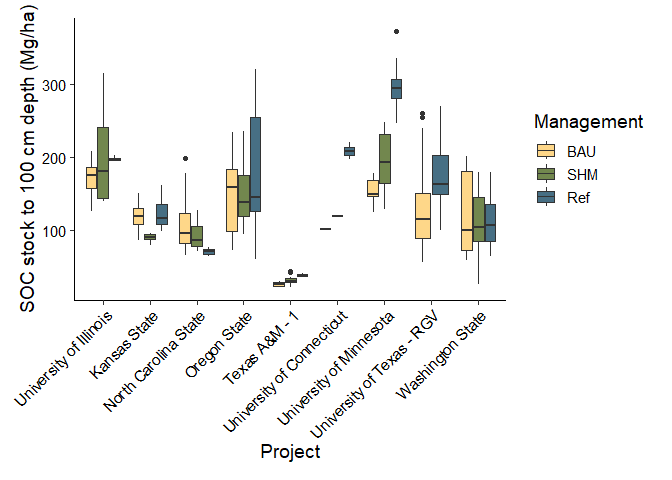<!-- -->

```
## Warning: Removed 2 rows containing non-finite outside the scale range
## (`stat_boxplot()`).
```

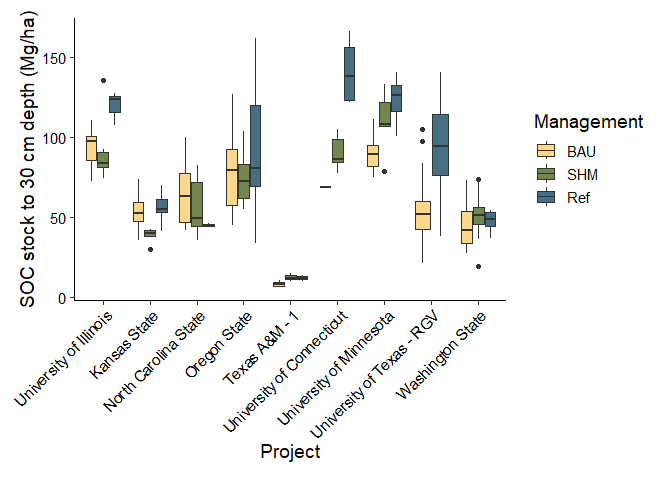<!-- -->

```
## Warning: Removed 2 rows containing non-finite outside the scale range
## (`stat_boxplot()`).
## Removed 18 rows containing non-finite outside the scale range
## (`stat_boxplot()`).
```

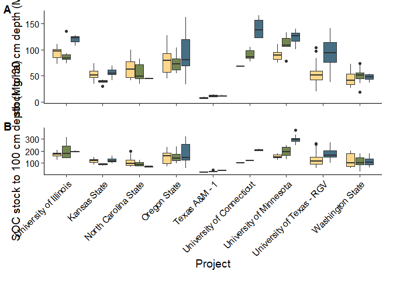<!-- -->

```
## Warning: Removed 18 rows containing non-finite outside the scale range
## (`stat_boxplot()`).
```

```
## Warning in get_plot_component(plot, "guide-box"): Multiple components found;
## returning the first one. To return all, use `return_all = TRUE`.
```

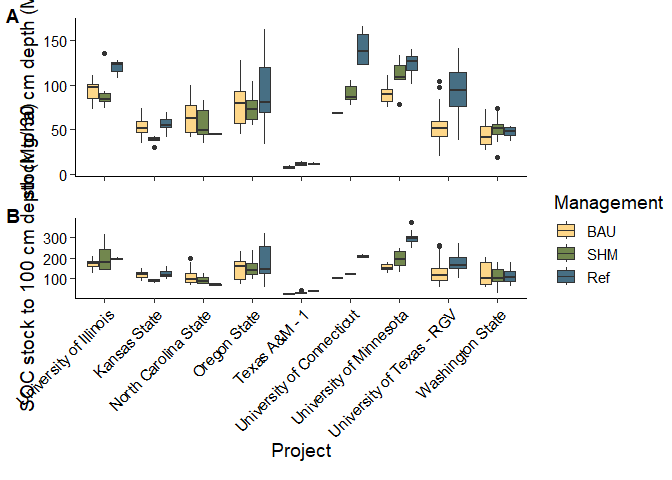<!-- -->

Takeaways:

-   Significant variability in SOC stocks between sites (expected)

-   Differences between treatments more apparent at 30 cm depth than 100
    cm depth

-   Reference sites are significantly higher in C at some, but not all
    sites (Illinois, UConn, University of Minnesota, UTRGV)

-   Differences between SHM and BAU are infrequently observed

Plot alternate version with significance letters ungrouped (not shown
because it is difficult to interpret):

## Boxplots of SOC stock data calculated via ESM


```
## `summarise()` has grouped output by 'project', 'label', 'dsp_pedon_id'. You can
## override using the `.groups` argument.
```

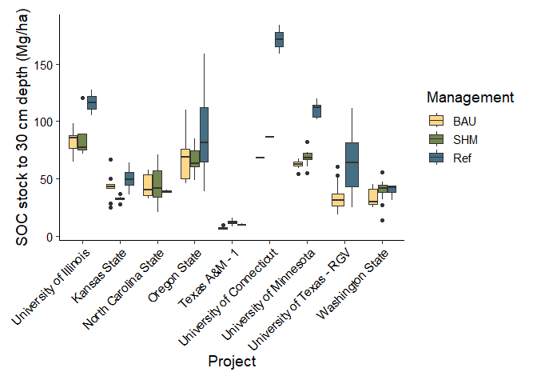<!-- -->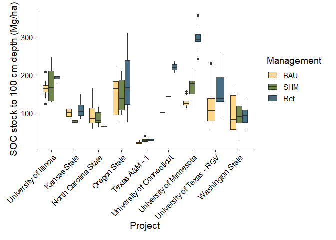<!-- -->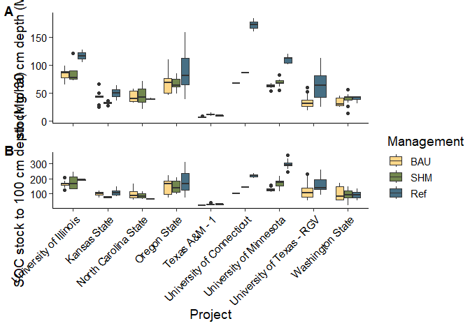<!-- -->

```
## Warning in get_plot_component(plot, "guide-box"): Multiple components found;
## returning the first one. To return all, use `return_all = TRUE`.
```

<!-- -->
## Comparison of ESM results to fixed depth results


``` r
esm_standard_min_totals_long <- esm_standard_min_totals %>%
  pivot_longer(soc_0to30:soc_0to100, names_to="depth", values_to="soc_stock") %>%
  select(-depth_increments) %>%
  mutate(depth = case_when(depth== "soc_0to30" ~ "0to30cm",
                               depth=="soc_0to100" ~ "0to100cm"))

soc_pedon_fixed <- soc_pedon %>%
  select(project, label, dsp_pedon_id, soc_stock_0_30cm, soc_stock_100cm) %>%
  pivot_longer(soc_stock_0_30cm:soc_stock_100cm,
               names_to="depth", values_to="soc_stock") %>%
    mutate(depth = case_when(depth== "soc_stock_0_30cm" ~ "0to30cm",
                               depth=="soc_stock_100cm" ~ "0to100cm"))

soc_fixed_esm <- soc_pedon_fixed %>%
  left_join(esm_standard_min_totals_long, by=c("project", "label", "dsp_pedon_id","depth"), suffix=c("_fixed", "_esm")) %>%
  pivot_longer(soc_stock_fixed:soc_stock_esm, names_to="calc_method", values_to="soc_stock") %>%
  mutate(depth = factor(depth, levels=c("0to30cm", "0to100cm"))) %>%
  filter(project!="TexasA&MPt-2")

# Make plot
ggplot(soc_fixed_esm, aes(x=label, y=soc_stock, fill=calc_method)) +
  geom_boxplot() +
  facet_grid(project ~ depth, scales="free_y", labeller=labeller(project = project_labels2, 
                                                                 depth=c("0to100cm"="0 to 100 cm", "0to30cm"="0 to 30 cm"))) +
  labs(x="Management", y="SOC Stock (Mg/ha)") +
  scale_fill_paletteer_d("nationalparkcolors::Arches", name="Calculation method",
                         labels=c("ESM (Cubic Spline)", "Fixed Depth")) +
  theme_katy()
```

```
## Warning: Removed 56 rows containing non-finite outside the scale range
## (`stat_boxplot()`).
```

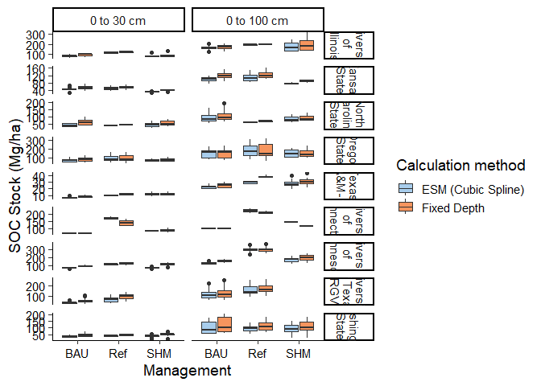<!-- -->

Table of difference in SOC stocks calculated via fixed depth vs. ESM:


``` r
# Calculate differences
soc_stock_comparison <- soc_fixed_esm %>%
  pivot_wider(names_from="calc_method", values_from="soc_stock") %>%
  group_by(project, label, depth) %>%
  summarize(across(soc_stock_fixed:soc_stock_esm, ~round(mean(.x, na.rm=TRUE),1))) %>%
  mutate(difference = round(soc_stock_fixed - soc_stock_esm,1)) %>%
  mutate(percent_diff = round((difference / soc_stock_esm)*100,1)) %>%
  mutate(label=factor(label, levels=c("BAU", "SHM", "Ref"))) %>%
  arrange(project, label, depth)
```

```
## `summarise()` has grouped output by 'project', 'label'. You can override using
## the `.groups` argument.
```

``` r
flextable(soc_stock_comparison)
```

```{=html}
<div class="tabwid"><style>.cl-133ec6bc{}.cl-133478a6{font-family:'Arial';font-size:11pt;font-weight:normal;font-style:normal;text-decoration:none;color:rgba(0, 0, 0, 1.00);background-color:transparent;}.cl-1337e860{margin:0;text-align:left;border-bottom: 0 solid rgba(0, 0, 0, 1.00);border-top: 0 solid rgba(0, 0, 0, 1.00);border-left: 0 solid rgba(0, 0, 0, 1.00);border-right: 0 solid rgba(0, 0, 0, 1.00);padding-bottom:5pt;padding-top:5pt;padding-left:5pt;padding-right:5pt;line-height: 1;background-color:transparent;}.cl-1337e86a{margin:0;text-align:right;border-bottom: 0 solid rgba(0, 0, 0, 1.00);border-top: 0 solid rgba(0, 0, 0, 1.00);border-left: 0 solid rgba(0, 0, 0, 1.00);border-right: 0 solid rgba(0, 0, 0, 1.00);padding-bottom:5pt;padding-top:5pt;padding-left:5pt;padding-right:5pt;line-height: 1;background-color:transparent;}.cl-1337ff26{width:0.75in;background-color:transparent;vertical-align: middle;border-bottom: 1.5pt solid rgba(102, 102, 102, 1.00);border-top: 1.5pt solid rgba(102, 102, 102, 1.00);border-left: 0 solid rgba(0, 0, 0, 1.00);border-right: 0 solid rgba(0, 0, 0, 1.00);margin-bottom:0;margin-top:0;margin-left:0;margin-right:0;}.cl-1337ff27{width:0.75in;background-color:transparent;vertical-align: middle;border-bottom: 1.5pt solid rgba(102, 102, 102, 1.00);border-top: 1.5pt solid rgba(102, 102, 102, 1.00);border-left: 0 solid rgba(0, 0, 0, 1.00);border-right: 0 solid rgba(0, 0, 0, 1.00);margin-bottom:0;margin-top:0;margin-left:0;margin-right:0;}.cl-1337ff30{width:0.75in;background-color:transparent;vertical-align: middle;border-bottom: 0 solid rgba(0, 0, 0, 1.00);border-top: 0 solid rgba(0, 0, 0, 1.00);border-left: 0 solid rgba(0, 0, 0, 1.00);border-right: 0 solid rgba(0, 0, 0, 1.00);margin-bottom:0;margin-top:0;margin-left:0;margin-right:0;}.cl-1337ff3a{width:0.75in;background-color:transparent;vertical-align: middle;border-bottom: 0 solid rgba(0, 0, 0, 1.00);border-top: 0 solid rgba(0, 0, 0, 1.00);border-left: 0 solid rgba(0, 0, 0, 1.00);border-right: 0 solid rgba(0, 0, 0, 1.00);margin-bottom:0;margin-top:0;margin-left:0;margin-right:0;}.cl-1337ff44{width:0.75in;background-color:transparent;vertical-align: middle;border-bottom: 1.5pt solid rgba(102, 102, 102, 1.00);border-top: 0 solid rgba(0, 0, 0, 1.00);border-left: 0 solid rgba(0, 0, 0, 1.00);border-right: 0 solid rgba(0, 0, 0, 1.00);margin-bottom:0;margin-top:0;margin-left:0;margin-right:0;}.cl-1337ff45{width:0.75in;background-color:transparent;vertical-align: middle;border-bottom: 1.5pt solid rgba(102, 102, 102, 1.00);border-top: 0 solid rgba(0, 0, 0, 1.00);border-left: 0 solid rgba(0, 0, 0, 1.00);border-right: 0 solid rgba(0, 0, 0, 1.00);margin-bottom:0;margin-top:0;margin-left:0;margin-right:0;}</style><table data-quarto-disable-processing='true' class='cl-133ec6bc'><thead><tr style="overflow-wrap:break-word;"><th class="cl-1337ff26"><p class="cl-1337e860"><span class="cl-133478a6">project</span></p></th><th class="cl-1337ff26"><p class="cl-1337e860"><span class="cl-133478a6">label</span></p></th><th class="cl-1337ff26"><p class="cl-1337e860"><span class="cl-133478a6">depth</span></p></th><th class="cl-1337ff27"><p class="cl-1337e86a"><span class="cl-133478a6">soc_stock_fixed</span></p></th><th class="cl-1337ff27"><p class="cl-1337e86a"><span class="cl-133478a6">soc_stock_esm</span></p></th><th class="cl-1337ff27"><p class="cl-1337e86a"><span class="cl-133478a6">difference</span></p></th><th class="cl-1337ff27"><p class="cl-1337e86a"><span class="cl-133478a6">percent_diff</span></p></th></tr></thead><tbody><tr style="overflow-wrap:break-word;"><td class="cl-1337ff30"><p class="cl-1337e860"><span class="cl-133478a6">Illinois</span></p></td><td class="cl-1337ff30"><p class="cl-1337e860"><span class="cl-133478a6">BAU</span></p></td><td class="cl-1337ff30"><p class="cl-1337e860"><span class="cl-133478a6">0to30cm</span></p></td><td class="cl-1337ff3a"><p class="cl-1337e86a"><span class="cl-133478a6">93.7</span></p></td><td class="cl-1337ff3a"><p class="cl-1337e86a"><span class="cl-133478a6">82.8</span></p></td><td class="cl-1337ff3a"><p class="cl-1337e86a"><span class="cl-133478a6">10.9</span></p></td><td class="cl-1337ff3a"><p class="cl-1337e86a"><span class="cl-133478a6">13.2</span></p></td></tr><tr style="overflow-wrap:break-word;"><td class="cl-1337ff30"><p class="cl-1337e860"><span class="cl-133478a6">Illinois</span></p></td><td class="cl-1337ff30"><p class="cl-1337e860"><span class="cl-133478a6">BAU</span></p></td><td class="cl-1337ff30"><p class="cl-1337e860"><span class="cl-133478a6">0to100cm</span></p></td><td class="cl-1337ff3a"><p class="cl-1337e86a"><span class="cl-133478a6">171.9</span></p></td><td class="cl-1337ff3a"><p class="cl-1337e86a"><span class="cl-133478a6">163.5</span></p></td><td class="cl-1337ff3a"><p class="cl-1337e86a"><span class="cl-133478a6">8.4</span></p></td><td class="cl-1337ff3a"><p class="cl-1337e86a"><span class="cl-133478a6">5.1</span></p></td></tr><tr style="overflow-wrap:break-word;"><td class="cl-1337ff30"><p class="cl-1337e860"><span class="cl-133478a6">Illinois</span></p></td><td class="cl-1337ff30"><p class="cl-1337e860"><span class="cl-133478a6">SHM</span></p></td><td class="cl-1337ff30"><p class="cl-1337e860"><span class="cl-133478a6">0to30cm</span></p></td><td class="cl-1337ff3a"><p class="cl-1337e86a"><span class="cl-133478a6">91.8</span></p></td><td class="cl-1337ff3a"><p class="cl-1337e86a"><span class="cl-133478a6">87.0</span></p></td><td class="cl-1337ff3a"><p class="cl-1337e86a"><span class="cl-133478a6">4.8</span></p></td><td class="cl-1337ff3a"><p class="cl-1337e86a"><span class="cl-133478a6">5.5</span></p></td></tr><tr style="overflow-wrap:break-word;"><td class="cl-1337ff30"><p class="cl-1337e860"><span class="cl-133478a6">Illinois</span></p></td><td class="cl-1337ff30"><p class="cl-1337e860"><span class="cl-133478a6">SHM</span></p></td><td class="cl-1337ff30"><p class="cl-1337e860"><span class="cl-133478a6">0to100cm</span></p></td><td class="cl-1337ff3a"><p class="cl-1337e86a"><span class="cl-133478a6">203.7</span></p></td><td class="cl-1337ff3a"><p class="cl-1337e86a"><span class="cl-133478a6">176.8</span></p></td><td class="cl-1337ff3a"><p class="cl-1337e86a"><span class="cl-133478a6">26.9</span></p></td><td class="cl-1337ff3a"><p class="cl-1337e86a"><span class="cl-133478a6">15.2</span></p></td></tr><tr style="overflow-wrap:break-word;"><td class="cl-1337ff30"><p class="cl-1337e860"><span class="cl-133478a6">Illinois</span></p></td><td class="cl-1337ff30"><p class="cl-1337e860"><span class="cl-133478a6">Ref</span></p></td><td class="cl-1337ff30"><p class="cl-1337e860"><span class="cl-133478a6">0to30cm</span></p></td><td class="cl-1337ff3a"><p class="cl-1337e86a"><span class="cl-133478a6">119.6</span></p></td><td class="cl-1337ff3a"><p class="cl-1337e86a"><span class="cl-133478a6">116.3</span></p></td><td class="cl-1337ff3a"><p class="cl-1337e86a"><span class="cl-133478a6">3.3</span></p></td><td class="cl-1337ff3a"><p class="cl-1337e86a"><span class="cl-133478a6">2.8</span></p></td></tr><tr style="overflow-wrap:break-word;"><td class="cl-1337ff30"><p class="cl-1337e860"><span class="cl-133478a6">Illinois</span></p></td><td class="cl-1337ff30"><p class="cl-1337e860"><span class="cl-133478a6">Ref</span></p></td><td class="cl-1337ff30"><p class="cl-1337e860"><span class="cl-133478a6">0to100cm</span></p></td><td class="cl-1337ff3a"><p class="cl-1337e86a"><span class="cl-133478a6">197.3</span></p></td><td class="cl-1337ff3a"><p class="cl-1337e86a"><span class="cl-133478a6">191.6</span></p></td><td class="cl-1337ff3a"><p class="cl-1337e86a"><span class="cl-133478a6">5.7</span></p></td><td class="cl-1337ff3a"><p class="cl-1337e86a"><span class="cl-133478a6">3.0</span></p></td></tr><tr style="overflow-wrap:break-word;"><td class="cl-1337ff30"><p class="cl-1337e860"><span class="cl-133478a6">KansasState</span></p></td><td class="cl-1337ff30"><p class="cl-1337e860"><span class="cl-133478a6">BAU</span></p></td><td class="cl-1337ff30"><p class="cl-1337e860"><span class="cl-133478a6">0to30cm</span></p></td><td class="cl-1337ff3a"><p class="cl-1337e86a"><span class="cl-133478a6">52.8</span></p></td><td class="cl-1337ff3a"><p class="cl-1337e86a"><span class="cl-133478a6">43.1</span></p></td><td class="cl-1337ff3a"><p class="cl-1337e86a"><span class="cl-133478a6">9.7</span></p></td><td class="cl-1337ff3a"><p class="cl-1337e86a"><span class="cl-133478a6">22.5</span></p></td></tr><tr style="overflow-wrap:break-word;"><td class="cl-1337ff30"><p class="cl-1337e860"><span class="cl-133478a6">KansasState</span></p></td><td class="cl-1337ff30"><p class="cl-1337e860"><span class="cl-133478a6">BAU</span></p></td><td class="cl-1337ff30"><p class="cl-1337e860"><span class="cl-133478a6">0to100cm</span></p></td><td class="cl-1337ff3a"><p class="cl-1337e86a"><span class="cl-133478a6">116.3</span></p></td><td class="cl-1337ff3a"><p class="cl-1337e86a"><span class="cl-133478a6">98.3</span></p></td><td class="cl-1337ff3a"><p class="cl-1337e86a"><span class="cl-133478a6">18.0</span></p></td><td class="cl-1337ff3a"><p class="cl-1337e86a"><span class="cl-133478a6">18.3</span></p></td></tr><tr style="overflow-wrap:break-word;"><td class="cl-1337ff30"><p class="cl-1337e860"><span class="cl-133478a6">KansasState</span></p></td><td class="cl-1337ff30"><p class="cl-1337e860"><span class="cl-133478a6">SHM</span></p></td><td class="cl-1337ff30"><p class="cl-1337e860"><span class="cl-133478a6">0to30cm</span></p></td><td class="cl-1337ff3a"><p class="cl-1337e86a"><span class="cl-133478a6">38.7</span></p></td><td class="cl-1337ff3a"><p class="cl-1337e86a"><span class="cl-133478a6">32.4</span></p></td><td class="cl-1337ff3a"><p class="cl-1337e86a"><span class="cl-133478a6">6.3</span></p></td><td class="cl-1337ff3a"><p class="cl-1337e86a"><span class="cl-133478a6">19.4</span></p></td></tr><tr style="overflow-wrap:break-word;"><td class="cl-1337ff30"><p class="cl-1337e860"><span class="cl-133478a6">KansasState</span></p></td><td class="cl-1337ff30"><p class="cl-1337e860"><span class="cl-133478a6">SHM</span></p></td><td class="cl-1337ff30"><p class="cl-1337e860"><span class="cl-133478a6">0to100cm</span></p></td><td class="cl-1337ff3a"><p class="cl-1337e86a"><span class="cl-133478a6">89.4</span></p></td><td class="cl-1337ff3a"><p class="cl-1337e86a"><span class="cl-133478a6">76.6</span></p></td><td class="cl-1337ff3a"><p class="cl-1337e86a"><span class="cl-133478a6">12.8</span></p></td><td class="cl-1337ff3a"><p class="cl-1337e86a"><span class="cl-133478a6">16.7</span></p></td></tr><tr style="overflow-wrap:break-word;"><td class="cl-1337ff30"><p class="cl-1337e860"><span class="cl-133478a6">KansasState</span></p></td><td class="cl-1337ff30"><p class="cl-1337e860"><span class="cl-133478a6">Ref</span></p></td><td class="cl-1337ff30"><p class="cl-1337e860"><span class="cl-133478a6">0to30cm</span></p></td><td class="cl-1337ff3a"><p class="cl-1337e86a"><span class="cl-133478a6">55.8</span></p></td><td class="cl-1337ff3a"><p class="cl-1337e86a"><span class="cl-133478a6">49.6</span></p></td><td class="cl-1337ff3a"><p class="cl-1337e86a"><span class="cl-133478a6">6.2</span></p></td><td class="cl-1337ff3a"><p class="cl-1337e86a"><span class="cl-133478a6">12.5</span></p></td></tr><tr style="overflow-wrap:break-word;"><td class="cl-1337ff30"><p class="cl-1337e860"><span class="cl-133478a6">KansasState</span></p></td><td class="cl-1337ff30"><p class="cl-1337e860"><span class="cl-133478a6">Ref</span></p></td><td class="cl-1337ff30"><p class="cl-1337e860"><span class="cl-133478a6">0to100cm</span></p></td><td class="cl-1337ff3a"><p class="cl-1337e86a"><span class="cl-133478a6">122.8</span></p></td><td class="cl-1337ff3a"><p class="cl-1337e86a"><span class="cl-133478a6">109.8</span></p></td><td class="cl-1337ff3a"><p class="cl-1337e86a"><span class="cl-133478a6">13.0</span></p></td><td class="cl-1337ff3a"><p class="cl-1337e86a"><span class="cl-133478a6">11.8</span></p></td></tr><tr style="overflow-wrap:break-word;"><td class="cl-1337ff30"><p class="cl-1337e860"><span class="cl-133478a6">NCState</span></p></td><td class="cl-1337ff30"><p class="cl-1337e860"><span class="cl-133478a6">BAU</span></p></td><td class="cl-1337ff30"><p class="cl-1337e860"><span class="cl-133478a6">0to30cm</span></p></td><td class="cl-1337ff3a"><p class="cl-1337e86a"><span class="cl-133478a6">65.2</span></p></td><td class="cl-1337ff3a"><p class="cl-1337e86a"><span class="cl-133478a6">43.5</span></p></td><td class="cl-1337ff3a"><p class="cl-1337e86a"><span class="cl-133478a6">21.7</span></p></td><td class="cl-1337ff3a"><p class="cl-1337e86a"><span class="cl-133478a6">49.9</span></p></td></tr><tr style="overflow-wrap:break-word;"><td class="cl-1337ff30"><p class="cl-1337e860"><span class="cl-133478a6">NCState</span></p></td><td class="cl-1337ff30"><p class="cl-1337e860"><span class="cl-133478a6">BAU</span></p></td><td class="cl-1337ff30"><p class="cl-1337e860"><span class="cl-133478a6">0to100cm</span></p></td><td class="cl-1337ff3a"><p class="cl-1337e86a"><span class="cl-133478a6">111.8</span></p></td><td class="cl-1337ff3a"><p class="cl-1337e86a"><span class="cl-133478a6">98.4</span></p></td><td class="cl-1337ff3a"><p class="cl-1337e86a"><span class="cl-133478a6">13.4</span></p></td><td class="cl-1337ff3a"><p class="cl-1337e86a"><span class="cl-133478a6">13.6</span></p></td></tr><tr style="overflow-wrap:break-word;"><td class="cl-1337ff30"><p class="cl-1337e860"><span class="cl-133478a6">NCState</span></p></td><td class="cl-1337ff30"><p class="cl-1337e860"><span class="cl-133478a6">SHM</span></p></td><td class="cl-1337ff30"><p class="cl-1337e860"><span class="cl-133478a6">0to30cm</span></p></td><td class="cl-1337ff3a"><p class="cl-1337e86a"><span class="cl-133478a6">56.2</span></p></td><td class="cl-1337ff3a"><p class="cl-1337e86a"><span class="cl-133478a6">45.2</span></p></td><td class="cl-1337ff3a"><p class="cl-1337e86a"><span class="cl-133478a6">11.0</span></p></td><td class="cl-1337ff3a"><p class="cl-1337e86a"><span class="cl-133478a6">24.3</span></p></td></tr><tr style="overflow-wrap:break-word;"><td class="cl-1337ff30"><p class="cl-1337e860"><span class="cl-133478a6">NCState</span></p></td><td class="cl-1337ff30"><p class="cl-1337e860"><span class="cl-133478a6">SHM</span></p></td><td class="cl-1337ff30"><p class="cl-1337e860"><span class="cl-133478a6">0to100cm</span></p></td><td class="cl-1337ff3a"><p class="cl-1337e86a"><span class="cl-133478a6">92.7</span></p></td><td class="cl-1337ff3a"><p class="cl-1337e86a"><span class="cl-133478a6">86.9</span></p></td><td class="cl-1337ff3a"><p class="cl-1337e86a"><span class="cl-133478a6">5.8</span></p></td><td class="cl-1337ff3a"><p class="cl-1337e86a"><span class="cl-133478a6">6.7</span></p></td></tr><tr style="overflow-wrap:break-word;"><td class="cl-1337ff30"><p class="cl-1337e860"><span class="cl-133478a6">NCState</span></p></td><td class="cl-1337ff30"><p class="cl-1337e860"><span class="cl-133478a6">Ref</span></p></td><td class="cl-1337ff30"><p class="cl-1337e860"><span class="cl-133478a6">0to30cm</span></p></td><td class="cl-1337ff3a"><p class="cl-1337e86a"><span class="cl-133478a6">45.0</span></p></td><td class="cl-1337ff3a"><p class="cl-1337e86a"><span class="cl-133478a6">39.1</span></p></td><td class="cl-1337ff3a"><p class="cl-1337e86a"><span class="cl-133478a6">5.9</span></p></td><td class="cl-1337ff3a"><p class="cl-1337e86a"><span class="cl-133478a6">15.1</span></p></td></tr><tr style="overflow-wrap:break-word;"><td class="cl-1337ff30"><p class="cl-1337e860"><span class="cl-133478a6">NCState</span></p></td><td class="cl-1337ff30"><p class="cl-1337e860"><span class="cl-133478a6">Ref</span></p></td><td class="cl-1337ff30"><p class="cl-1337e860"><span class="cl-133478a6">0to100cm</span></p></td><td class="cl-1337ff3a"><p class="cl-1337e86a"><span class="cl-133478a6">70.2</span></p></td><td class="cl-1337ff3a"><p class="cl-1337e86a"><span class="cl-133478a6">63.8</span></p></td><td class="cl-1337ff3a"><p class="cl-1337e86a"><span class="cl-133478a6">6.4</span></p></td><td class="cl-1337ff3a"><p class="cl-1337e86a"><span class="cl-133478a6">10.0</span></p></td></tr><tr style="overflow-wrap:break-word;"><td class="cl-1337ff30"><p class="cl-1337e860"><span class="cl-133478a6">OregonState</span></p></td><td class="cl-1337ff30"><p class="cl-1337e860"><span class="cl-133478a6">BAU</span></p></td><td class="cl-1337ff30"><p class="cl-1337e860"><span class="cl-133478a6">0to30cm</span></p></td><td class="cl-1337ff3a"><p class="cl-1337e86a"><span class="cl-133478a6">78.8</span></p></td><td class="cl-1337ff3a"><p class="cl-1337e86a"><span class="cl-133478a6">68.0</span></p></td><td class="cl-1337ff3a"><p class="cl-1337e86a"><span class="cl-133478a6">10.8</span></p></td><td class="cl-1337ff3a"><p class="cl-1337e86a"><span class="cl-133478a6">15.9</span></p></td></tr><tr style="overflow-wrap:break-word;"><td class="cl-1337ff30"><p class="cl-1337e860"><span class="cl-133478a6">OregonState</span></p></td><td class="cl-1337ff30"><p class="cl-1337e860"><span class="cl-133478a6">BAU</span></p></td><td class="cl-1337ff30"><p class="cl-1337e860"><span class="cl-133478a6">0to100cm</span></p></td><td class="cl-1337ff3a"><p class="cl-1337e86a"><span class="cl-133478a6">149.6</span></p></td><td class="cl-1337ff3a"><p class="cl-1337e86a"><span class="cl-133478a6">149.6</span></p></td><td class="cl-1337ff3a"><p class="cl-1337e86a"><span class="cl-133478a6">0.0</span></p></td><td class="cl-1337ff3a"><p class="cl-1337e86a"><span class="cl-133478a6">0.0</span></p></td></tr><tr style="overflow-wrap:break-word;"><td class="cl-1337ff30"><p class="cl-1337e860"><span class="cl-133478a6">OregonState</span></p></td><td class="cl-1337ff30"><p class="cl-1337e860"><span class="cl-133478a6">SHM</span></p></td><td class="cl-1337ff30"><p class="cl-1337e860"><span class="cl-133478a6">0to30cm</span></p></td><td class="cl-1337ff3a"><p class="cl-1337e86a"><span class="cl-133478a6">74.0</span></p></td><td class="cl-1337ff3a"><p class="cl-1337e86a"><span class="cl-133478a6">66.9</span></p></td><td class="cl-1337ff3a"><p class="cl-1337e86a"><span class="cl-133478a6">7.1</span></p></td><td class="cl-1337ff3a"><p class="cl-1337e86a"><span class="cl-133478a6">10.6</span></p></td></tr><tr style="overflow-wrap:break-word;"><td class="cl-1337ff30"><p class="cl-1337e860"><span class="cl-133478a6">OregonState</span></p></td><td class="cl-1337ff30"><p class="cl-1337e860"><span class="cl-133478a6">SHM</span></p></td><td class="cl-1337ff30"><p class="cl-1337e860"><span class="cl-133478a6">0to100cm</span></p></td><td class="cl-1337ff3a"><p class="cl-1337e86a"><span class="cl-133478a6">151.4</span></p></td><td class="cl-1337ff3a"><p class="cl-1337e86a"><span class="cl-133478a6">146.0</span></p></td><td class="cl-1337ff3a"><p class="cl-1337e86a"><span class="cl-133478a6">5.4</span></p></td><td class="cl-1337ff3a"><p class="cl-1337e86a"><span class="cl-133478a6">3.7</span></p></td></tr><tr style="overflow-wrap:break-word;"><td class="cl-1337ff30"><p class="cl-1337e860"><span class="cl-133478a6">OregonState</span></p></td><td class="cl-1337ff30"><p class="cl-1337e860"><span class="cl-133478a6">Ref</span></p></td><td class="cl-1337ff30"><p class="cl-1337e860"><span class="cl-133478a6">0to30cm</span></p></td><td class="cl-1337ff3a"><p class="cl-1337e86a"><span class="cl-133478a6">91.3</span></p></td><td class="cl-1337ff3a"><p class="cl-1337e86a"><span class="cl-133478a6">90.0</span></p></td><td class="cl-1337ff3a"><p class="cl-1337e86a"><span class="cl-133478a6">1.3</span></p></td><td class="cl-1337ff3a"><p class="cl-1337e86a"><span class="cl-133478a6">1.4</span></p></td></tr><tr style="overflow-wrap:break-word;"><td class="cl-1337ff30"><p class="cl-1337e860"><span class="cl-133478a6">OregonState</span></p></td><td class="cl-1337ff30"><p class="cl-1337e860"><span class="cl-133478a6">Ref</span></p></td><td class="cl-1337ff30"><p class="cl-1337e860"><span class="cl-133478a6">0to100cm</span></p></td><td class="cl-1337ff3a"><p class="cl-1337e86a"><span class="cl-133478a6">173.4</span></p></td><td class="cl-1337ff3a"><p class="cl-1337e86a"><span class="cl-133478a6">174.7</span></p></td><td class="cl-1337ff3a"><p class="cl-1337e86a"><span class="cl-133478a6">-1.3</span></p></td><td class="cl-1337ff3a"><p class="cl-1337e86a"><span class="cl-133478a6">-0.7</span></p></td></tr><tr style="overflow-wrap:break-word;"><td class="cl-1337ff30"><p class="cl-1337e860"><span class="cl-133478a6">TexasA&amp;MPt-1</span></p></td><td class="cl-1337ff30"><p class="cl-1337e860"><span class="cl-133478a6">BAU</span></p></td><td class="cl-1337ff30"><p class="cl-1337e860"><span class="cl-133478a6">0to30cm</span></p></td><td class="cl-1337ff3a"><p class="cl-1337e86a"><span class="cl-133478a6">8.1</span></p></td><td class="cl-1337ff3a"><p class="cl-1337e86a"><span class="cl-133478a6">7.0</span></p></td><td class="cl-1337ff3a"><p class="cl-1337e86a"><span class="cl-133478a6">1.1</span></p></td><td class="cl-1337ff3a"><p class="cl-1337e86a"><span class="cl-133478a6">15.7</span></p></td></tr><tr style="overflow-wrap:break-word;"><td class="cl-1337ff30"><p class="cl-1337e860"><span class="cl-133478a6">TexasA&amp;MPt-1</span></p></td><td class="cl-1337ff30"><p class="cl-1337e860"><span class="cl-133478a6">BAU</span></p></td><td class="cl-1337ff30"><p class="cl-1337e860"><span class="cl-133478a6">0to100cm</span></p></td><td class="cl-1337ff3a"><p class="cl-1337e86a"><span class="cl-133478a6">25.2</span></p></td><td class="cl-1337ff3a"><p class="cl-1337e86a"><span class="cl-133478a6">22.5</span></p></td><td class="cl-1337ff3a"><p class="cl-1337e86a"><span class="cl-133478a6">2.7</span></p></td><td class="cl-1337ff3a"><p class="cl-1337e86a"><span class="cl-133478a6">12.0</span></p></td></tr><tr style="overflow-wrap:break-word;"><td class="cl-1337ff30"><p class="cl-1337e860"><span class="cl-133478a6">TexasA&amp;MPt-1</span></p></td><td class="cl-1337ff30"><p class="cl-1337e860"><span class="cl-133478a6">SHM</span></p></td><td class="cl-1337ff30"><p class="cl-1337e860"><span class="cl-133478a6">0to30cm</span></p></td><td class="cl-1337ff3a"><p class="cl-1337e86a"><span class="cl-133478a6">12.2</span></p></td><td class="cl-1337ff3a"><p class="cl-1337e86a"><span class="cl-133478a6">11.8</span></p></td><td class="cl-1337ff3a"><p class="cl-1337e86a"><span class="cl-133478a6">0.4</span></p></td><td class="cl-1337ff3a"><p class="cl-1337e86a"><span class="cl-133478a6">3.4</span></p></td></tr><tr style="overflow-wrap:break-word;"><td class="cl-1337ff30"><p class="cl-1337e860"><span class="cl-133478a6">TexasA&amp;MPt-1</span></p></td><td class="cl-1337ff30"><p class="cl-1337e860"><span class="cl-133478a6">SHM</span></p></td><td class="cl-1337ff30"><p class="cl-1337e860"><span class="cl-133478a6">0to100cm</span></p></td><td class="cl-1337ff3a"><p class="cl-1337e86a"><span class="cl-133478a6">30.9</span></p></td><td class="cl-1337ff3a"><p class="cl-1337e86a"><span class="cl-133478a6">27.5</span></p></td><td class="cl-1337ff3a"><p class="cl-1337e86a"><span class="cl-133478a6">3.4</span></p></td><td class="cl-1337ff3a"><p class="cl-1337e86a"><span class="cl-133478a6">12.4</span></p></td></tr><tr style="overflow-wrap:break-word;"><td class="cl-1337ff30"><p class="cl-1337e860"><span class="cl-133478a6">TexasA&amp;MPt-1</span></p></td><td class="cl-1337ff30"><p class="cl-1337e860"><span class="cl-133478a6">Ref</span></p></td><td class="cl-1337ff30"><p class="cl-1337e860"><span class="cl-133478a6">0to30cm</span></p></td><td class="cl-1337ff3a"><p class="cl-1337e86a"><span class="cl-133478a6">11.9</span></p></td><td class="cl-1337ff3a"><p class="cl-1337e86a"><span class="cl-133478a6">10.0</span></p></td><td class="cl-1337ff3a"><p class="cl-1337e86a"><span class="cl-133478a6">1.9</span></p></td><td class="cl-1337ff3a"><p class="cl-1337e86a"><span class="cl-133478a6">19.0</span></p></td></tr><tr style="overflow-wrap:break-word;"><td class="cl-1337ff30"><p class="cl-1337e860"><span class="cl-133478a6">TexasA&amp;MPt-1</span></p></td><td class="cl-1337ff30"><p class="cl-1337e860"><span class="cl-133478a6">Ref</span></p></td><td class="cl-1337ff30"><p class="cl-1337e860"><span class="cl-133478a6">0to100cm</span></p></td><td class="cl-1337ff3a"><p class="cl-1337e86a"><span class="cl-133478a6">38.3</span></p></td><td class="cl-1337ff3a"><p class="cl-1337e86a"><span class="cl-133478a6">29.2</span></p></td><td class="cl-1337ff3a"><p class="cl-1337e86a"><span class="cl-133478a6">9.1</span></p></td><td class="cl-1337ff3a"><p class="cl-1337e86a"><span class="cl-133478a6">31.2</span></p></td></tr><tr style="overflow-wrap:break-word;"><td class="cl-1337ff30"><p class="cl-1337e860"><span class="cl-133478a6">UConn</span></p></td><td class="cl-1337ff30"><p class="cl-1337e860"><span class="cl-133478a6">BAU</span></p></td><td class="cl-1337ff30"><p class="cl-1337e860"><span class="cl-133478a6">0to30cm</span></p></td><td class="cl-1337ff3a"><p class="cl-1337e86a"><span class="cl-133478a6">69.0</span></p></td><td class="cl-1337ff3a"><p class="cl-1337e86a"><span class="cl-133478a6">68.0</span></p></td><td class="cl-1337ff3a"><p class="cl-1337e86a"><span class="cl-133478a6">1.0</span></p></td><td class="cl-1337ff3a"><p class="cl-1337e86a"><span class="cl-133478a6">1.5</span></p></td></tr><tr style="overflow-wrap:break-word;"><td class="cl-1337ff30"><p class="cl-1337e860"><span class="cl-133478a6">UConn</span></p></td><td class="cl-1337ff30"><p class="cl-1337e860"><span class="cl-133478a6">BAU</span></p></td><td class="cl-1337ff30"><p class="cl-1337e860"><span class="cl-133478a6">0to100cm</span></p></td><td class="cl-1337ff3a"><p class="cl-1337e86a"><span class="cl-133478a6">100.7</span></p></td><td class="cl-1337ff3a"><p class="cl-1337e86a"><span class="cl-133478a6">99.6</span></p></td><td class="cl-1337ff3a"><p class="cl-1337e86a"><span class="cl-133478a6">1.1</span></p></td><td class="cl-1337ff3a"><p class="cl-1337e86a"><span class="cl-133478a6">1.1</span></p></td></tr><tr style="overflow-wrap:break-word;"><td class="cl-1337ff30"><p class="cl-1337e860"><span class="cl-133478a6">UConn</span></p></td><td class="cl-1337ff30"><p class="cl-1337e860"><span class="cl-133478a6">SHM</span></p></td><td class="cl-1337ff30"><p class="cl-1337e860"><span class="cl-133478a6">0to30cm</span></p></td><td class="cl-1337ff3a"><p class="cl-1337e86a"><span class="cl-133478a6">90.2</span></p></td><td class="cl-1337ff3a"><p class="cl-1337e86a"><span class="cl-133478a6">86.2</span></p></td><td class="cl-1337ff3a"><p class="cl-1337e86a"><span class="cl-133478a6">4.0</span></p></td><td class="cl-1337ff3a"><p class="cl-1337e86a"><span class="cl-133478a6">4.6</span></p></td></tr><tr style="overflow-wrap:break-word;"><td class="cl-1337ff30"><p class="cl-1337e860"><span class="cl-133478a6">UConn</span></p></td><td class="cl-1337ff30"><p class="cl-1337e860"><span class="cl-133478a6">SHM</span></p></td><td class="cl-1337ff30"><p class="cl-1337e860"><span class="cl-133478a6">0to100cm</span></p></td><td class="cl-1337ff3a"><p class="cl-1337e86a"><span class="cl-133478a6">119.3</span></p></td><td class="cl-1337ff3a"><p class="cl-1337e86a"><span class="cl-133478a6">142.6</span></p></td><td class="cl-1337ff3a"><p class="cl-1337e86a"><span class="cl-133478a6">-23.3</span></p></td><td class="cl-1337ff3a"><p class="cl-1337e86a"><span class="cl-133478a6">-16.3</span></p></td></tr><tr style="overflow-wrap:break-word;"><td class="cl-1337ff30"><p class="cl-1337e860"><span class="cl-133478a6">UConn</span></p></td><td class="cl-1337ff30"><p class="cl-1337e860"><span class="cl-133478a6">Ref</span></p></td><td class="cl-1337ff30"><p class="cl-1337e860"><span class="cl-133478a6">0to30cm</span></p></td><td class="cl-1337ff3a"><p class="cl-1337e86a"><span class="cl-133478a6">141.1</span></p></td><td class="cl-1337ff3a"><p class="cl-1337e86a"><span class="cl-133478a6">171.5</span></p></td><td class="cl-1337ff3a"><p class="cl-1337e86a"><span class="cl-133478a6">-30.4</span></p></td><td class="cl-1337ff3a"><p class="cl-1337e86a"><span class="cl-133478a6">-17.7</span></p></td></tr><tr style="overflow-wrap:break-word;"><td class="cl-1337ff30"><p class="cl-1337e860"><span class="cl-133478a6">UConn</span></p></td><td class="cl-1337ff30"><p class="cl-1337e860"><span class="cl-133478a6">Ref</span></p></td><td class="cl-1337ff30"><p class="cl-1337e860"><span class="cl-133478a6">0to100cm</span></p></td><td class="cl-1337ff3a"><p class="cl-1337e86a"><span class="cl-133478a6">208.2</span></p></td><td class="cl-1337ff3a"><p class="cl-1337e86a"><span class="cl-133478a6">220.3</span></p></td><td class="cl-1337ff3a"><p class="cl-1337e86a"><span class="cl-133478a6">-12.1</span></p></td><td class="cl-1337ff3a"><p class="cl-1337e86a"><span class="cl-133478a6">-5.5</span></p></td></tr><tr style="overflow-wrap:break-word;"><td class="cl-1337ff30"><p class="cl-1337e860"><span class="cl-133478a6">UTRGV</span></p></td><td class="cl-1337ff30"><p class="cl-1337e860"><span class="cl-133478a6">BAU</span></p></td><td class="cl-1337ff30"><p class="cl-1337e860"><span class="cl-133478a6">0to30cm</span></p></td><td class="cl-1337ff3a"><p class="cl-1337e86a"><span class="cl-133478a6">53.5</span></p></td><td class="cl-1337ff3a"><p class="cl-1337e86a"><span class="cl-133478a6">32.9</span></p></td><td class="cl-1337ff3a"><p class="cl-1337e86a"><span class="cl-133478a6">20.6</span></p></td><td class="cl-1337ff3a"><p class="cl-1337e86a"><span class="cl-133478a6">62.6</span></p></td></tr><tr style="overflow-wrap:break-word;"><td class="cl-1337ff30"><p class="cl-1337e860"><span class="cl-133478a6">UTRGV</span></p></td><td class="cl-1337ff30"><p class="cl-1337e860"><span class="cl-133478a6">BAU</span></p></td><td class="cl-1337ff30"><p class="cl-1337e860"><span class="cl-133478a6">0to100cm</span></p></td><td class="cl-1337ff3a"><p class="cl-1337e86a"><span class="cl-133478a6">130.3</span></p></td><td class="cl-1337ff3a"><p class="cl-1337e86a"><span class="cl-133478a6">117.7</span></p></td><td class="cl-1337ff3a"><p class="cl-1337e86a"><span class="cl-133478a6">12.6</span></p></td><td class="cl-1337ff3a"><p class="cl-1337e86a"><span class="cl-133478a6">10.7</span></p></td></tr><tr style="overflow-wrap:break-word;"><td class="cl-1337ff30"><p class="cl-1337e860"><span class="cl-133478a6">UTRGV</span></p></td><td class="cl-1337ff30"><p class="cl-1337e860"><span class="cl-133478a6">Ref</span></p></td><td class="cl-1337ff30"><p class="cl-1337e860"><span class="cl-133478a6">0to30cm</span></p></td><td class="cl-1337ff3a"><p class="cl-1337e86a"><span class="cl-133478a6">93.2</span></p></td><td class="cl-1337ff3a"><p class="cl-1337e86a"><span class="cl-133478a6">64.6</span></p></td><td class="cl-1337ff3a"><p class="cl-1337e86a"><span class="cl-133478a6">28.6</span></p></td><td class="cl-1337ff3a"><p class="cl-1337e86a"><span class="cl-133478a6">44.3</span></p></td></tr><tr style="overflow-wrap:break-word;"><td class="cl-1337ff30"><p class="cl-1337e860"><span class="cl-133478a6">UTRGV</span></p></td><td class="cl-1337ff30"><p class="cl-1337e860"><span class="cl-133478a6">Ref</span></p></td><td class="cl-1337ff30"><p class="cl-1337e860"><span class="cl-133478a6">0to100cm</span></p></td><td class="cl-1337ff3a"><p class="cl-1337e86a"><span class="cl-133478a6">176.0</span></p></td><td class="cl-1337ff3a"><p class="cl-1337e86a"><span class="cl-133478a6">161.0</span></p></td><td class="cl-1337ff3a"><p class="cl-1337e86a"><span class="cl-133478a6">15.0</span></p></td><td class="cl-1337ff3a"><p class="cl-1337e86a"><span class="cl-133478a6">9.3</span></p></td></tr><tr style="overflow-wrap:break-word;"><td class="cl-1337ff30"><p class="cl-1337e860"><span class="cl-133478a6">UnivOfMinnesota</span></p></td><td class="cl-1337ff30"><p class="cl-1337e860"><span class="cl-133478a6">BAU</span></p></td><td class="cl-1337ff30"><p class="cl-1337e860"><span class="cl-133478a6">0to30cm</span></p></td><td class="cl-1337ff3a"><p class="cl-1337e86a"><span class="cl-133478a6">90.4</span></p></td><td class="cl-1337ff3a"><p class="cl-1337e86a"><span class="cl-133478a6">62.5</span></p></td><td class="cl-1337ff3a"><p class="cl-1337e86a"><span class="cl-133478a6">27.9</span></p></td><td class="cl-1337ff3a"><p class="cl-1337e86a"><span class="cl-133478a6">44.6</span></p></td></tr><tr style="overflow-wrap:break-word;"><td class="cl-1337ff30"><p class="cl-1337e860"><span class="cl-133478a6">UnivOfMinnesota</span></p></td><td class="cl-1337ff30"><p class="cl-1337e860"><span class="cl-133478a6">BAU</span></p></td><td class="cl-1337ff30"><p class="cl-1337e860"><span class="cl-133478a6">0to100cm</span></p></td><td class="cl-1337ff3a"><p class="cl-1337e86a"><span class="cl-133478a6">153.8</span></p></td><td class="cl-1337ff3a"><p class="cl-1337e86a"><span class="cl-133478a6">128.8</span></p></td><td class="cl-1337ff3a"><p class="cl-1337e86a"><span class="cl-133478a6">25.0</span></p></td><td class="cl-1337ff3a"><p class="cl-1337e86a"><span class="cl-133478a6">19.4</span></p></td></tr><tr style="overflow-wrap:break-word;"><td class="cl-1337ff30"><p class="cl-1337e860"><span class="cl-133478a6">UnivOfMinnesota</span></p></td><td class="cl-1337ff30"><p class="cl-1337e860"><span class="cl-133478a6">SHM</span></p></td><td class="cl-1337ff30"><p class="cl-1337e860"><span class="cl-133478a6">0to30cm</span></p></td><td class="cl-1337ff3a"><p class="cl-1337e86a"><span class="cl-133478a6">111.0</span></p></td><td class="cl-1337ff3a"><p class="cl-1337e86a"><span class="cl-133478a6">68.3</span></p></td><td class="cl-1337ff3a"><p class="cl-1337e86a"><span class="cl-133478a6">42.7</span></p></td><td class="cl-1337ff3a"><p class="cl-1337e86a"><span class="cl-133478a6">62.5</span></p></td></tr><tr style="overflow-wrap:break-word;"><td class="cl-1337ff30"><p class="cl-1337e860"><span class="cl-133478a6">UnivOfMinnesota</span></p></td><td class="cl-1337ff30"><p class="cl-1337e860"><span class="cl-133478a6">SHM</span></p></td><td class="cl-1337ff30"><p class="cl-1337e860"><span class="cl-133478a6">0to100cm</span></p></td><td class="cl-1337ff3a"><p class="cl-1337e86a"><span class="cl-133478a6">197.3</span></p></td><td class="cl-1337ff3a"><p class="cl-1337e86a"><span class="cl-133478a6">169.4</span></p></td><td class="cl-1337ff3a"><p class="cl-1337e86a"><span class="cl-133478a6">27.9</span></p></td><td class="cl-1337ff3a"><p class="cl-1337e86a"><span class="cl-133478a6">16.5</span></p></td></tr><tr style="overflow-wrap:break-word;"><td class="cl-1337ff30"><p class="cl-1337e860"><span class="cl-133478a6">UnivOfMinnesota</span></p></td><td class="cl-1337ff30"><p class="cl-1337e860"><span class="cl-133478a6">Ref</span></p></td><td class="cl-1337ff30"><p class="cl-1337e860"><span class="cl-133478a6">0to30cm</span></p></td><td class="cl-1337ff3a"><p class="cl-1337e86a"><span class="cl-133478a6">123.4</span></p></td><td class="cl-1337ff3a"><p class="cl-1337e86a"><span class="cl-133478a6">110.0</span></p></td><td class="cl-1337ff3a"><p class="cl-1337e86a"><span class="cl-133478a6">13.4</span></p></td><td class="cl-1337ff3a"><p class="cl-1337e86a"><span class="cl-133478a6">12.2</span></p></td></tr><tr style="overflow-wrap:break-word;"><td class="cl-1337ff30"><p class="cl-1337e860"><span class="cl-133478a6">UnivOfMinnesota</span></p></td><td class="cl-1337ff30"><p class="cl-1337e860"><span class="cl-133478a6">Ref</span></p></td><td class="cl-1337ff30"><p class="cl-1337e860"><span class="cl-133478a6">0to100cm</span></p></td><td class="cl-1337ff3a"><p class="cl-1337e86a"><span class="cl-133478a6">297.9</span></p></td><td class="cl-1337ff3a"><p class="cl-1337e86a"><span class="cl-133478a6">296.7</span></p></td><td class="cl-1337ff3a"><p class="cl-1337e86a"><span class="cl-133478a6">1.2</span></p></td><td class="cl-1337ff3a"><p class="cl-1337e86a"><span class="cl-133478a6">0.4</span></p></td></tr><tr style="overflow-wrap:break-word;"><td class="cl-1337ff30"><p class="cl-1337e860"><span class="cl-133478a6">WashingtonState</span></p></td><td class="cl-1337ff30"><p class="cl-1337e860"><span class="cl-133478a6">BAU</span></p></td><td class="cl-1337ff30"><p class="cl-1337e860"><span class="cl-133478a6">0to30cm</span></p></td><td class="cl-1337ff3a"><p class="cl-1337e86a"><span class="cl-133478a6">44.3</span></p></td><td class="cl-1337ff3a"><p class="cl-1337e86a"><span class="cl-133478a6">33.9</span></p></td><td class="cl-1337ff3a"><p class="cl-1337e86a"><span class="cl-133478a6">10.4</span></p></td><td class="cl-1337ff3a"><p class="cl-1337e86a"><span class="cl-133478a6">30.7</span></p></td></tr><tr style="overflow-wrap:break-word;"><td class="cl-1337ff30"><p class="cl-1337e860"><span class="cl-133478a6">WashingtonState</span></p></td><td class="cl-1337ff30"><p class="cl-1337e860"><span class="cl-133478a6">BAU</span></p></td><td class="cl-1337ff30"><p class="cl-1337e860"><span class="cl-133478a6">0to100cm</span></p></td><td class="cl-1337ff3a"><p class="cl-1337e86a"><span class="cl-133478a6">118.9</span></p></td><td class="cl-1337ff3a"><p class="cl-1337e86a"><span class="cl-133478a6">98.5</span></p></td><td class="cl-1337ff3a"><p class="cl-1337e86a"><span class="cl-133478a6">20.4</span></p></td><td class="cl-1337ff3a"><p class="cl-1337e86a"><span class="cl-133478a6">20.7</span></p></td></tr><tr style="overflow-wrap:break-word;"><td class="cl-1337ff30"><p class="cl-1337e860"><span class="cl-133478a6">WashingtonState</span></p></td><td class="cl-1337ff30"><p class="cl-1337e860"><span class="cl-133478a6">SHM</span></p></td><td class="cl-1337ff30"><p class="cl-1337e860"><span class="cl-133478a6">0to30cm</span></p></td><td class="cl-1337ff3a"><p class="cl-1337e86a"><span class="cl-133478a6">51.0</span></p></td><td class="cl-1337ff3a"><p class="cl-1337e86a"><span class="cl-133478a6">39.4</span></p></td><td class="cl-1337ff3a"><p class="cl-1337e86a"><span class="cl-133478a6">11.6</span></p></td><td class="cl-1337ff3a"><p class="cl-1337e86a"><span class="cl-133478a6">29.4</span></p></td></tr><tr style="overflow-wrap:break-word;"><td class="cl-1337ff30"><p class="cl-1337e860"><span class="cl-133478a6">WashingtonState</span></p></td><td class="cl-1337ff30"><p class="cl-1337e860"><span class="cl-133478a6">SHM</span></p></td><td class="cl-1337ff30"><p class="cl-1337e860"><span class="cl-133478a6">0to100cm</span></p></td><td class="cl-1337ff3a"><p class="cl-1337e86a"><span class="cl-133478a6">111.5</span></p></td><td class="cl-1337ff3a"><p class="cl-1337e86a"><span class="cl-133478a6">93.3</span></p></td><td class="cl-1337ff3a"><p class="cl-1337e86a"><span class="cl-133478a6">18.2</span></p></td><td class="cl-1337ff3a"><p class="cl-1337e86a"><span class="cl-133478a6">19.5</span></p></td></tr><tr style="overflow-wrap:break-word;"><td class="cl-1337ff30"><p class="cl-1337e860"><span class="cl-133478a6">WashingtonState</span></p></td><td class="cl-1337ff30"><p class="cl-1337e860"><span class="cl-133478a6">Ref</span></p></td><td class="cl-1337ff30"><p class="cl-1337e860"><span class="cl-133478a6">0to30cm</span></p></td><td class="cl-1337ff3a"><p class="cl-1337e86a"><span class="cl-133478a6">47.6</span></p></td><td class="cl-1337ff3a"><p class="cl-1337e86a"><span class="cl-133478a6">40.1</span></p></td><td class="cl-1337ff3a"><p class="cl-1337e86a"><span class="cl-133478a6">7.5</span></p></td><td class="cl-1337ff3a"><p class="cl-1337e86a"><span class="cl-133478a6">18.7</span></p></td></tr><tr style="overflow-wrap:break-word;"><td class="cl-1337ff44"><p class="cl-1337e860"><span class="cl-133478a6">WashingtonState</span></p></td><td class="cl-1337ff44"><p class="cl-1337e860"><span class="cl-133478a6">Ref</span></p></td><td class="cl-1337ff44"><p class="cl-1337e860"><span class="cl-133478a6">0to100cm</span></p></td><td class="cl-1337ff45"><p class="cl-1337e86a"><span class="cl-133478a6">112.8</span></p></td><td class="cl-1337ff45"><p class="cl-1337e86a"><span class="cl-133478a6">93.1</span></p></td><td class="cl-1337ff45"><p class="cl-1337e86a"><span class="cl-133478a6">19.7</span></p></td><td class="cl-1337ff45"><p class="cl-1337e86a"><span class="cl-133478a6">21.2</span></p></td></tr></tbody></table></div>
```

``` r
soc_stock_comparison_summary <- soc_stock_comparison %>%
  ungroup() %>%
  group_by(depth) %>%
  summarize(mean_diff = round(mean(difference),1),
            mean_percent_diff = round(mean(percent_diff),1))
flextable(soc_stock_comparison_summary)
```

```{=html}
<div class="tabwid"><style>.cl-134dbf00{}.cl-13462a6a{font-family:'Arial';font-size:11pt;font-weight:normal;font-style:normal;text-decoration:none;color:rgba(0, 0, 0, 1.00);background-color:transparent;}.cl-1348e34a{margin:0;text-align:left;border-bottom: 0 solid rgba(0, 0, 0, 1.00);border-top: 0 solid rgba(0, 0, 0, 1.00);border-left: 0 solid rgba(0, 0, 0, 1.00);border-right: 0 solid rgba(0, 0, 0, 1.00);padding-bottom:5pt;padding-top:5pt;padding-left:5pt;padding-right:5pt;line-height: 1;background-color:transparent;}.cl-1348e354{margin:0;text-align:right;border-bottom: 0 solid rgba(0, 0, 0, 1.00);border-top: 0 solid rgba(0, 0, 0, 1.00);border-left: 0 solid rgba(0, 0, 0, 1.00);border-right: 0 solid rgba(0, 0, 0, 1.00);padding-bottom:5pt;padding-top:5pt;padding-left:5pt;padding-right:5pt;line-height: 1;background-color:transparent;}.cl-1348f538{width:0.75in;background-color:transparent;vertical-align: middle;border-bottom: 1.5pt solid rgba(102, 102, 102, 1.00);border-top: 1.5pt solid rgba(102, 102, 102, 1.00);border-left: 0 solid rgba(0, 0, 0, 1.00);border-right: 0 solid rgba(0, 0, 0, 1.00);margin-bottom:0;margin-top:0;margin-left:0;margin-right:0;}.cl-1348f542{width:0.75in;background-color:transparent;vertical-align: middle;border-bottom: 1.5pt solid rgba(102, 102, 102, 1.00);border-top: 1.5pt solid rgba(102, 102, 102, 1.00);border-left: 0 solid rgba(0, 0, 0, 1.00);border-right: 0 solid rgba(0, 0, 0, 1.00);margin-bottom:0;margin-top:0;margin-left:0;margin-right:0;}.cl-1348f543{width:0.75in;background-color:transparent;vertical-align: middle;border-bottom: 0 solid rgba(0, 0, 0, 1.00);border-top: 0 solid rgba(0, 0, 0, 1.00);border-left: 0 solid rgba(0, 0, 0, 1.00);border-right: 0 solid rgba(0, 0, 0, 1.00);margin-bottom:0;margin-top:0;margin-left:0;margin-right:0;}.cl-1348f54c{width:0.75in;background-color:transparent;vertical-align: middle;border-bottom: 0 solid rgba(0, 0, 0, 1.00);border-top: 0 solid rgba(0, 0, 0, 1.00);border-left: 0 solid rgba(0, 0, 0, 1.00);border-right: 0 solid rgba(0, 0, 0, 1.00);margin-bottom:0;margin-top:0;margin-left:0;margin-right:0;}.cl-1348f54d{width:0.75in;background-color:transparent;vertical-align: middle;border-bottom: 1.5pt solid rgba(102, 102, 102, 1.00);border-top: 0 solid rgba(0, 0, 0, 1.00);border-left: 0 solid rgba(0, 0, 0, 1.00);border-right: 0 solid rgba(0, 0, 0, 1.00);margin-bottom:0;margin-top:0;margin-left:0;margin-right:0;}.cl-1348f54e{width:0.75in;background-color:transparent;vertical-align: middle;border-bottom: 1.5pt solid rgba(102, 102, 102, 1.00);border-top: 0 solid rgba(0, 0, 0, 1.00);border-left: 0 solid rgba(0, 0, 0, 1.00);border-right: 0 solid rgba(0, 0, 0, 1.00);margin-bottom:0;margin-top:0;margin-left:0;margin-right:0;}</style><table data-quarto-disable-processing='true' class='cl-134dbf00'><thead><tr style="overflow-wrap:break-word;"><th class="cl-1348f538"><p class="cl-1348e34a"><span class="cl-13462a6a">depth</span></p></th><th class="cl-1348f542"><p class="cl-1348e354"><span class="cl-13462a6a">mean_diff</span></p></th><th class="cl-1348f542"><p class="cl-1348e354"><span class="cl-13462a6a">mean_percent_diff</span></p></th></tr></thead><tbody><tr style="overflow-wrap:break-word;"><td class="cl-1348f543"><p class="cl-1348e34a"><span class="cl-13462a6a">0to30cm</span></p></td><td class="cl-1348f54c"><p class="cl-1348e354"><span class="cl-13462a6a">9.2</span></p></td><td class="cl-1348f54c"><p class="cl-1348e354"><span class="cl-13462a6a">20.2</span></p></td></tr><tr style="overflow-wrap:break-word;"><td class="cl-1348f54d"><p class="cl-1348e34a"><span class="cl-13462a6a">0to100cm</span></p></td><td class="cl-1348f54e"><p class="cl-1348e354"><span class="cl-13462a6a">9.1</span></p></td><td class="cl-1348f54e"><p class="cl-1348e354"><span class="cl-13462a6a">9.8</span></p></td></tr></tbody></table></div>
```

Mean difference in SOC stocks between fixed depth and ESM is 9.5 Mg/ha (greater in fixed depth vs ESM), mean percent difference is 14.3%.

## Fig 3 - Ribbon plot of SOC stocks by depth (continuous):

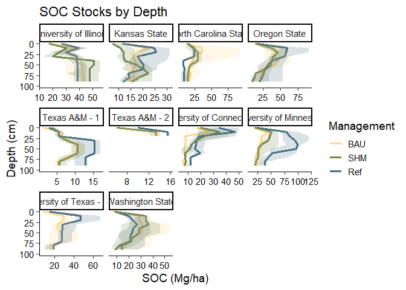<!-- -->

Takeaways:

-   Very few projects actually showed greater SOC stocks throughout the
    soil profile (Minnesota, Texas A&M, UTRGV)
-   Differences in C stocks tended to be most apparent at shallow depths
    (though see Texas A&M Pt 1 and Minnesota for exceptions where
    differences were greater deeper in the soil profile)

# Test effect of treatment on SOC stocks and concentrations with mixed linear model

## Effect of treatment on SOC stocks to 100 cm depth


``` r
# Remove NAs from data
soc100_clean <- soc_pedon %>%
  select(dsp_pedon_id, project, label, soil, soc_stock_100cm) %>%
  na.omit() 

# Random effects: project
# Fixed effects: label
soc_stock100_mixed <- lmer(soc_stock_100cm ~ label + (1|project), data = soc100_clean)
summary(soc_stock100_mixed)
```

```
## Linear mixed model fit by REML ['lmerMod']
## Formula: soc_stock_100cm ~ label + (1 | project)
##    Data: soc100_clean
## 
## REML criterion at convergence: 2484.1
## 
## Scaled residuals: 
##     Min      1Q  Median      3Q     Max 
## -2.5271 -0.5977 -0.1282  0.4769  2.9054 
## 
## Random effects:
##  Groups   Name        Variance Std.Dev.
##  project  (Intercept) 2668     51.65   
##  Residual             2316     48.12   
## Number of obs: 234, groups:  project, 9
## 
## Fixed effects:
##             Estimate Std. Error t value
## (Intercept)  123.423     18.070   6.830
## labelRef      36.910      8.221   4.490
## labelSHM       3.908      7.942   0.492
## 
## Correlation of Fixed Effects:
##          (Intr) lablRf
## labelRef -0.173       
## labelSHM -0.186  0.410
```

``` r
# Test significance of treatment by comparing full and reduced models, use likelihood ratio test
stock100_mixed_full <- lmer(soc_stock_100cm ~ label + (1|project), data = soc100_clean, REML = FALSE)
stock100_mixed_reduced <- lmer(soc_stock_100cm ~ (1|project), data = soc100_clean, REML = FALSE)
anova(stock100_mixed_full, stock100_mixed_reduced, text="Chisq")
```

```
## Data: soc100_clean
## Models:
## stock100_mixed_reduced: soc_stock_100cm ~ (1 | project)
## stock100_mixed_full: soc_stock_100cm ~ label + (1 | project)
##                        npar    AIC    BIC  logLik deviance  Chisq Df Pr(>Chisq)
## stock100_mixed_reduced    3 2531.0 2541.4 -1262.5   2525.0                     
## stock100_mixed_full       5 2513.4 2530.7 -1251.7   2503.4 21.585  2  2.056e-05
##                           
## stock100_mixed_reduced    
## stock100_mixed_full    ***
## ---
## Signif. codes:  0 '***' 0.001 '**' 0.01 '*' 0.05 '.' 0.1 ' ' 1
```

``` r
# Tukey post-hoc
soc_stock100_mixed_tukey <- glht(soc_stock100_mixed, linfct = mcp(label = 'Tukey'))
summary(soc_stock100_mixed_tukey)
```

```
## 
## 	 Simultaneous Tests for General Linear Hypotheses
## 
## Multiple Comparisons of Means: Tukey Contrasts
## 
## 
## Fit: lmer(formula = soc_stock_100cm ~ label + (1 | project), data = soc100_clean)
## 
## Linear Hypotheses:
##                Estimate Std. Error z value Pr(>|z|)    
## Ref - BAU == 0   36.910      8.221   4.490  < 1e-04 ***
## SHM - BAU == 0    3.908      7.942   0.492  0.87490    
## SHM - Ref == 0  -33.002      8.781  -3.758  0.00046 ***
## ---
## Signif. codes:  0 '***' 0.001 '**' 0.01 '*' 0.05 '.' 0.1 ' ' 1
## (Adjusted p values reported -- single-step method)
```

**Results:** Full model is significantly different from reduced model -
there is a significant effect of treatment when between-project
variation is controlled for. Tukey HSD post-hoc test shows that Ref SOC
stock is significantly different from BAU and Ref groups.

## Effect of treatment on SOC stocks to 30 cm depth


``` r
# Remove NAs from data
soc30_clean <- soc_pedon %>%
  select(dsp_pedon_id, project, label, soil, soc_stock_0_30cm) %>%
  na.omit() 

# Random effects: project
# Fixed effects: label
soc_stock30_mixed <- lmer(soc_stock_0_30cm ~ label + (1|project), data = soc30_clean)
summary(soc_stock30_mixed)
```

```
## Linear mixed model fit by REML ['lmerMod']
## Formula: soc_stock_0_30cm ~ label + (1 | project)
##    Data: soc30_clean
## 
## REML criterion at convergence: 2203.7
## 
## Scaled residuals: 
##     Min      1Q  Median      3Q     Max 
## -3.0993 -0.6676 -0.0388  0.4469  3.6310 
## 
## Random effects:
##  Groups   Name        Variance Std.Dev.
##  project  (Intercept) 952.9    30.87   
##  Residual             363.1    19.06   
## Number of obs: 250, groups:  project, 9
## 
## Fixed effects:
##             Estimate Std. Error t value
## (Intercept)   64.218     10.488   6.123
## labelRef      17.995      3.217   5.594
## labelSHM       1.561      3.030   0.515
## 
## Correlation of Fixed Effects:
##          (Intr) lablRf
## labelRef -0.116       
## labelSHM -0.133  0.425
```

``` r
# Test significance of treatment by comparing full and reduced models, use likelihood ratio test
stock30_mixed_full <- lmer(soc_stock_0_30cm ~ label + (1|project), data = soc30_clean, REML = FALSE)
stock30_mixed_reduced <- lmer(soc_stock_0_30cm ~ (1|project), data = soc30_clean, REML = FALSE)
anova(stock30_mixed_full, stock30_mixed_reduced, text="Chisq")
```

```
## Data: soc30_clean
## Models:
## stock30_mixed_reduced: soc_stock_0_30cm ~ (1 | project)
## stock30_mixed_full: soc_stock_0_30cm ~ label + (1 | project)
##                       npar    AIC    BIC  logLik deviance  Chisq Df Pr(>Chisq)
## stock30_mixed_reduced    3 2257.7 2268.2 -1125.8   2251.7                     
## stock30_mixed_full       5 2228.2 2245.8 -1109.1   2218.2 33.489  2  5.345e-08
##                          
## stock30_mixed_reduced    
## stock30_mixed_full    ***
## ---
## Signif. codes:  0 '***' 0.001 '**' 0.01 '*' 0.05 '.' 0.1 ' ' 1
```

``` r
# Full model is significantly different from reduced model - there is a significant effect of treatment when between-project variation is controlled for 

# Tukey post-hoc
soc_stock30_mixed_tukey <- glht(soc_stock30_mixed, linfct = mcp(label = 'Tukey'))
summary(soc_stock30_mixed_tukey)
```

```
## 
## 	 Simultaneous Tests for General Linear Hypotheses
## 
## Multiple Comparisons of Means: Tukey Contrasts
## 
## 
## Fit: lmer(formula = soc_stock_0_30cm ~ label + (1 | project), data = soc30_clean)
## 
## Linear Hypotheses:
##                Estimate Std. Error z value Pr(>|z|)    
## Ref - BAU == 0   17.995      3.217   5.594   <1e-05 ***
## SHM - BAU == 0    1.561      3.030   0.515    0.864    
## SHM - Ref == 0  -16.435      3.354  -4.899   <1e-05 ***
## ---
## Signif. codes:  0 '***' 0.001 '**' 0.01 '*' 0.05 '.' 0.1 ' ' 1
## (Adjusted p values reported -- single-step method)
```

**Results:** Full model is significantly different from reduced model -
there is a significant effect of treatment when between-project
variation is controlled for. Tukey HSD post-hoc test shows that Ref SOC
stock is significantly different from BAU and Ref groups.

## Plot results of mixed linear model

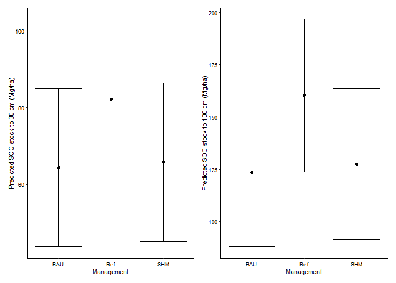<!-- -->

Takeaways:

-   Though not many significant differences are detected between
    treatments within each project, mixed linear model suggests that
    when accounting for between-project variability, SOC stocks (both
    30cm and 100cm depth) are significantly higher in the Ref condition
    vs. SHM and BAU.

-   Supports choice of Ref conditions as a broad concept.

# SHAPE Score Analysis

Plot SOC stocks vs SHAPE scores:


``` r
# Need to join SHAPE scores to SOC stock data
shape_soc_stock <- shape_spatial %>%
  select(dsp_pedon_id, score_mean_soc, gt_90_soc) %>%
  left_join(select(soc_pedon, dsp_pedon_id, project, soil, label, trt, lu, till, soc_stock_0_30cm, soc_stock_100cm),
            by="dsp_pedon_id")

# Details of logarithmic regression
shape_soc_lm <- lm(score_mean_soc ~ log(soc_stock_100cm), data=shape_soc_stock)
summary(shape_soc_lm)
```

```
## 
## Call:
## lm(formula = score_mean_soc ~ log(soc_stock_100cm), data = shape_soc_stock)
## 
## Residuals:
##      Min       1Q   Median       3Q      Max 
## -0.72427 -0.14150  0.02464  0.15260  0.58300 
## 
## Coefficients:
##                      Estimate Std. Error t value Pr(>|t|)    
## (Intercept)          -0.90065    0.10988  -8.197 1.84e-14 ***
## log(soc_stock_100cm)  0.31638    0.02305  13.728  < 2e-16 ***
## ---
## Signif. codes:  0 '***' 0.001 '**' 0.01 '*' 0.05 '.' 0.1 ' ' 1
## 
## Residual standard error: 0.2242 on 226 degrees of freedom
##   (48 observations deleted due to missingness)
## Multiple R-squared:  0.4547,	Adjusted R-squared:  0.4523 
## F-statistic: 188.5 on 1 and 226 DF,  p-value: < 2.2e-16
```

``` r
# Plot
shape_soc_plot <- ggplot(shape_soc_stock, aes(x=soc_stock_100cm, y=score_mean_soc)) +
  geom_point(aes(colour=label)) + 
  geom_smooth(method="lm", formula=y~log(x), color="black") +
  annotate(geom="text", x=250, y=0.22,
           label=expression(atop("y = -0.90 + 0.32*log(x)", R^2~"= 0.45, p < 0.001"))) +
  labs(x="SOC stock to 100 cm depth (Mg/ha)",
       y="SHAPE Score (Peer Group Percentile)") +
  scale_colour_manual(values=c("#FED789FF","#72874EFF","#476F84FF"),
                    breaks=c("BAU", "SHM", "Ref"), 
                    name="Management") +
  theme_katy()
shape_soc_plot
```

```
## Warning: Removed 48 rows containing non-finite outside the scale range
## (`stat_smooth()`).
```

```
## Warning: Removed 48 rows containing missing values or values outside the scale range
## (`geom_point()`).
```

```
## Warning in is.na(x): is.na() applied to non-(list or vector) of type
## 'expression'
```

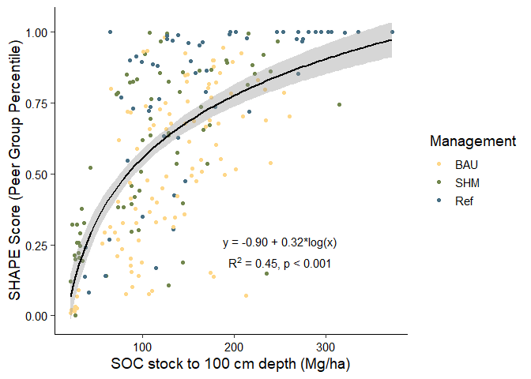<!-- -->

Boxplots of SHAPE SOC scores:


```
## Warning: Removed 13 rows containing non-finite outside the scale range
## (`stat_boxplot()`).
```

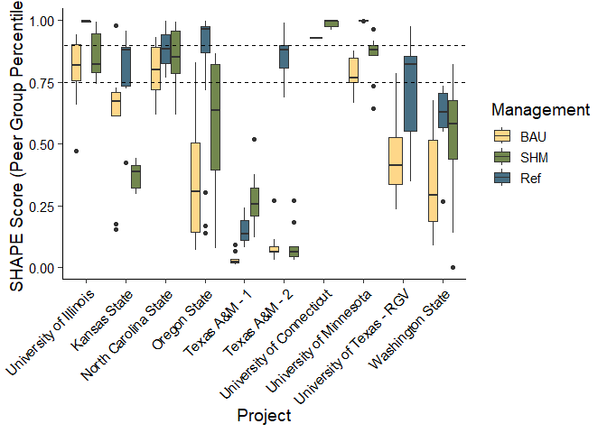<!-- -->

```
## Warning: Removed 13 rows containing non-finite outside the scale range
## (`stat_boxplot()`).
```

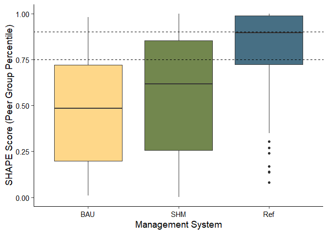<!-- -->

```
## Warning: Removed 13 rows containing non-finite outside the scale range
## (`stat_boxplot()`).
```

```
## Warning: Removed 48 rows containing non-finite outside the scale range
## (`stat_smooth()`).
```

```
## Warning: Removed 48 rows containing missing values or values outside the scale range
## (`geom_point()`).
```

```
## Warning in is.na(x): is.na() applied to non-(list or vector) of type
## 'expression'
```

```
## Warning: Removed 13 rows containing non-finite outside the scale range
## (`stat_boxplot()`).
## Removed 13 rows containing non-finite outside the scale range
## (`stat_boxplot()`).
```

```
## Warning in get_plot_component(plot, "guide-box"): Multiple components found;
## returning the first one. To return all, use `return_all = TRUE`.
```

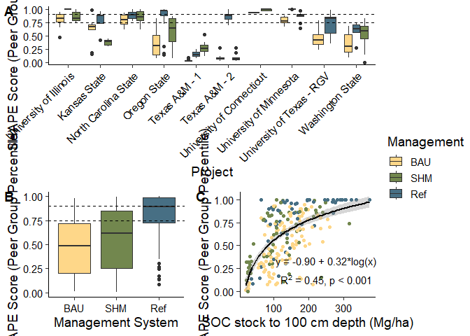<!-- -->

Overall, the SHAPE scores support the Ref/SHM/BAU groupings:

-   Very few projects had median Ref SHAPE score at 90th percentile or
    above (Illinois, Oregon State, University of Minnesota, and UTRGV)

-   Most projects had median Ref SHAPE score at 75th percentile or above
    (only Texas A&M projects do not hit 75th percentile - wonder if this
    is a spatial issue)

-   Only one project has SHM SHAPE score at 90th percentile (UConn)

-   Few projects had SHM SHAPE scores at 75th percentile (University of
    Minnesota, Oregon State, NC State is just a hair below the 75th
    percentile)

-   No projects had BAU SHAPE scores at or above the 75th percentile

## SHAPE Scores and ESD-STMs

``` r
eco_sites_trt <- eco_sites %>%
  left_join(select(project, dsp_plot_id, label, trt), by="dsp_plot_id") %>%
  distinct()

eco_sites_shape <- eco_sites %>%
  left_join(shape_spatial_proj, by="dsp_plot_id")
```

Plot SHAPE scores and SOC% corresponding to different ecological states for project that correlated sampling sites with ecological states - UTRGV is the only project that did this.


``` r
# Compile data - need surface SOC%
utrgv_soc_surf <- surf %>%
  select(project, dsp_pedon_id, soc_pct) %>%
  filter(project=="UTRGV")

shape_soc_utrgv <- eco_sites_shape %>%
  filter(project.y=="UTRGV") %>%
  select(project.y, dsp_pedon_id, ecological_site, ecological_state, soil, label, score_mean_soc) %>%
  rename(project = project.y,
         soc_shape = score_mean_soc) %>%
  left_join(utrgv_soc_surf, by=c("dsp_pedon_id", "project")) %>%
  rename(soc_measured = soc_pct) %>%
  pivot_longer(cols=soc_shape:soc_measured,
               names_to="type", values_to="value")

# Make plot
ggplot(shape_soc_utrgv, aes(x=ecological_state, 
                          y=value, 
                          fill=ecological_state)) +
  geom_boxplot() +
  labs(x="Ecological state",
       title="UTRGV - Loamy Bottomland Ecological Site",
       y=NULL) +
  facet_wrap(vars(type), scales="free",
             strip.position = "left", 
             labeller = as_labeller(c(soc_measured = "Measured SOC (%)", soc_shape = "SOC SHAPE Score (Peer Group Percentile"))) +
  scale_fill_manual(values=c("#FED789FF", "#476F84FF")) +
  theme_katy() +
  theme(legend.position="none",
        strip.background = element_blank(),
        strip.placement = "outside")
```

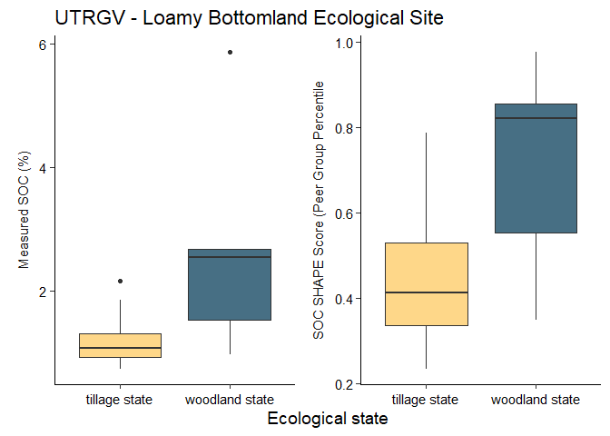<!-- -->

The tricky thing here is that woodland state is not actually the reference state for this ecological site - the reference state is savannah!

## Treatment table for eco sites

Make a table showing all treatments - ecological sites and states can be added to this:


``` r
treatment_table <- project %>%
  select(project, label, lu, till, trt) %>%
  distinct()
flextable(treatment_table)
```

```{=html}
<div class="tabwid"><style>.cl-1617e2f6{}.cl-160d6150{font-family:'Arial';font-size:11pt;font-weight:normal;font-style:normal;text-decoration:none;color:rgba(0, 0, 0, 1.00);background-color:transparent;}.cl-161139d8{margin:0;text-align:left;border-bottom: 0 solid rgba(0, 0, 0, 1.00);border-top: 0 solid rgba(0, 0, 0, 1.00);border-left: 0 solid rgba(0, 0, 0, 1.00);border-right: 0 solid rgba(0, 0, 0, 1.00);padding-bottom:5pt;padding-top:5pt;padding-left:5pt;padding-right:5pt;line-height: 1;background-color:transparent;}.cl-16115292{width:0.75in;background-color:transparent;vertical-align: middle;border-bottom: 1.5pt solid rgba(102, 102, 102, 1.00);border-top: 1.5pt solid rgba(102, 102, 102, 1.00);border-left: 0 solid rgba(0, 0, 0, 1.00);border-right: 0 solid rgba(0, 0, 0, 1.00);margin-bottom:0;margin-top:0;margin-left:0;margin-right:0;}.cl-1611529c{width:0.75in;background-color:transparent;vertical-align: middle;border-bottom: 0 solid rgba(0, 0, 0, 1.00);border-top: 0 solid rgba(0, 0, 0, 1.00);border-left: 0 solid rgba(0, 0, 0, 1.00);border-right: 0 solid rgba(0, 0, 0, 1.00);margin-bottom:0;margin-top:0;margin-left:0;margin-right:0;}.cl-1611529d{width:0.75in;background-color:transparent;vertical-align: middle;border-bottom: 1.5pt solid rgba(102, 102, 102, 1.00);border-top: 0 solid rgba(0, 0, 0, 1.00);border-left: 0 solid rgba(0, 0, 0, 1.00);border-right: 0 solid rgba(0, 0, 0, 1.00);margin-bottom:0;margin-top:0;margin-left:0;margin-right:0;}</style><table data-quarto-disable-processing='true' class='cl-1617e2f6'><thead><tr style="overflow-wrap:break-word;"><th class="cl-16115292"><p class="cl-161139d8"><span class="cl-160d6150">project</span></p></th><th class="cl-16115292"><p class="cl-161139d8"><span class="cl-160d6150">label</span></p></th><th class="cl-16115292"><p class="cl-161139d8"><span class="cl-160d6150">lu</span></p></th><th class="cl-16115292"><p class="cl-161139d8"><span class="cl-160d6150">till</span></p></th><th class="cl-16115292"><p class="cl-161139d8"><span class="cl-160d6150">trt</span></p></th></tr></thead><tbody><tr style="overflow-wrap:break-word;"><td class="cl-1611529c"><p class="cl-161139d8"><span class="cl-160d6150">KansasState</span></p></td><td class="cl-1611529c"><p class="cl-161139d8"><span class="cl-160d6150">BAU</span></p></td><td class="cl-1611529c"><p class="cl-161139d8"><span class="cl-160d6150">CROP</span></p></td><td class="cl-1611529c"><p class="cl-161139d8"><span class="cl-160d6150">Till</span></p></td><td class="cl-1611529c"><p class="cl-161139d8"><span class="cl-160d6150">Till with rotation (eco-fallow)</span></p></td></tr><tr style="overflow-wrap:break-word;"><td class="cl-1611529c"><p class="cl-161139d8"><span class="cl-160d6150">KansasState</span></p></td><td class="cl-1611529c"><p class="cl-161139d8"><span class="cl-160d6150">BAU</span></p></td><td class="cl-1611529c"><p class="cl-161139d8"><span class="cl-160d6150">CROP</span></p></td><td class="cl-1611529c"><p class="cl-161139d8"><span class="cl-160d6150">Till</span></p></td><td class="cl-1611529c"><p class="cl-161139d8"><span class="cl-160d6150">Tilled once every 3 years.  Sorghum/wheat/corn</span></p></td></tr><tr style="overflow-wrap:break-word;"><td class="cl-1611529c"><p class="cl-161139d8"><span class="cl-160d6150">KansasState</span></p></td><td class="cl-1611529c"><p class="cl-161139d8"><span class="cl-160d6150">BAU</span></p></td><td class="cl-1611529c"><p class="cl-161139d8"><span class="cl-160d6150">CROP</span></p></td><td class="cl-1611529c"><p class="cl-161139d8"><span class="cl-160d6150">Till</span></p></td><td class="cl-1611529c"><p class="cl-161139d8"><span class="cl-160d6150">Till converting to no-till</span></p></td></tr><tr style="overflow-wrap:break-word;"><td class="cl-1611529c"><p class="cl-161139d8"><span class="cl-160d6150">KansasState</span></p></td><td class="cl-1611529c"><p class="cl-161139d8"><span class="cl-160d6150">SHM</span></p></td><td class="cl-1611529c"><p class="cl-161139d8"><span class="cl-160d6150">CROP</span></p></td><td class="cl-1611529c"><p class="cl-161139d8"><span class="cl-160d6150">No-till</span></p></td><td class="cl-1611529c"><p class="cl-161139d8"><span class="cl-160d6150">No-Till  with cover crop -  corn, oats, or wheat.</span></p></td></tr><tr style="overflow-wrap:break-word;"><td class="cl-1611529c"><p class="cl-161139d8"><span class="cl-160d6150">KansasState</span></p></td><td class="cl-1611529c"><p class="cl-161139d8"><span class="cl-160d6150">SHM</span></p></td><td class="cl-1611529c"><p class="cl-161139d8"><span class="cl-160d6150">CROP</span></p></td><td class="cl-1611529c"><p class="cl-161139d8"><span class="cl-160d6150">No-till</span></p></td><td class="cl-1611529c"><p class="cl-161139d8"><span class="cl-160d6150">No-till - diverse rotation</span></p></td></tr><tr style="overflow-wrap:break-word;"><td class="cl-1611529c"><p class="cl-161139d8"><span class="cl-160d6150">KansasState</span></p></td><td class="cl-1611529c"><p class="cl-161139d8"><span class="cl-160d6150">Ref</span></p></td><td class="cl-1611529c"><p class="cl-161139d8"><span class="cl-160d6150">RANGE</span></p></td><td class="cl-1611529c"><p class="cl-161139d8"><span class="cl-160d6150">Perennial</span></p></td><td class="cl-1611529c"><p class="cl-161139d8"><span class="cl-160d6150">Native Rangeland (&gt;40 years)</span></p></td></tr><tr style="overflow-wrap:break-word;"><td class="cl-1611529c"><p class="cl-161139d8"><span class="cl-160d6150">KansasState</span></p></td><td class="cl-1611529c"><p class="cl-161139d8"><span class="cl-160d6150">Ref</span></p></td><td class="cl-1611529c"><p class="cl-161139d8"><span class="cl-160d6150">RANGE</span></p></td><td class="cl-1611529c"><p class="cl-161139d8"><span class="cl-160d6150">Perennial</span></p></td><td class="cl-1611529c"><p class="cl-161139d8"><span class="cl-160d6150">Native Rangeland - w 1 haying</span></p></td></tr><tr style="overflow-wrap:break-word;"><td class="cl-1611529c"><p class="cl-161139d8"><span class="cl-160d6150">KansasState</span></p></td><td class="cl-1611529c"><p class="cl-161139d8"><span class="cl-160d6150">Ref</span></p></td><td class="cl-1611529c"><p class="cl-161139d8"><span class="cl-160d6150">RANGE</span></p></td><td class="cl-1611529c"><p class="cl-161139d8"><span class="cl-160d6150">Perennial</span></p></td><td class="cl-1611529c"><p class="cl-161139d8"><span class="cl-160d6150">Native Rangeland (&gt;80years)</span></p></td></tr><tr style="overflow-wrap:break-word;"><td class="cl-1611529c"><p class="cl-161139d8"><span class="cl-160d6150">NCState</span></p></td><td class="cl-1611529c"><p class="cl-161139d8"><span class="cl-160d6150">BAU</span></p></td><td class="cl-1611529c"><p class="cl-161139d8"><span class="cl-160d6150">CROP</span></p></td><td class="cl-1611529c"><p class="cl-161139d8"><span class="cl-160d6150">Till</span></p></td><td class="cl-1611529c"><p class="cl-161139d8"><span class="cl-160d6150">wheat - 1</span></p></td></tr><tr style="overflow-wrap:break-word;"><td class="cl-1611529c"><p class="cl-161139d8"><span class="cl-160d6150">NCState</span></p></td><td class="cl-1611529c"><p class="cl-161139d8"><span class="cl-160d6150">BAU</span></p></td><td class="cl-1611529c"><p class="cl-161139d8"><span class="cl-160d6150">CROP</span></p></td><td class="cl-1611529c"><p class="cl-161139d8"><span class="cl-160d6150">Till</span></p></td><td class="cl-1611529c"><p class="cl-161139d8"><span class="cl-160d6150">wheat - 2</span></p></td></tr><tr style="overflow-wrap:break-word;"><td class="cl-1611529c"><p class="cl-161139d8"><span class="cl-160d6150">NCState</span></p></td><td class="cl-1611529c"><p class="cl-161139d8"><span class="cl-160d6150">BAU</span></p></td><td class="cl-1611529c"><p class="cl-161139d8"><span class="cl-160d6150">CROP</span></p></td><td class="cl-1611529c"><p class="cl-161139d8"><span class="cl-160d6150">Till</span></p></td><td class="cl-1611529c"><p class="cl-161139d8"><span class="cl-160d6150">wheat - 3</span></p></td></tr><tr style="overflow-wrap:break-word;"><td class="cl-1611529c"><p class="cl-161139d8"><span class="cl-160d6150">NCState</span></p></td><td class="cl-1611529c"><p class="cl-161139d8"><span class="cl-160d6150">Ref</span></p></td><td class="cl-1611529c"><p class="cl-161139d8"><span class="cl-160d6150">FOREST</span></p></td><td class="cl-1611529c"><p class="cl-161139d8"><span class="cl-160d6150">Perennial</span></p></td><td class="cl-1611529c"><p class="cl-161139d8"><span class="cl-160d6150">forest</span></p></td></tr><tr style="overflow-wrap:break-word;"><td class="cl-1611529c"><p class="cl-161139d8"><span class="cl-160d6150">NCState</span></p></td><td class="cl-1611529c"><p class="cl-161139d8"><span class="cl-160d6150">SHM</span></p></td><td class="cl-1611529c"><p class="cl-161139d8"><span class="cl-160d6150">FORAGE</span></p></td><td class="cl-1611529c"><p class="cl-161139d8"><span class="cl-160d6150">Perennial</span></p></td><td class="cl-1611529c"><p class="cl-161139d8"><span class="cl-160d6150">hay 1</span></p></td></tr><tr style="overflow-wrap:break-word;"><td class="cl-1611529c"><p class="cl-161139d8"><span class="cl-160d6150">NCState</span></p></td><td class="cl-1611529c"><p class="cl-161139d8"><span class="cl-160d6150">SHM</span></p></td><td class="cl-1611529c"><p class="cl-161139d8"><span class="cl-160d6150">FORAGE</span></p></td><td class="cl-1611529c"><p class="cl-161139d8"><span class="cl-160d6150">Perennial</span></p></td><td class="cl-1611529c"><p class="cl-161139d8"><span class="cl-160d6150">hay 2</span></p></td></tr><tr style="overflow-wrap:break-word;"><td class="cl-1611529c"><p class="cl-161139d8"><span class="cl-160d6150">NCState</span></p></td><td class="cl-1611529c"><p class="cl-161139d8"><span class="cl-160d6150">SHM</span></p></td><td class="cl-1611529c"><p class="cl-161139d8"><span class="cl-160d6150">FORAGE</span></p></td><td class="cl-1611529c"><p class="cl-161139d8"><span class="cl-160d6150">Perennial</span></p></td><td class="cl-1611529c"><p class="cl-161139d8"><span class="cl-160d6150">hay 3</span></p></td></tr><tr style="overflow-wrap:break-word;"><td class="cl-1611529c"><p class="cl-161139d8"><span class="cl-160d6150">WashingtonState</span></p></td><td class="cl-1611529c"><p class="cl-161139d8"><span class="cl-160d6150">SHM</span></p></td><td class="cl-1611529c"><p class="cl-161139d8"><span class="cl-160d6150">CROP</span></p></td><td class="cl-1611529c"><p class="cl-161139d8"><span class="cl-160d6150">No-till</span></p></td><td class="cl-1611529c"><p class="cl-161139d8"><span class="cl-160d6150">ASP10</span></p></td></tr><tr style="overflow-wrap:break-word;"><td class="cl-1611529c"><p class="cl-161139d8"><span class="cl-160d6150">WashingtonState</span></p></td><td class="cl-1611529c"><p class="cl-161139d8"><span class="cl-160d6150">SHM</span></p></td><td class="cl-1611529c"><p class="cl-161139d8"><span class="cl-160d6150">CROP</span></p></td><td class="cl-1611529c"><p class="cl-161139d8"><span class="cl-160d6150">No-till</span></p></td><td class="cl-1611529c"><p class="cl-161139d8"><span class="cl-160d6150">ASP2</span></p></td></tr><tr style="overflow-wrap:break-word;"><td class="cl-1611529c"><p class="cl-161139d8"><span class="cl-160d6150">WashingtonState</span></p></td><td class="cl-1611529c"><p class="cl-161139d8"><span class="cl-160d6150">SHM</span></p></td><td class="cl-1611529c"><p class="cl-161139d8"><span class="cl-160d6150">CROP</span></p></td><td class="cl-1611529c"><p class="cl-161139d8"><span class="cl-160d6150">No-till</span></p></td><td class="cl-1611529c"><p class="cl-161139d8"><span class="cl-160d6150">ASP6</span></p></td></tr><tr style="overflow-wrap:break-word;"><td class="cl-1611529c"><p class="cl-161139d8"><span class="cl-160d6150">WashingtonState</span></p></td><td class="cl-1611529c"><p class="cl-161139d8"><span class="cl-160d6150">SHM</span></p></td><td class="cl-1611529c"><p class="cl-161139d8"><span class="cl-160d6150">CROP</span></p></td><td class="cl-1611529c"><p class="cl-161139d8"><span class="cl-160d6150">No-till</span></p></td><td class="cl-1611529c"><p class="cl-161139d8"><span class="cl-160d6150">ASP9</span></p></td></tr><tr style="overflow-wrap:break-word;"><td class="cl-1611529c"><p class="cl-161139d8"><span class="cl-160d6150">WashingtonState</span></p></td><td class="cl-1611529c"><p class="cl-161139d8"><span class="cl-160d6150">BAU</span></p></td><td class="cl-1611529c"><p class="cl-161139d8"><span class="cl-160d6150">CROP</span></p></td><td class="cl-1611529c"><p class="cl-161139d8"><span class="cl-160d6150">Till</span></p></td><td class="cl-1611529c"><p class="cl-161139d8"><span class="cl-160d6150">BAU3</span></p></td></tr><tr style="overflow-wrap:break-word;"><td class="cl-1611529c"><p class="cl-161139d8"><span class="cl-160d6150">WashingtonState</span></p></td><td class="cl-1611529c"><p class="cl-161139d8"><span class="cl-160d6150">BAU</span></p></td><td class="cl-1611529c"><p class="cl-161139d8"><span class="cl-160d6150">CROP</span></p></td><td class="cl-1611529c"><p class="cl-161139d8"><span class="cl-160d6150">Till</span></p></td><td class="cl-1611529c"><p class="cl-161139d8"><span class="cl-160d6150">BAU8</span></p></td></tr><tr style="overflow-wrap:break-word;"><td class="cl-1611529c"><p class="cl-161139d8"><span class="cl-160d6150">WashingtonState</span></p></td><td class="cl-1611529c"><p class="cl-161139d8"><span class="cl-160d6150">BAU</span></p></td><td class="cl-1611529c"><p class="cl-161139d8"><span class="cl-160d6150">CROP</span></p></td><td class="cl-1611529c"><p class="cl-161139d8"><span class="cl-160d6150">Till</span></p></td><td class="cl-1611529c"><p class="cl-161139d8"><span class="cl-160d6150">BAU9</span></p></td></tr><tr style="overflow-wrap:break-word;"><td class="cl-1611529c"><p class="cl-161139d8"><span class="cl-160d6150">WashingtonState</span></p></td><td class="cl-1611529c"><p class="cl-161139d8"><span class="cl-160d6150">Ref</span></p></td><td class="cl-1611529c"><p class="cl-161139d8"><span class="cl-160d6150">GRASS</span></p></td><td class="cl-1611529c"><p class="cl-161139d8"><span class="cl-160d6150">Perennial</span></p></td><td class="cl-1611529c"><p class="cl-161139d8"><span class="cl-160d6150">PGL7</span></p></td></tr><tr style="overflow-wrap:break-word;"><td class="cl-1611529c"><p class="cl-161139d8"><span class="cl-160d6150">WashingtonState</span></p></td><td class="cl-1611529c"><p class="cl-161139d8"><span class="cl-160d6150">Ref</span></p></td><td class="cl-1611529c"><p class="cl-161139d8"><span class="cl-160d6150">GRASS</span></p></td><td class="cl-1611529c"><p class="cl-161139d8"><span class="cl-160d6150">Perennial</span></p></td><td class="cl-1611529c"><p class="cl-161139d8"><span class="cl-160d6150">PGL9</span></p></td></tr><tr style="overflow-wrap:break-word;"><td class="cl-1611529c"><p class="cl-161139d8"><span class="cl-160d6150">UnivOfMinnesota</span></p></td><td class="cl-1611529c"><p class="cl-161139d8"><span class="cl-160d6150">SHM</span></p></td><td class="cl-1611529c"><p class="cl-161139d8"><span class="cl-160d6150">CROP</span></p></td><td class="cl-1611529c"><p class="cl-161139d8"><span class="cl-160d6150">No-till</span></p></td><td class="cl-1611529c"><p class="cl-161139d8"><span class="cl-160d6150">No-till (cover crop, no-fertilizer). Soybean. Soybean</span></p></td></tr><tr style="overflow-wrap:break-word;"><td class="cl-1611529c"><p class="cl-161139d8"><span class="cl-160d6150">UnivOfMinnesota</span></p></td><td class="cl-1611529c"><p class="cl-161139d8"><span class="cl-160d6150">BAU</span></p></td><td class="cl-1611529c"><p class="cl-161139d8"><span class="cl-160d6150">CROP</span></p></td><td class="cl-1611529c"><p class="cl-161139d8"><span class="cl-160d6150">Till</span></p></td><td class="cl-1611529c"><p class="cl-161139d8"><span class="cl-160d6150">conventional tillage (10cm tillage in Spring; 30cm tillage in fall). Soybean</span></p></td></tr><tr style="overflow-wrap:break-word;"><td class="cl-1611529c"><p class="cl-161139d8"><span class="cl-160d6150">UnivOfMinnesota</span></p></td><td class="cl-1611529c"><p class="cl-161139d8"><span class="cl-160d6150">Ref</span></p></td><td class="cl-1611529c"><p class="cl-161139d8"><span class="cl-160d6150">RANGE</span></p></td><td class="cl-1611529c"><p class="cl-161139d8"><span class="cl-160d6150">Perennial</span></p></td><td class="cl-1611529c"><p class="cl-161139d8"><span class="cl-160d6150">Native rangeland</span></p></td></tr><tr style="overflow-wrap:break-word;"><td class="cl-1611529c"><p class="cl-161139d8"><span class="cl-160d6150">Illinois</span></p></td><td class="cl-1611529c"><p class="cl-161139d8"><span class="cl-160d6150">Ref</span></p></td><td class="cl-1611529c"><p class="cl-161139d8"><span class="cl-160d6150">FOREST</span></p></td><td class="cl-1611529c"><p class="cl-161139d8"><span class="cl-160d6150">Perennial</span></p></td><td class="cl-1611529c"><p class="cl-161139d8"><span class="cl-160d6150">Ref</span></p></td></tr><tr style="overflow-wrap:break-word;"><td class="cl-1611529c"><p class="cl-161139d8"><span class="cl-160d6150">Illinois</span></p></td><td class="cl-1611529c"><p class="cl-161139d8"><span class="cl-160d6150">SHM</span></p></td><td class="cl-1611529c"><p class="cl-161139d8"><span class="cl-160d6150">CROP</span></p></td><td class="cl-1611529c"><p class="cl-161139d8"><span class="cl-160d6150">No-till</span></p></td><td class="cl-1611529c"><p class="cl-161139d8"><span class="cl-160d6150">NT</span></p></td></tr><tr style="overflow-wrap:break-word;"><td class="cl-1611529c"><p class="cl-161139d8"><span class="cl-160d6150">Illinois</span></p></td><td class="cl-1611529c"><p class="cl-161139d8"><span class="cl-160d6150">BAU</span></p></td><td class="cl-1611529c"><p class="cl-161139d8"><span class="cl-160d6150">CROP</span></p></td><td class="cl-1611529c"><p class="cl-161139d8"><span class="cl-160d6150">Till</span></p></td><td class="cl-1611529c"><p class="cl-161139d8"><span class="cl-160d6150">Organic</span></p></td></tr><tr style="overflow-wrap:break-word;"><td class="cl-1611529c"><p class="cl-161139d8"><span class="cl-160d6150">Illinois</span></p></td><td class="cl-1611529c"><p class="cl-161139d8"><span class="cl-160d6150">BAU</span></p></td><td class="cl-1611529c"><p class="cl-161139d8"><span class="cl-160d6150">CROP</span></p></td><td class="cl-1611529c"><p class="cl-161139d8"><span class="cl-160d6150">Till</span></p></td><td class="cl-1611529c"><p class="cl-161139d8"><span class="cl-160d6150">Conventional</span></p></td></tr><tr style="overflow-wrap:break-word;"><td class="cl-1611529c"><p class="cl-161139d8"><span class="cl-160d6150">UConn</span></p></td><td class="cl-1611529c"><p class="cl-161139d8"><span class="cl-160d6150">SHM</span></p></td><td class="cl-1611529c"><p class="cl-161139d8"><span class="cl-160d6150">GRASS</span></p></td><td class="cl-1611529c"><p class="cl-161139d8"><span class="cl-160d6150">No-till</span></p></td><td class="cl-1611529c"><p class="cl-161139d8"><span class="cl-160d6150">Hayland</span></p></td></tr><tr style="overflow-wrap:break-word;"><td class="cl-1611529c"><p class="cl-161139d8"><span class="cl-160d6150">UConn</span></p></td><td class="cl-1611529c"><p class="cl-161139d8"><span class="cl-160d6150">SHM</span></p></td><td class="cl-1611529c"><p class="cl-161139d8"><span class="cl-160d6150">GRASS</span></p></td><td class="cl-1611529c"><p class="cl-161139d8"><span class="cl-160d6150">No-till</span></p></td><td class="cl-1611529c"><p class="cl-161139d8"><span class="cl-160d6150">Lawn</span></p></td></tr><tr style="overflow-wrap:break-word;"><td class="cl-1611529c"><p class="cl-161139d8"><span class="cl-160d6150">UConn</span></p></td><td class="cl-1611529c"><p class="cl-161139d8"><span class="cl-160d6150">Ref</span></p></td><td class="cl-1611529c"><p class="cl-161139d8"><span class="cl-160d6150">FOREST</span></p></td><td class="cl-1611529c"><p class="cl-161139d8"><span class="cl-160d6150">Perennial</span></p></td><td class="cl-1611529c"><p class="cl-161139d8"><span class="cl-160d6150">Managed forest</span></p></td></tr><tr style="overflow-wrap:break-word;"><td class="cl-1611529c"><p class="cl-161139d8"><span class="cl-160d6150">UConn</span></p></td><td class="cl-1611529c"><p class="cl-161139d8"><span class="cl-160d6150">SHM</span></p></td><td class="cl-1611529c"><p class="cl-161139d8"><span class="cl-160d6150">FOREST</span></p></td><td class="cl-1611529c"><p class="cl-161139d8"><span class="cl-160d6150">Perennial</span></p></td><td class="cl-1611529c"><p class="cl-161139d8"><span class="cl-160d6150">Managed forest</span></p></td></tr><tr style="overflow-wrap:break-word;"><td class="cl-1611529c"><p class="cl-161139d8"><span class="cl-160d6150">UConn</span></p></td><td class="cl-1611529c"><p class="cl-161139d8"><span class="cl-160d6150">BAU</span></p></td><td class="cl-1611529c"><p class="cl-161139d8"><span class="cl-160d6150">CROP</span></p></td><td class="cl-1611529c"><p class="cl-161139d8"><span class="cl-160d6150">Till</span></p></td><td class="cl-1611529c"><p class="cl-161139d8"><span class="cl-160d6150">Conv till silage corn</span></p></td></tr><tr style="overflow-wrap:break-word;"><td class="cl-1611529c"><p class="cl-161139d8"><span class="cl-160d6150">UConn</span></p></td><td class="cl-1611529c"><p class="cl-161139d8"><span class="cl-160d6150">Ref</span></p></td><td class="cl-1611529c"><p class="cl-161139d8"><span class="cl-160d6150">FOREST</span></p></td><td class="cl-1611529c"><p class="cl-161139d8"><span class="cl-160d6150">Perennial</span></p></td><td class="cl-1611529c"><p class="cl-161139d8"><span class="cl-160d6150">Unmanaged forest</span></p></td></tr><tr style="overflow-wrap:break-word;"><td class="cl-1611529c"><p class="cl-161139d8"><span class="cl-160d6150">UTRGV</span></p></td><td class="cl-1611529c"><p class="cl-161139d8"><span class="cl-160d6150">Ref</span></p></td><td class="cl-1611529c"><p class="cl-161139d8"><span class="cl-160d6150">FOREST</span></p></td><td class="cl-1611529c"><p class="cl-161139d8"><span class="cl-160d6150">Perennial</span></p></td><td class="cl-1611529c"><p class="cl-161139d8"><span class="cl-160d6150">Reference</span></p></td></tr><tr style="overflow-wrap:break-word;"><td class="cl-1611529c"><p class="cl-161139d8"><span class="cl-160d6150">UTRGV</span></p></td><td class="cl-1611529c"><p class="cl-161139d8"><span class="cl-160d6150">BAU</span></p></td><td class="cl-1611529c"><p class="cl-161139d8"><span class="cl-160d6150">CROP</span></p></td><td class="cl-1611529c"><p class="cl-161139d8"><span class="cl-160d6150">Till</span></p></td><td class="cl-1611529c"><p class="cl-161139d8"><span class="cl-160d6150">Conventional Till</span></p></td></tr><tr style="overflow-wrap:break-word;"><td class="cl-1611529c"><p class="cl-161139d8"><span class="cl-160d6150">UTRGV</span></p></td><td class="cl-1611529c"><p class="cl-161139d8"><span class="cl-160d6150">BAU</span></p></td><td class="cl-1611529c"><p class="cl-161139d8"><span class="cl-160d6150">CROP</span></p></td><td class="cl-1611529c"><p class="cl-161139d8"><span class="cl-160d6150">Till</span></p></td><td class="cl-1611529c"><p class="cl-161139d8"><span class="cl-160d6150">Intermittent Till</span></p></td></tr><tr style="overflow-wrap:break-word;"><td class="cl-1611529c"><p class="cl-161139d8"><span class="cl-160d6150">UTRGV</span></p></td><td class="cl-1611529c"><p class="cl-161139d8"><span class="cl-160d6150">BAU</span></p></td><td class="cl-1611529c"><p class="cl-161139d8"><span class="cl-160d6150">CROP</span></p></td><td class="cl-1611529c"><p class="cl-161139d8"><span class="cl-160d6150">Till</span></p></td><td class="cl-1611529c"><p class="cl-161139d8"><span class="cl-160d6150">Strip Till</span></p></td></tr><tr style="overflow-wrap:break-word;"><td class="cl-1611529c"><p class="cl-161139d8"><span class="cl-160d6150">TexasA&amp;MPt-1</span></p></td><td class="cl-1611529c"><p class="cl-161139d8"><span class="cl-160d6150">BAU</span></p></td><td class="cl-1611529c"><p class="cl-161139d8"><span class="cl-160d6150">CROP</span></p></td><td class="cl-1611529c"><p class="cl-161139d8"><span class="cl-160d6150">Till</span></p></td><td class="cl-1611529c"><p class="cl-161139d8"><span class="cl-160d6150">Conv Till - 1</span></p></td></tr><tr style="overflow-wrap:break-word;"><td class="cl-1611529c"><p class="cl-161139d8"><span class="cl-160d6150">TexasA&amp;MPt-1</span></p></td><td class="cl-1611529c"><p class="cl-161139d8"><span class="cl-160d6150">BAU</span></p></td><td class="cl-1611529c"><p class="cl-161139d8"><span class="cl-160d6150">CROP</span></p></td><td class="cl-1611529c"><p class="cl-161139d8"><span class="cl-160d6150">Till</span></p></td><td class="cl-1611529c"><p class="cl-161139d8"><span class="cl-160d6150">Conv Till - 2</span></p></td></tr><tr style="overflow-wrap:break-word;"><td class="cl-1611529c"><p class="cl-161139d8"><span class="cl-160d6150">TexasA&amp;MPt-1</span></p></td><td class="cl-1611529c"><p class="cl-161139d8"><span class="cl-160d6150">BAU</span></p></td><td class="cl-1611529c"><p class="cl-161139d8"><span class="cl-160d6150">CROP</span></p></td><td class="cl-1611529c"><p class="cl-161139d8"><span class="cl-160d6150">Till</span></p></td><td class="cl-1611529c"><p class="cl-161139d8"><span class="cl-160d6150">Conv Till - 3</span></p></td></tr><tr style="overflow-wrap:break-word;"><td class="cl-1611529c"><p class="cl-161139d8"><span class="cl-160d6150">TexasA&amp;MPt-1</span></p></td><td class="cl-1611529c"><p class="cl-161139d8"><span class="cl-160d6150">Ref</span></p></td><td class="cl-1611529c"><p class="cl-161139d8"><span class="cl-160d6150">GRASS</span></p></td><td class="cl-1611529c"><p class="cl-161139d8"><span class="cl-160d6150">Perennial</span></p></td><td class="cl-1611529c"><p class="cl-161139d8"><span class="cl-160d6150">Rangland</span></p></td></tr><tr style="overflow-wrap:break-word;"><td class="cl-1611529c"><p class="cl-161139d8"><span class="cl-160d6150">TexasA&amp;MPt-1</span></p></td><td class="cl-1611529c"><p class="cl-161139d8"><span class="cl-160d6150">SHM</span></p></td><td class="cl-1611529c"><p class="cl-161139d8"><span class="cl-160d6150">CROP</span></p></td><td class="cl-1611529c"><p class="cl-161139d8"><span class="cl-160d6150">Till</span></p></td><td class="cl-1611529c"><p class="cl-161139d8"><span class="cl-160d6150">No Till - Mixed - 1</span></p></td></tr><tr style="overflow-wrap:break-word;"><td class="cl-1611529c"><p class="cl-161139d8"><span class="cl-160d6150">TexasA&amp;MPt-1</span></p></td><td class="cl-1611529c"><p class="cl-161139d8"><span class="cl-160d6150">SHM</span></p></td><td class="cl-1611529c"><p class="cl-161139d8"><span class="cl-160d6150">CROP</span></p></td><td class="cl-1611529c"><p class="cl-161139d8"><span class="cl-160d6150">Till</span></p></td><td class="cl-1611529c"><p class="cl-161139d8"><span class="cl-160d6150">No Till - Mixed - 2</span></p></td></tr><tr style="overflow-wrap:break-word;"><td class="cl-1611529c"><p class="cl-161139d8"><span class="cl-160d6150">TexasA&amp;MPt-1</span></p></td><td class="cl-1611529c"><p class="cl-161139d8"><span class="cl-160d6150">SHM</span></p></td><td class="cl-1611529c"><p class="cl-161139d8"><span class="cl-160d6150">CROP</span></p></td><td class="cl-1611529c"><p class="cl-161139d8"><span class="cl-160d6150">Till</span></p></td><td class="cl-1611529c"><p class="cl-161139d8"><span class="cl-160d6150">No Till - Mixed - 3</span></p></td></tr><tr style="overflow-wrap:break-word;"><td class="cl-1611529c"><p class="cl-161139d8"><span class="cl-160d6150">TexasA&amp;MPt-1</span></p></td><td class="cl-1611529c"><p class="cl-161139d8"><span class="cl-160d6150">SHM</span></p></td><td class="cl-1611529c"><p class="cl-161139d8"><span class="cl-160d6150">CROP</span></p></td><td class="cl-1611529c"><p class="cl-161139d8"><span class="cl-160d6150">Till</span></p></td><td class="cl-1611529c"><p class="cl-161139d8"><span class="cl-160d6150">No Till - Rye - 1</span></p></td></tr><tr style="overflow-wrap:break-word;"><td class="cl-1611529c"><p class="cl-161139d8"><span class="cl-160d6150">TexasA&amp;MPt-1</span></p></td><td class="cl-1611529c"><p class="cl-161139d8"><span class="cl-160d6150">SHM</span></p></td><td class="cl-1611529c"><p class="cl-161139d8"><span class="cl-160d6150">CROP</span></p></td><td class="cl-1611529c"><p class="cl-161139d8"><span class="cl-160d6150">Till</span></p></td><td class="cl-1611529c"><p class="cl-161139d8"><span class="cl-160d6150">No Till - Rye - 2</span></p></td></tr><tr style="overflow-wrap:break-word;"><td class="cl-1611529c"><p class="cl-161139d8"><span class="cl-160d6150">TexasA&amp;MPt-1</span></p></td><td class="cl-1611529c"><p class="cl-161139d8"><span class="cl-160d6150">SHM</span></p></td><td class="cl-1611529c"><p class="cl-161139d8"><span class="cl-160d6150">CROP</span></p></td><td class="cl-1611529c"><p class="cl-161139d8"><span class="cl-160d6150">Till</span></p></td><td class="cl-1611529c"><p class="cl-161139d8"><span class="cl-160d6150">No Till - Rye - 3</span></p></td></tr><tr style="overflow-wrap:break-word;"><td class="cl-1611529c"><p class="cl-161139d8"><span class="cl-160d6150">TexasA&amp;MPt-2</span></p></td><td class="cl-1611529c"><p class="cl-161139d8"><span class="cl-160d6150">BAU</span></p></td><td class="cl-1611529c"><p class="cl-161139d8"><span class="cl-160d6150">CROP</span></p></td><td class="cl-1611529c"><p class="cl-161139d8"><span class="cl-160d6150">Till</span></p></td><td class="cl-1611529c"><p class="cl-161139d8"><span class="cl-160d6150">Mulch tillage fallow after sorghum</span></p></td></tr><tr style="overflow-wrap:break-word;"><td class="cl-1611529c"><p class="cl-161139d8"><span class="cl-160d6150">TexasA&amp;MPt-2</span></p></td><td class="cl-1611529c"><p class="cl-161139d8"><span class="cl-160d6150">BAU</span></p></td><td class="cl-1611529c"><p class="cl-161139d8"><span class="cl-160d6150">CROP</span></p></td><td class="cl-1611529c"><p class="cl-161139d8"><span class="cl-160d6150">Till</span></p></td><td class="cl-1611529c"><p class="cl-161139d8"><span class="cl-160d6150">mulch tillage fallow after wheat</span></p></td></tr><tr style="overflow-wrap:break-word;"><td class="cl-1611529c"><p class="cl-161139d8"><span class="cl-160d6150">TexasA&amp;MPt-2</span></p></td><td class="cl-1611529c"><p class="cl-161139d8"><span class="cl-160d6150">BAU</span></p></td><td class="cl-1611529c"><p class="cl-161139d8"><span class="cl-160d6150">CROP</span></p></td><td class="cl-1611529c"><p class="cl-161139d8"><span class="cl-160d6150">Till</span></p></td><td class="cl-1611529c"><p class="cl-161139d8"><span class="cl-160d6150">mulch tillage wheat</span></p></td></tr><tr style="overflow-wrap:break-word;"><td class="cl-1611529c"><p class="cl-161139d8"><span class="cl-160d6150">TexasA&amp;MPt-2</span></p></td><td class="cl-1611529c"><p class="cl-161139d8"><span class="cl-160d6150">SHM</span></p></td><td class="cl-1611529c"><p class="cl-161139d8"><span class="cl-160d6150">CROP</span></p></td><td class="cl-1611529c"><p class="cl-161139d8"><span class="cl-160d6150">No-till</span></p></td><td class="cl-1611529c"><p class="cl-161139d8"><span class="cl-160d6150">no-till fallow after sorghum</span></p></td></tr><tr style="overflow-wrap:break-word;"><td class="cl-1611529c"><p class="cl-161139d8"><span class="cl-160d6150">TexasA&amp;MPt-2</span></p></td><td class="cl-1611529c"><p class="cl-161139d8"><span class="cl-160d6150">SHM</span></p></td><td class="cl-1611529c"><p class="cl-161139d8"><span class="cl-160d6150">CROP</span></p></td><td class="cl-1611529c"><p class="cl-161139d8"><span class="cl-160d6150">No-till</span></p></td><td class="cl-1611529c"><p class="cl-161139d8"><span class="cl-160d6150">no-till fallow after wheat</span></p></td></tr><tr style="overflow-wrap:break-word;"><td class="cl-1611529c"><p class="cl-161139d8"><span class="cl-160d6150">TexasA&amp;MPt-2</span></p></td><td class="cl-1611529c"><p class="cl-161139d8"><span class="cl-160d6150">SHM</span></p></td><td class="cl-1611529c"><p class="cl-161139d8"><span class="cl-160d6150">CROP</span></p></td><td class="cl-1611529c"><p class="cl-161139d8"><span class="cl-160d6150">No-till</span></p></td><td class="cl-1611529c"><p class="cl-161139d8"><span class="cl-160d6150">no-till wheat</span></p></td></tr><tr style="overflow-wrap:break-word;"><td class="cl-1611529c"><p class="cl-161139d8"><span class="cl-160d6150">TexasA&amp;MPt-2</span></p></td><td class="cl-1611529c"><p class="cl-161139d8"><span class="cl-160d6150">Ref</span></p></td><td class="cl-1611529c"><p class="cl-161139d8"><span class="cl-160d6150">FORAGE</span></p></td><td class="cl-1611529c"><p class="cl-161139d8"><span class="cl-160d6150">Perennial</span></p></td><td class="cl-1611529c"><p class="cl-161139d8"><span class="cl-160d6150">Native Rangeland</span></p></td></tr><tr style="overflow-wrap:break-word;"><td class="cl-1611529c"><p class="cl-161139d8"><span class="cl-160d6150">TexasA&amp;MPt-2</span></p></td><td class="cl-1611529c"><p class="cl-161139d8"><span class="cl-160d6150">Ref</span></p></td><td class="cl-1611529c"><p class="cl-161139d8"><span class="cl-160d6150">FORAGE</span></p></td><td class="cl-1611529c"><p class="cl-161139d8"><span class="cl-160d6150">Perennial</span></p></td><td class="cl-1611529c"><p class="cl-161139d8"><span class="cl-160d6150">Native with introduced species</span></p></td></tr><tr style="overflow-wrap:break-word;"><td class="cl-1611529c"><p class="cl-161139d8"><span class="cl-160d6150">OregonState</span></p></td><td class="cl-1611529c"><p class="cl-161139d8"><span class="cl-160d6150">Ref</span></p></td><td class="cl-1611529c"><p class="cl-161139d8"><span class="cl-160d6150">FOREST</span></p></td><td class="cl-1611529c"><p class="cl-161139d8"><span class="cl-160d6150">Perennial</span></p></td><td class="cl-1611529c"><p class="cl-161139d8"><span class="cl-160d6150">Forest</span></p></td></tr><tr style="overflow-wrap:break-word;"><td class="cl-1611529c"><p class="cl-161139d8"><span class="cl-160d6150">OregonState</span></p></td><td class="cl-1611529c"><p class="cl-161139d8"><span class="cl-160d6150">SHM</span></p></td><td class="cl-1611529c"><p class="cl-161139d8"><span class="cl-160d6150">CROP</span></p></td><td class="cl-1611529c"><p class="cl-161139d8"><span class="cl-160d6150">Conservation</span></p></td><td class="cl-1611529c"><p class="cl-161139d8"><span class="cl-160d6150">Vineyard</span></p></td></tr><tr style="overflow-wrap:break-word;"><td class="cl-1611529c"><p class="cl-161139d8"><span class="cl-160d6150">OregonState</span></p></td><td class="cl-1611529c"><p class="cl-161139d8"><span class="cl-160d6150">BAU</span></p></td><td class="cl-1611529c"><p class="cl-161139d8"><span class="cl-160d6150">CROP</span></p></td><td class="cl-1611529c"><p class="cl-161139d8"><span class="cl-160d6150">Till</span></p></td><td class="cl-1611529c"><p class="cl-161139d8"><span class="cl-160d6150">Christmas tree</span></p></td></tr><tr style="overflow-wrap:break-word;"><td class="cl-1611529c"><p class="cl-161139d8"><span class="cl-160d6150">OregonState</span></p></td><td class="cl-1611529c"><p class="cl-161139d8"><span class="cl-160d6150">BAU</span></p></td><td class="cl-1611529c"><p class="cl-161139d8"><span class="cl-160d6150">CROP</span></p></td><td class="cl-1611529c"><p class="cl-161139d8"><span class="cl-160d6150">Till</span></p></td><td class="cl-1611529c"><p class="cl-161139d8"><span class="cl-160d6150">Conventional till</span></p></td></tr><tr style="overflow-wrap:break-word;"><td class="cl-1611529c"><p class="cl-161139d8"><span class="cl-160d6150">OregonState</span></p></td><td class="cl-1611529c"><p class="cl-161139d8"><span class="cl-160d6150">Ref</span></p></td><td class="cl-1611529c"><p class="cl-161139d8"><span class="cl-160d6150">ORCHARD</span></p></td><td class="cl-1611529c"><p class="cl-161139d8"><span class="cl-160d6150">Perennial</span></p></td><td class="cl-1611529c"><p class="cl-161139d8"><span class="cl-160d6150">Hazelnut</span></p></td></tr><tr style="overflow-wrap:break-word;"><td class="cl-1611529c"><p class="cl-161139d8"><span class="cl-160d6150">OregonState</span></p></td><td class="cl-1611529c"><p class="cl-161139d8"><span class="cl-160d6150">SHM</span></p></td><td class="cl-1611529c"><p class="cl-161139d8"><span class="cl-160d6150">CROP</span></p></td><td class="cl-1611529c"><p class="cl-161139d8"><span class="cl-160d6150">No-till</span></p></td><td class="cl-1611529c"><p class="cl-161139d8"><span class="cl-160d6150">No-till</span></p></td></tr><tr style="overflow-wrap:break-word;"><td class="cl-1611529d"><p class="cl-161139d8"><span class="cl-160d6150">OregonState</span></p></td><td class="cl-1611529d"><p class="cl-161139d8"><span class="cl-160d6150">SHM</span></p></td><td class="cl-1611529d"><p class="cl-161139d8"><span class="cl-160d6150">GRASS</span></p></td><td class="cl-1611529d"><p class="cl-161139d8"><span class="cl-160d6150">No-till</span></p></td><td class="cl-1611529d"><p class="cl-161139d8"><span class="cl-160d6150">No-till</span></p></td></tr></tbody></table></div>
```
